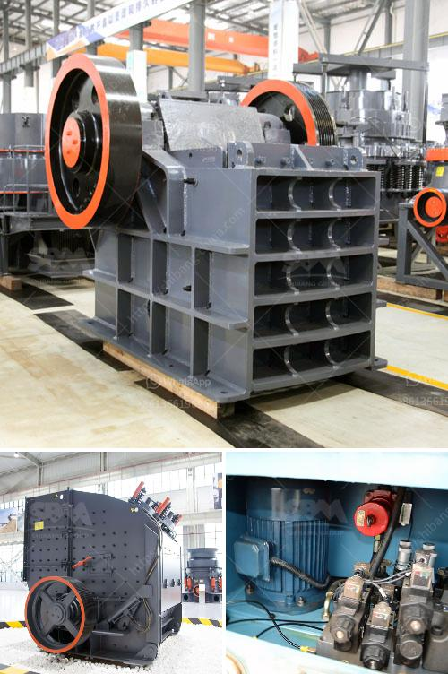

<h3>malaysia crusher plant manufacturer and supplier</h3>
Malaysia is a Southeast Asian country with a wealth of natural resources that are used for a wide range of industries. Other than agriculture, Malaysia also has a thriving mining sector, contributing to a significant amount of its GDP. By collaborating with local and international partners, Malaysia is paving the way for increased global recognition in the mining industry.

As a result of this growth, the demand for crushing equipment is also increasing, leading to a surge in the number of crusher plant manufacturers and suppliers in the country. These companies have been instrumental in providing the necessary machinery and equipment required by the mining industry, ensuring efficient and cost-effective production processes.

One such company that has gained a reputation as a prominent crusher plant manufacturer and supplier in Malaysia is Aimix Group. With over 30 years of experience in the industry, Aimix has been offering a wide range of qualitative products, including concrete batching plants, asphalt mixing plants, and jaw crushers. Their commitment to delivering high-quality machinery and exceptional customer service has earned them a loyal clientele.

Aimix's crusher plants are designed to meet the specific requirements of the mining industry and are built to withstand harsh operating conditions. Their range of crushing equipment includes primary, secondary, and tertiary crushers that utilize different types of technologies, such as jaw crushers, impact crushers, and cone crushers. These crushers are equipped with advanced features, such as adjustable settings, hydraulic systems, and heavy-duty construction, ensuring optimal performance and durability.

In addition to manufacturing crusher plants, Aimix also provides comprehensive after-sales support, including installation, commissioning, and maintenance services. Their experienced team of engineers and technicians ensures that the machinery is properly installed and operates at peak performance, resulting in increased productivity and reduced downtime.

Furthermore, as a supplier, Aimix understands the importance of delivering products on time and within budget. They have established a strong distribution network across Malaysia, enabling them to efficiently cater to the needs of their customers. Additionally, Aimix maintains a well-stocked inventory of spare parts, ensuring quick replacements and minimizing downtime in case of any equipment malfunction.

Apart from Aimix, there are several other reputed crusher plant manufacturers and suppliers in Malaysia, including Terex, Sandvik, FLSmidth, and Striker. Each of these companies has their own unique strengths and specialties. Some specialize in specific types of crushers, while others offer a wide range of crushing equipment suitable for various applications. This diversity allows customers to choose the most suitable crusher plant for their specific needs.

With the rising demand for crushing equipment in Malaysia's mining industry, crusher plant manufacturers and suppliers have witnessed an upward trend in their business. Aimix Group, being a leader in the industry, offers an extensive range of crushing equipment that meets diverse customer requirements. Their commitment to quality, reliability, and customer satisfaction gives them a competitive edge in the market. As the mining industry in Malaysia continues to grow, the demand for crushers and other mining equipment is expected to rise further, providing excellent opportunities for crusher plant manufacturers and suppliers to expand their business and contribute to Malaysia's economic growth.
<h3>Contact us</h3><ul><li><strong>Whatsapp:&nbsp;<a href="https://wa.me/8613661969651">+8613661969651</a></strong></li><li><a href="https://swt.shibang-china.com/?git&amp;zhl&amp;malaysia crusher plant manufacturer and supplier"><strong>Online Service(chat now)</strong></a></li></ul><h3>Related</h3><ul><li><a href='activated bentonite production line.md'>activated bentonite production line</a></li><li><a href='alluvial gold mining methods in zimbabwe.md'>alluvial gold mining methods in zimbabwe</a></li><li><a href='rock crusher plant for sale.md'>rock crusher plant for sale</a></li><li><a href='quarry equipment uk.md'>quarry equipment uk</a></li><li><a href='rock crushing machine price.md'>rock crushing machine price</a></li></ul>