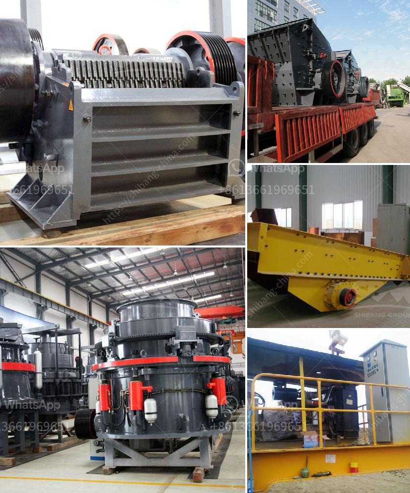

<h3>malaysian crusher plant manufacturer and supplier</h3>
Malaysia is known for its rich diversity in resources, ranging from natural gas and petroleum to timber and palm oil. However, despite being blessed with abundant resources, the country faces numerous challenges when it comes to manufacturing and supplying high-quality crusher plants. 

A crusher plant is a machine that reduces the size of materials in order to make them easier to process and recycle. Crushers are an important part of any industrial and construction process, and they are crucial for efficiently breaking down material into smaller, more manageable pieces. 

In Malaysia, many industries such as construction, mining, oil and gas, and recycling rely heavily on the use of crusher plants. In fact, a significant amount of the country's infrastructure and development projects are made possible by these machines. 

One prominent Malaysian crusher plant manufacturer and supplier is Aimix Group. Aimix Group provides various types of crusher plants for sale in Malaysia, including jaw crusher, impact crusher, cone crusher, and mobile crusher plant. Aimix Group is committed to providing high-quality products and personalized service, and they have won widespread praise from their customers. 

In addition to Aimix, another leading crusher manufacturer and supplier in Malaysia is Tianyuan Plastic Machinery. Tianyuan Plastic Machinery specializes in the production of plastic recycling machines, and they also provide crusher plants to meet the needs of various industries. With a strong focus on research and development, Tianyuan Plastic Machinery continually innovates to deliver advanced and efficient crusher plants. 

The crusher plants offered by these manufacturers and suppliers are highly efficient and offer high versatility. They can be used for various types of materials, including concrete, limestone, granite, and more. Additionally, these crusher plants can be customized to fit specific requirements and can be equipped with additional features and accessories to enhance productivity and efficiency. 

Apart from manufacturing and supplying high-quality crusher plants, Malaysian manufacturers and suppliers also offer after-sales service and support. This includes technical assistance, maintenance, and repair services to ensure that the crusher plants operate smoothly and efficiently. Additionally, these companies provide training and guidance to their customers to help them maximize the benefits and potential of their crusher plants. 

In conclusion, Malaysian crusher plant manufacturers and suppliers play a crucial role in the construction and mining industries. These companies offer a wide range of crusher plants which are used for various materials, including concrete, limestone, granite, and more. They also provide after-sales support and services to ensure that the crusher plants operate efficiently. With their commitment to quality and customer satisfaction, Malaysian manufacturers and suppliers continue to contribute to the development of the country's infrastructure and economy.
<h3>Contact us</h3><ul><li><strong>Whatsapp:&nbsp;<a href="https://wa.me/8613661969651">+8613661969651</a></strong></li><li><a href="https://swt.shibang-china.com/?git&amp;zhl&amp;malaysian crusher plant manufacturer and supplier"><strong>Online Service(chat now)</strong></a></li></ul><h3>Related</h3><ul><li><a href='how much does a jaw crusher cost.md'>how much does a jaw crusher cost</a></li><li><a href='stone crusher 7 tonne per day.md'>stone crusher 7 tonne per day</a></li><li><a href='stone crushers gold.md'>stone crushers gold</a></li><li><a href='ball mill grinding rotate.md'>ball mill grinding rotate</a></li><li><a href='setting up a coal mining plant.md'>setting up a coal mining plant</a></li></ul>