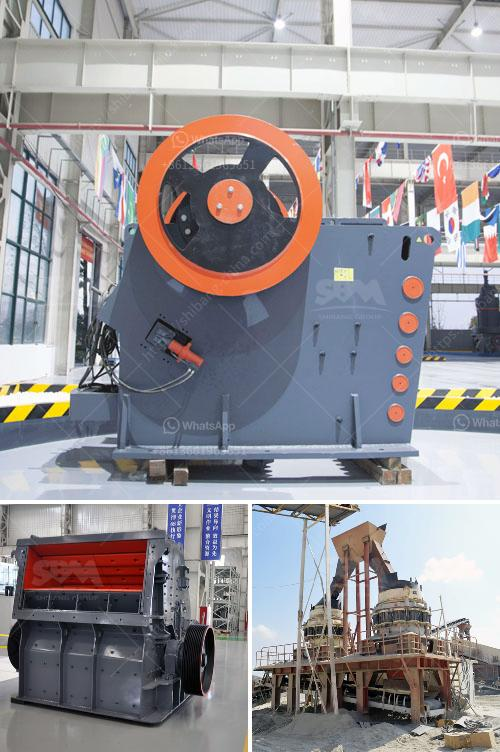

<h3>manganese ball milling machine</h3>
In the mining industry, grinding processes play a crucial role in extracting valuable minerals and metals from their ores. Manganese, a widely used metal in the manufacturing industry, is no exception. To obtain high-quality manganese, ball milling machines are often utilized to grind manganese ore into fine powders.

Ball milling machines, also known as ball mills, are used to disintegrate or mix solid particles in a rotating container. These machines have been around for centuries and have proven to be efficient and reliable for various grinding applications. In the case of manganese, ball milling machines are essential in transforming raw ores into smaller particles suitable for further processing.

One key advantage of using ball milling machines for manganese grinding is their ability to produce uniform and fine particles. The grinding process involves the use of heavy-duty steel balls that are cylindrical in shape. These balls rotate inside the milling machine, colliding with the manganese ore to break it down into smaller particles. The size of these particles depends on factors like the rotational speed of the milling machine, the size of the steel balls, and the duration of the grinding process.

The uniformity and fineness of the particles produced by ball milling machines are crucial for downstream processing. When manganese ore is finely ground, it increases the surface area available for chemical reactions during the subsequent extraction or refining processes. This, in turn, enhances the efficiency and effectiveness of the overall operation. Moreover, uniform particle size ensures consistent quality of the manganese produced, leading to better product performance and customer satisfaction.

The use of ball milling machines for manganese grinding also offers flexibility and cost-effectiveness. These machines can handle various types of raw manganese ores with different mineralogical compositions. By adjusting the operating parameters, such as mill speed and ball size, operators can optimize the grinding process to suit specific ore characteristics. This versatility enables mining companies to extract manganese from different deposits, even those with complex ore compositions.

Furthermore, ball milling machines are relatively low-cost compared to other grinding equipment. Their simplicity in design and operation makes them a cost-effective option for processing large quantities of manganese ore. Additionally, the wear and tear on the machine's components, such as the grinding balls and the milling chamber, can be managed and mitigated, reducing maintenance and replacement costs.

In conclusion, ball milling machines are invaluable tools in the mining industry, especially for grinding manganese ore. Their ability to produce uniform and finely ground particles enhances the efficiency and effectiveness of downstream processes. Additionally, the flexibility and cost-effectiveness of these machines make them an attractive option for miners looking to extract manganese from various ore deposits. As the demand for high-quality manganese continues to grow, the importance of reliable and efficient grinding equipment, like ball milling machines, cannot be overstated.
<h3>Contact us</h3><ul><li><strong>Whatsapp:&nbsp;<a href="https://wa.me/8613661969651">+8613661969651</a></strong></li><li><a href="https://swt.shibang-china.com/?git&amp;zhl&amp;manganese ball milling machine"><strong>Online Service(chat now)</strong></a></li></ul><h3>Related</h3><ul><li><a href='rock breaker machine in south africa.md'>rock breaker machine in south africa</a></li><li><a href='second hand quarry cruher equipment price south africa.md'>second hand quarry cruher equipment price south africa</a></li><li><a href='jaw concrete crusher price.md'>jaw concrete crusher price</a></li><li><a href='hammer mill stone crusher.md'>hammer mill stone crusher</a></li><li><a href='rock crusher application.md'>rock crusher application</a></li></ul>