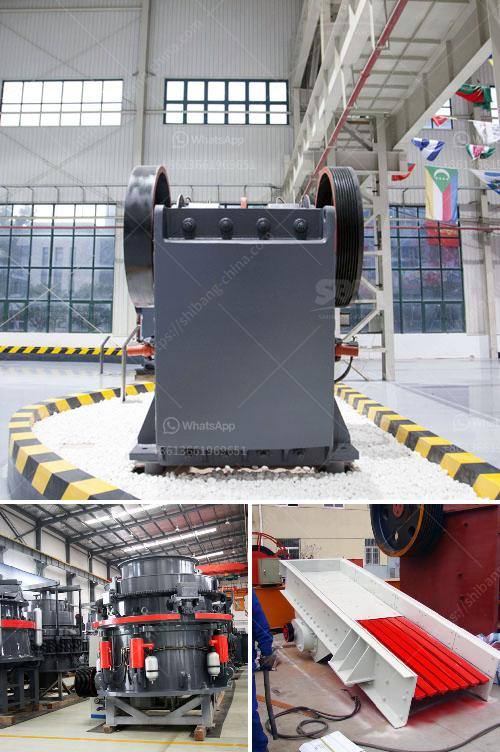

<h3>manganese crusing and processing shipping</h3>
Manganese is a critical metal that has applications across various industries, making its extraction, crushing, and processing crucial for global supply chains. Its significance lies in its unique properties, which make it an indispensable component in the production of steel, battery cells, and many other essential products. This article will explore the process of manganese crushing and processing, with a particular focus on the transportation of manganese ore.

The process of manganese extraction typically begins with crushing the mined ore into smaller pieces. Crushing is a vital step as it enables the liberation of valuable minerals locked within the ore. Once the ore is reduced in size, it undergoes further processing through beneficiation methods such as gravity concentration, magnetic separation, or flotation. These techniques aim to separate manganese minerals from other unwanted substances, refining the ore to ultimately produce manganese concentrate.

After the extraction and processing phases, manganese concentrate is transported to different destinations around the world for further refinement and utilization. Shipping plays a crucial role in ensuring the efficient and cost-effective transportation of manganese concentrate. This necessitates the need for reliable shipping methods that are flexible and can cater to the specific requirements of manganese exporters.

The transportation of manganese concentrate requires careful consideration of several key factors. Firstly, the concentrate's physical properties, including particle size, moisture content, and bulk density, must be well-understood to determine the most suitable shipping method. Secondly, the distance and destination of the shipment dictate the choice of transportation mode, whether it be by sea, land, or air. Sea transportation is the most commonly used method due to its cost-effectiveness for large-scale exports.

Shipping manganese concentrate by sea involves a series of steps, starting with the loading of the ore onto specialized vessels known as bulk carriers. These ships are designed to transport large quantities of dry bulk cargoes efficiently. Prior to loading, the moisture content of the concentrate must be carefully controlled to comply with international shipping regulations and prevent cargo damage.

Once loaded, the bulk carriers sail to their destination, where the manganese concentrate is offloaded using specialized equipment such as cranes and grab buckets. The concentrate is then transported to refineries or processing facilities for further treatment or directly employed in various industrial applications.

Efficient shipping logistics are essential for ensuring a steady supply of manganese concentrate to manufacturers and consumers worldwide. Any disruptions in the shipping process, such as prolonged delays or damages to the cargo, can have significant impacts on downstream industries dependent on manganese supply. Hence, maintaining a reliable shipping network and close coordination between exporters, shipping companies, and ports is critical to ensure the timely and secure delivery of manganese concentrate.

In conclusion, manganese crushing and processing are vital stages in the overall production of this critical metal. The subsequent shipping of manganese concentrate to various destinations worldwide is equally essential to sustain global supply chains. With growing demands for manganese in industries such as steel production and battery manufacturing, efficient and reliable shipping logistics become increasingly crucial to meet market needs. By understanding the intricacies of manganese crushing, processing, and transportation, stakeholders can work collaboratively to ensure a smooth flow of this indispensable metal.
<h3>Contact us</h3><ul><li><strong>Whatsapp:&nbsp;<a href="https://wa.me/8613661969651">+8613661969651</a></strong></li><li><a href="https://swt.shibang-china.com/?git&amp;zhl&amp;manganese crusing and processing shipping"><strong>Online Service(chat now)</strong></a></li></ul><h3>Related</h3><ul><li><a href='gypsum factory in ethiopia.md'>gypsum factory in ethiopia</a></li><li><a href='gravel gravel and sand mining equipment.md'>gravel gravel and sand mining equipment</a></li><li><a href='copper crusher manufacturer in turkey.md'>copper crusher manufacturer in turkey</a></li><li><a href='powder grinfing mill sale.md'>powder grinfing mill sale</a></li><li><a href='hard stone aggregate crusher price.md'>hard stone aggregate crusher price</a></li></ul>