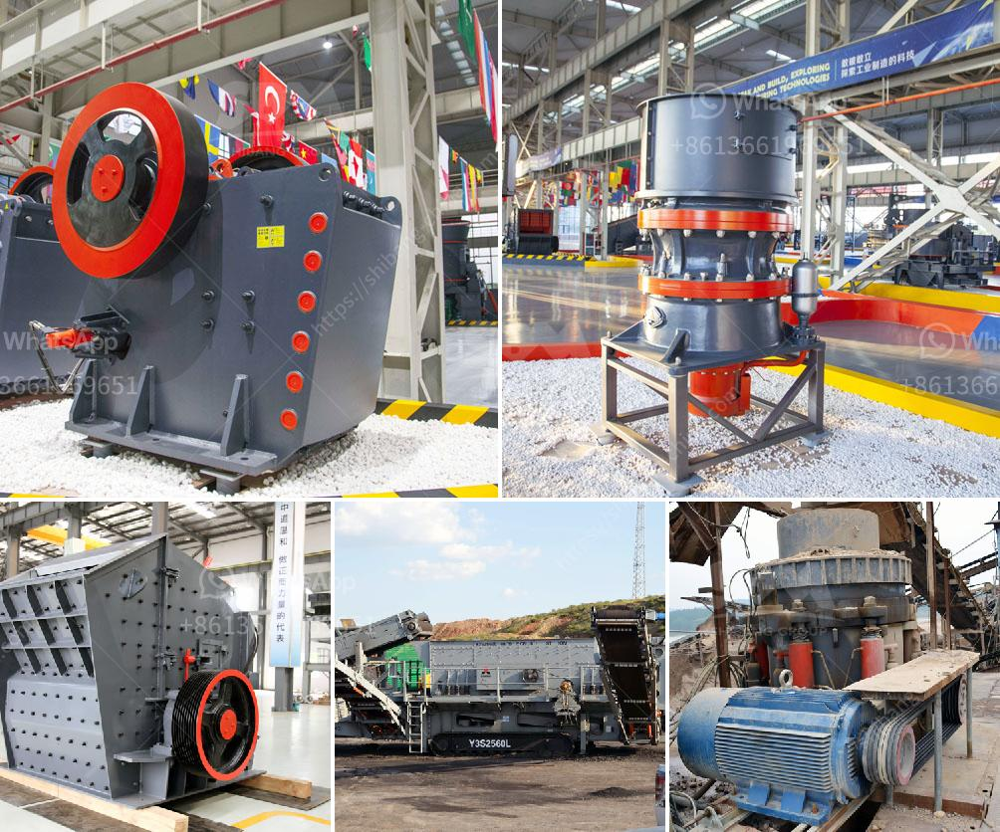

<h3>manganese mobile processing plants</h3>
Manganese is a critical mineral used in various industries, including steel production, battery manufacturing, and even agriculture. As its demand continues to rise, so does the need for efficient processing plants that can extract manganese from its ores with maximum productivity. This is where manganese mobile processing plants come into play, revolutionizing the mining industry and offering new possibilities for increased efficiency, reduced costs, and improved sustainability.

Traditionally, manganese processing plants were established in fixed locations near the mines, leading to significant transportation costs and environmental impacts associated with the movement of raw materials. However, the advent of mobile processing plants has paved the way for a more sustainable and economically viable approach.

These innovative mobile units are self-contained and can be easily transported to different mine sites, enabling the processing of manganese directly at the source. By eliminating the need for complex transportation logistics, these plants significantly reduce carbon emissions and fuel consumption, making them a greener alternative for manganese production.

Another advantage of manganese mobile processing plants is their ability to be quickly deployed and operational within a short period. With traditional fixed plants, the construction process can take months, if not years, making it difficult for mining companies to react promptly to fluctuating market demands. On the other hand, mobile processing plants can be set up within days, allowing for a more flexible response to changing manganese prices and supply needs.

One key feature of mobile processing plants is their compact design, allowing them to be easily transported on standard trucks. These units are equipped with state-of-the-art technologies that enable efficient ore processing, including crushing, screening, and separation. Moreover, advancements in automation and remote monitoring have enhanced the performance and accuracy of these plants, reducing the need for manual labor and minimizing human error.

Furthermore, mobile processing plants are equipped with advanced filtration and water treatment systems, ensuring responsible water usage and minimizing the environmental impact. This is particularly important considering that manganese mining and processing involve significant water consumption and potential contamination risks. By integrating sustainable water management practices, these mobile units contribute to the preservation of local ecosystems and water resources.

The economic benefits of using manganese mobile processing plants are also substantial. Firstly, the reduced transportation costs result in significant savings for mining companies, enabling them to allocate more resources towards innovation and expansion. Secondly, the increased operational flexibility allows for better optimization of production schedules, meeting market demands in a timely manner and maximizing profits.

In conclusion, manganese mobile processing plants have revolutionized the mining industry by providing a sustainable, efficient, and cost-effective solution for extracting this critical mineral. With their ability to be quickly deployed and operational at the source, these mobile units offer mining companies newfound flexibility and agility in responding to market needs. By reducing transportation costs, carbon emissions, and environmental impacts, mobile processing plants are paving the way for a greener and more sustainable future for manganese mining.
<h3>Contact us</h3><ul><li><strong>Whatsapp:&nbsp;<a href="https://wa.me/8613661969651">+8613661969651</a></strong></li><li><a href="https://swt.shibang-china.com/?git&amp;zhl&amp;manganese mobile processing plants"><strong>Online Service(chat now)</strong></a></li></ul><h3>Related</h3><ul><li><a href='cost setting up limestone mine.md'>cost setting up limestone mine</a></li><li><a href='screw conveyor design calculation.md'>screw conveyor design calculation</a></li><li><a href='manufacture of ball mill stator.md'>manufacture of ball mill stator</a></li><li><a href='quarry crusher machine usa.md'>quarry crusher machine usa</a></li><li><a href='marble and granite plant.md'>marble and granite plant</a></li></ul>