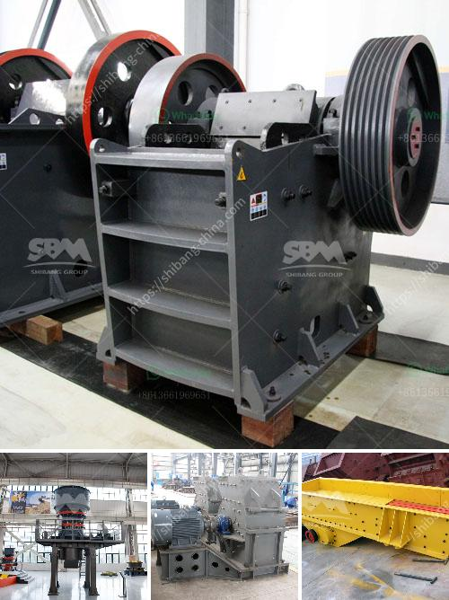

<h3>manufacture of ball mill stator</h3>
The manufacturing process of a ball mill stator is a complex and precise process that involves various steps to ensure the quality and functionality of the product. From raw materials to the final product, every stage requires careful attention to detail and expertise.

The first step in the manufacturing process is the selection of suitable materials. The stator, which forms the core of the ball mill, is typically made from high-quality steel or cast iron. The choice of material depends on factors such as the type of ball mill, the operating conditions, and the desired performance of the stator.

Once the material is selected, the next step is to prepare it for processing. This involves cutting the material into the desired shape and size using state-of-the-art machinery and tools. Precision cutting ensures that the stator will fit perfectly into the ball mill, allowing for efficient operation and minimal wear and tear.

After the initial shaping, the stator is subjected to a series of machining operations. These operations include drilling, milling, and turning, which are carried out with extreme precision to achieve the desired dimensional accuracy and surface finish. CNC machines are commonly used during this stage to ensure the highest level of accuracy and repeatability.

One critical aspect of the stator manufacturing process is the winding of the stator coils. The coils are typically made from copper or aluminum wire and are wound around the stator core in a specific pattern. The winding process requires skilled technicians who carefully wind and connect each coil to ensure proper electrical conductivity and stability.

Once the winding is complete, the stator undergoes a series of quality control tests to ensure its performance and reliability. These tests include checks for insulation resistance, electrical continuity, and mechanical stability. Any defects or issues found during the testing phase are addressed and corrected before the stator is considered ready for assembly.

Finally, the fully assembled stator is subjected to a final inspection to ensure that it meets all quality standards and specifications. This includes checks for proper fit and alignment within the ball mill, as well as overall functionality and performance. Any necessary adjustments or modifications are made at this stage to ensure the stator's optimal performance.

In conclusion, the manufacture of a ball mill stator involves a meticulous and comprehensive process to create a high-quality and functional component. Each step, from material selection and preparation to machining, winding, and final assembly, requires expertise and attention to detail. By following stringent quality control measures, manufacturers can ensure that the ball mill stator meets the exact requirements of the application and contributes to the overall efficiency and reliability of the ball mill system.
<h3>Contact us</h3><ul><li><strong>Whatsapp:&nbsp;<a href="https://wa.me/8613661969651">+8613661969651</a></strong></li><li><a href="https://swt.shibang-china.com/?git&amp;zhl&amp;manufacture of ball mill stator"><strong>Online Service(chat now)</strong></a></li></ul><h3>Related</h3><ul><li><a href='project proposal for gypsum manufacturing.md'>project proposal for gypsum manufacturing</a></li><li><a href='coal mill manufacturers.md'>coal mill manufacturers</a></li><li><a href='manufacturers of conveyor belts.md'>manufacturers of conveyor belts</a></li><li><a href='hammer mills semarang.md'>hammer mills semarang</a></li><li><a href='portable hammer mill for gold ore.md'>portable hammer mill for gold ore</a></li></ul>