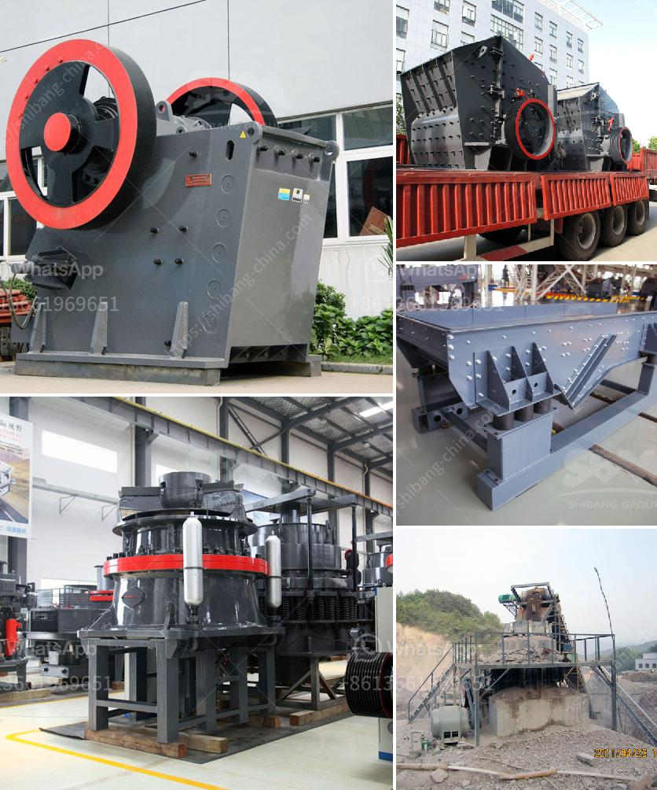

<h3>manufactured sand screening machine</h3>
The construction industry is flowing towards modernization, embracing new technologies to enhance the quality and durability of building materials. One such innovative solution that has gained immense popularity in recent years is manufactured sand, also known as M-sand. M-sand is a substitute for natural river sand and is preferred due to its fine texture and eco-friendly nature. However, the process of producing high-quality M-sand involves numerous challenges, especially in terms of screening the sand particles accurately. This is where the manufactured sand screening machine comes into play, revolutionizing the construction industry.

The manufactured sand screening machine acts as a game-changer in the production of M-sand. It streamlines the production process and ensures that the sand particles possess the desired properties. The machine consists of several components, including a vibrating screen, motors, controls, and optional water sprays. It efficiently screens the sand particles, segregates them according to size, and removes any impurities or contaminants present, resulting in a superior-quality product.

One of the significant advantages of using a manufactured sand screening machine is its ability to achieve consistent gradation. The machine can be calibrated to produce sand particles of a specific size, which is crucial for various construction applications. This ensures a uniform mix while preparing concrete or mortar, thus enhancing the overall strength and durability of the structures. Moreover, the machine's adjustable settings enable the production of different grades of sand, catering to the specific requirements of construction projects.

Another noteworthy aspect of the manufactured sand screening machine is its efficiency in removing impurities and contaminants. River sand often contains impurities like clay, silt, and organic matter, which can adversely affect the quality of the sand. The screening machine effectively separates these impurities, ensuring a clean and pure sand product. This eliminates the need for additional washing or treatment processes, reducing overall costs and enhancing the environmental sustainability of the construction process.

Furthermore, the manufactured sand screening machine offers exceptional versatility. It can be integrated into existing sand production units or used as a standalone machine, depending on the specific needs of the project. This flexibility allows construction companies to optimize their sand production operations, saving time and resources. Additionally, the machine's compact design and ease of installation make it ideal for both small-scale and large-scale construction projects.

In conclusion, the manufactured sand screening machine has revolutionized the construction industry by providing a reliable and efficient solution for producing high-quality M-sand. Its ability to achieve consistent grading, remove impurities, and offer versatility has made it an invaluable asset in sand production units across the globe. As the demand for sustainable and eco-friendly construction materials continues to rise, the manufactured sand screening machine will continue to play a pivotal role in shaping the future of the construction industry.
<h3>Contact us</h3><ul><li><strong>Whatsapp:&nbsp;<a href="https://wa.me/8613661969651">+8613661969651</a></strong></li><li><a href="https://swt.shibang-china.com/?git&amp;zhl&amp;manufactured sand screening machine"><strong>Online Service(chat now)</strong></a></li></ul><h3>Related</h3><ul><li><a href='mineral materials crushers.md'>mineral materials crushers</a></li><li><a href='graphite powder machine.md'>graphite powder machine</a></li><li><a href='rock crusher gravel production.md'>rock crusher gravel production</a></li><li><a href='cost gravel crusher.md'>cost gravel crusher</a></li><li><a href='sand washing plant for sale in south africa.md'>sand washing plant for sale in south africa</a></li></ul>