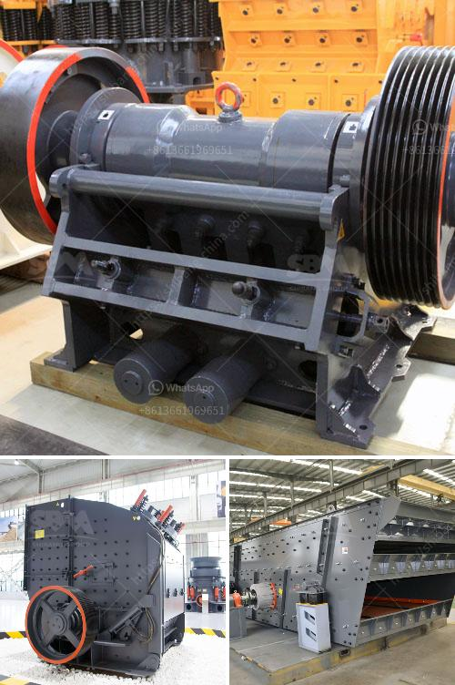

<h3>manufacturer of ball mill companies indonesia</h3>
The manufacturing industry in Indonesia has grown immensely due to the country's favorable economic conditions and supportive government policies. Over the years, several companies have emerged as leading manufacturers of ball mills, contributing significantly to the growth of the industry.

One such company is PT Dingbo Indonesia Jaya, a leading manufacturer of mining machinery and equipment. The company specializes in designing and manufacturing ball mills that are characterized by their high operational efficiency, low maintenance, and user-friendly features. With a team of highly skilled engineers and technicians, PT Dingbo Indonesia Jaya has garnered a reputation for delivering high-quality products that meet international standards.

Another prominent player in the manufacturing of ball mills is PT Sanco Indonesia. The company manufactures various types of industrial machinery such as chocolate moulding machines, biscuit machines, and ball mills used in the mining industry. With its state-of-the-art manufacturing facilities and cutting-edge technology, PT Sanco Indonesia has established itself as a reliable and trusted name among its customers.

These manufacturers understand the importance of continuous innovation and product development to stay ahead in the market. They invest heavily in research and development to improve the functionality and performance of their ball mills, ensuring that they meet the evolving needs of their customers.

Furthermore, these companies are also committed to providing excellent after-sales service and support to their clients. This includes timely maintenance, spare parts availability, and technical assistance whenever required. By focusing on customer satisfaction, these manufacturers have been able to build long-lasting relationships with their clients and secure their position in the competitive market.

As Indonesia continues to witness economic growth and industrialization, the demand for ball mills is expected to rise. Manufacturers like PT Dingbo Indonesia Jaya and PT Sanco Indonesia are well-positioned to cater to this demand, offering technologically advanced and efficient ball mills. With their commitment to quality and customer satisfaction, these companies are making significant contributions to the growth and development of the manufacturing industry in Indonesia.
<h3>Contact us</h3><ul><li><strong>Whatsapp:&nbsp;<a href="https://wa.me/8613661969651">+8613661969651</a></strong></li><li><a href="https://swt.shibang-china.com/?git&amp;zhl&amp;manufacturer of ball mill companies indonesia"><strong>Online Service(chat now)</strong></a></li></ul><h3>Related</h3><ul><li><a href='crush cobble machine.md'>crush cobble machine</a></li><li><a href='used sand mobile washing equipment.md'>used sand mobile washing equipment</a></li><li><a href='jaw crusher shaft parts diagram.md'>jaw crusher shaft parts diagram</a></li><li><a href='buy sand washing plant in sri lanka.md'>buy sand washing plant in sri lanka</a></li><li><a href='gypsum import from bhutan.md'>gypsum import from bhutan</a></li></ul>