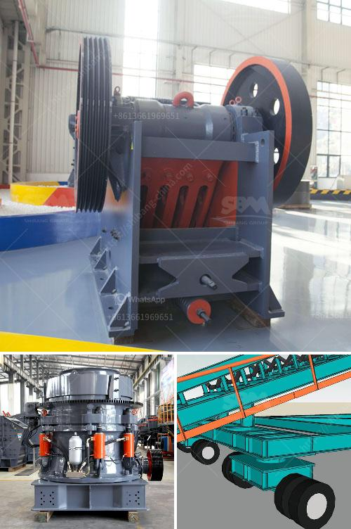

<h3>manufacturers of conveyor belts</h3>
In the world of manufacturing and industrial processes, conveyor belts play a crucial role in the efficient movement of materials and products. Whether it's in the mining, automotive, food processing, or logistics industries, conveyor belts have become an essential part of the production line, speeding up processes and ensuring smooth operations. And behind these vital components are the manufacturers who design and produce conveyor belts tailored to meet the specific needs of various industries.

Manufacturers of conveyor belts are responsible for creating durable, high-quality products that can withstand the rigors of industrial environments. These companies are at the forefront of innovation, continuously developing and improving conveyor belt designs to maximize efficiency, reduce downtime, and ensure workplace safety.

One of the key aspects of conveyor belt manufacturing is understanding the specific requirements of different industries. For example, mining companies typically require heavy-duty conveyor belts capable of withstanding harsh environment conditions and carrying heavy loads. These belts need to be resistant to abrasion, chemicals, and extreme temperatures. On the other hand, food processing companies demand conveyor belts that are safe for direct food contact, with considerations for hygiene, easy cleaning, and compliance with industry standards. Conveyor belt manufacturers work closely with industry professionals to design belts that meet these specific needs.

Conveyor belt manufacturers utilize a variety of materials to create belts that suit different applications. Common materials used include rubber, PVC, polyurethane, and nylon. Rubber belts are known for their elasticity and durability, making them suitable for heavy-duty applications. PVC belts, on the other hand, provide excellent chemical resistance and are therefore preferred in industries handling corrosive substances. Polyurethane belts are highly flexible, making them ideal for applications requiring tight turns or complex geometries. Nylon belts offer excellent strength and durability, making them suitable for heavy-duty operations.

One significant advancement in the manufacturing of conveyor belts is the integration of technology. Conveyor belts equipped with sensors, automation systems, and smart monitoring tools allow for real-time tracking of belt performance, preventing potential breakdowns or failures. This technology provides manufacturers with valuable data and insights to optimize maintenance schedules and keep production lines running smoothly.

Additionally, conveyor belt manufacturers have been increasingly incorporating sustainability into their manufacturing processes. Many companies are adopting eco-friendly practices, such as using recycled materials in belt production and implementing energy-efficient manufacturing techniques. These initiatives reduce waste, lower carbon footprints, and contribute to a more sustainable industry overall.

Moreover, manufacturers of conveyor belts go beyond producing standard products. They also offer customized solutions to meet the unique needs of individual companies. From customized belt shapes and sizes to special coatings or additives for increased strength or temperature resistance, conveyor belt manufacturers work closely with their clients to develop tailored solutions that optimize productivity and efficiency.

In conclusion, manufacturers of conveyor belts play a vital role in the material handling industry. With their expertise in designing, producing, and customizing conveyor belts, they ensure smooth, efficient operations across various sectors. Harnessing innovation, utilizing diverse materials, integrating technology, and promoting sustainability, these manufacturers continue to pave the way for improved material handling and the future of industrial production.
<h3>Contact us</h3><ul><li><strong>Whatsapp:&nbsp;<a href="https://wa.me/8613661969651">+8613661969651</a></strong></li><li><a href="https://swt.shibang-china.com/?git&amp;zhl&amp;manufacturers of conveyor belts"><strong>Online Service(chat now)</strong></a></li></ul><h3>Related</h3><ul><li><a href='machine to crush quartz into powder.md'>machine to crush quartz into powder</a></li><li><a href='magnesium sulfate production line equipment.md'>magnesium sulfate production line equipment</a></li><li><a href='ball mill operating rpm calculation.md'>ball mill operating rpm calculation</a></li><li><a href='wet process of cement production.md'>wet process of cement production</a></li><li><a href='price of stone crusher machine.md'>price of stone crusher machine</a></li></ul>