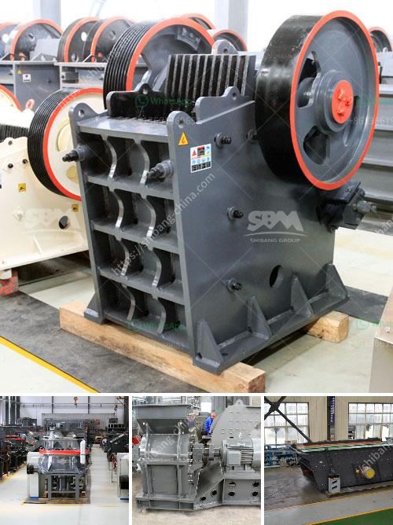

<h3>manufactures hammer mills</h3>
Hammer mills are powerful grinding machines that crush and grind material into a fine powder or paste. These machines are widely used in various industries, such as agriculture, mining, and construction, to break down raw material into smaller pieces. They are particularly essential in the production of animal feed, biofuels, and wood products.

Manufacturers of hammer mills understand the importance of creating durable machines that can withstand the harsh conditions of industrial processes. As a result, they design and engineer these machines with high-quality materials and advanced features to ensure long-lasting performance and efficiency.

One key feature of modern hammer mills is their ability to control the size and consistency of the output material. Adjustable screens and varying hammer configurations allow operators to achieve the desired particle size for different applications. This versatility makes hammer mills ideal for a wide range of operations, from crushing corn and soybeans for animal feed to pulverizing wood chips for biomass fuel.

Furthermore, manufacturers have incorporated safety features into hammer mills to protect operators and prevent accidents. These safety measures include emergency stop buttons, safety grates, and interlocks that shut down the machine automatically if any abnormality is detected.

Moreover, manufacturers are constantly innovating and improving their hammer mill designs to optimize efficiency and reduce energy consumption. This includes the use of energy-saving motors, efficient cooling systems, and advanced control panels that allow for precise monitoring and adjustment of operational parameters.

In conclusion, manufacturers of hammer mills play a crucial role in meeting the demands of various industries. By producing reliable and efficient machines, they enable businesses to process raw materials more effectively and efficiently. With continuous technological advancements and a focus on safety and sustainability, hammer mills are poised to remain an indispensable tool for many industries in the years to come.
<h3>Contact us</h3><ul><li><strong>Whatsapp:&nbsp;<a href="https://wa.me/8613661969651">+8613661969651</a></strong></li><li><a href="https://swt.shibang-china.com/?git&amp;zhl&amp;manufactures hammer mills"><strong>Online Service(chat now)</strong></a></li></ul><h3>Related</h3><ul><li><a href='crusher concrete kuwait.md'>crusher concrete kuwait</a></li><li><a href='dealers of grinding mills in uganda.md'>dealers of grinding mills in uganda</a></li><li><a href='quartz powder machine manufacturer in india.md'>quartz powder machine manufacturer in india</a></li><li><a href='setting up a quarry in nigeria.md'>setting up a quarry in nigeria</a></li><li><a href='hammer mill for sale in zimbabwe.md'>hammer mill for sale in zimbabwe</a></li></ul>