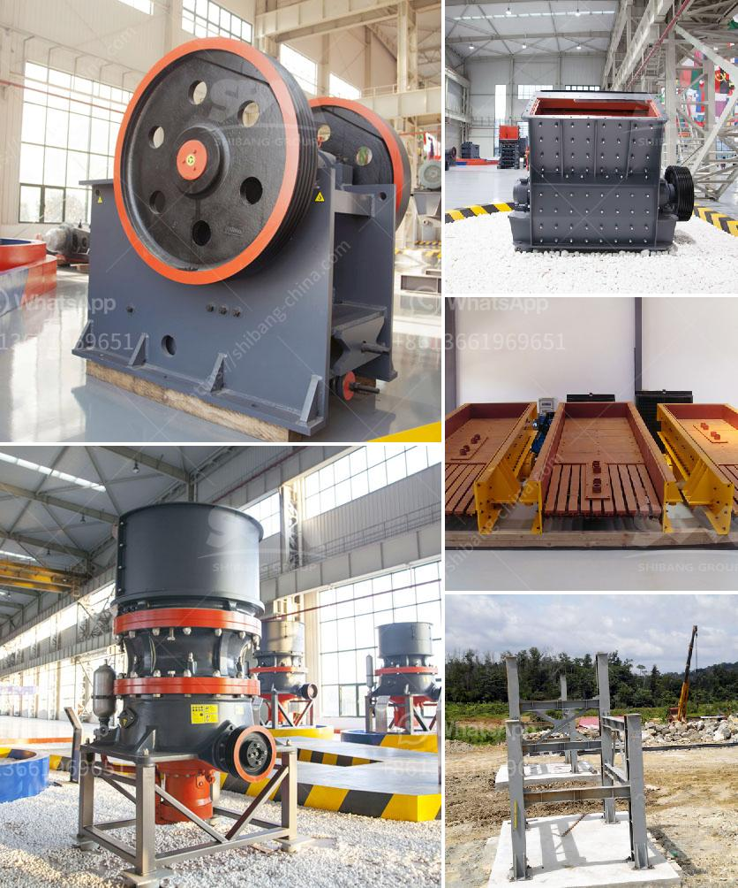

<h3>manufacturing process of calcium carbonate</h3>
Calcium carbonate is a versatile compound that is widely used in various industries, including the manufacturing of paper, plastics, paints, and construction materials. It is primarily obtained from the mining and processing of natural limestone deposits, but it can also be produced synthetically through different manufacturing processes.

The most common method of manufacturing calcium carbonate is through the extraction and purification of natural limestone. Limestone is a sedimentary rock that is mainly composed of calcium carbonate minerals (calcite and aragonite). It is extracted from quarries and underground mines using drilling and blasting techniques.

Once the limestone is extracted, it undergoes a series of crushing, grinding, and screening processes to produce various sizes of calcium carbonate particles. These particles are further processed through different techniques to obtain the desired grade and characteristics.

One of the main manufacturing processes for calcium carbonate is the wet method, also known as the carbonation process. In this process, limestone is first dissolved in an acid, such as hydrochloric acid or carbon dioxide, to form calcium chloride or calcium bicarbonate solutions. These solutions are then reacted with a source of carbonate ions, such as soda ash (sodium carbonate), to precipitate calcium carbonate.

The precipitated calcium carbonate is then filtered, washed, and dried to remove any impurities. It is further processed through grinding and classification steps to achieve the desired particle size distribution. The final product, known as ground calcium carbonate (GCC), is commonly used in various industrial applications.

Another manufacturing process for calcium carbonate is the dry method. In this process, limestone is crushed and pulverized into a fine powder. This powder is then subjected to high temperatures in a kiln or furnace to produce calcium oxide (also known as quicklime). The quicklime is then slaked with water to produce calcium hydroxide, which is further carbonated to form calcium carbonate.

The dry method is often used to produce precipitated calcium carbonate (PCC), which has a more uniform particle size and shape than GCC. PCC is commonly used in the manufacturing of paper, where its high brightness and opacity improve the printability and color reproduction.

In addition to these primary manufacturing processes, there are also various modification and surface treatment techniques that can be applied to calcium carbonate to enhance its performance and functionality. These techniques include surface coating, dispersion, and blending with other additives.

Overall, the manufacturing process of calcium carbonate involves the extraction and purification of natural limestone or the production of synthetic calcium oxide, which is then converted into calcium carbonate through carbonation or other chemical reactions. The resulting product is widely used in industries that require a versatile and reliable compound with excellent physical and chemical properties.
<h3>Contact us</h3><ul><li><strong>Whatsapp:&nbsp;<a href="https://wa.me/8613661969651">+8613661969651</a></strong></li><li><a href="https://swt.shibang-china.com/?git&amp;zhl&amp;manufacturing process of calcium carbonate"><strong>Online Service(chat now)</strong></a></li></ul><h3>Related</h3><ul><li><a href='used silica crushing plants for sale.md'>used silica crushing plants for sale</a></li><li><a href='barite crusher equipment.md'>barite crusher equipment</a></li><li><a href='rent a rock crusher saudi.md'>rent a rock crusher saudi</a></li><li><a href='petroleum coke mill.md'>petroleum coke mill</a></li><li><a href='crushing and screening of aggregates in mexico.md'>crushing and screening of aggregates in mexico</a></li></ul>