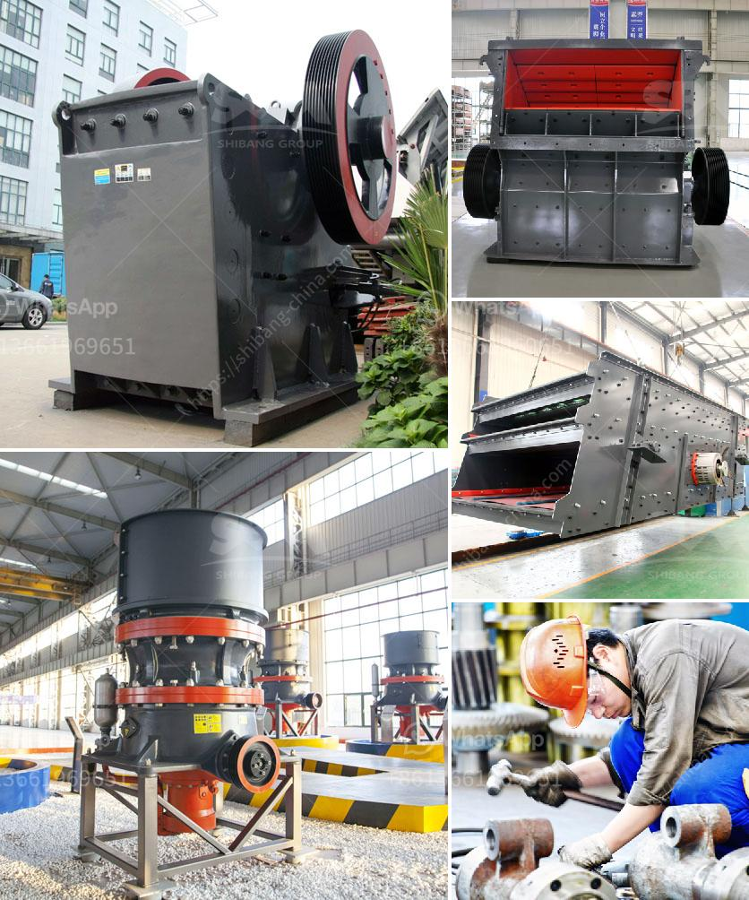

<h3>marble and granite plant</h3>
Marble and granite are two stunning natural stones that have been used for centuries in architecture and design. Both have distinct qualities and characteristics that make them highly sought after in the construction industry. The process of extracting, processing, and transforming marble and granite into functional products is a complex and fascinating one. In this article, we will explore the world of marble and granite plants and delve into the various stages involved in their production.

Marble and granite plants are specialized facilities where these stones are extracted from quarries and then processed into slabs, tiles, and other custom-made products. These plants serve as the backbone of the stone industry, ensuring that the raw materials undergo the necessary treatments to meet market demands.

The first step in the process is quarrying. Marble and granite quarries are meticulously selected based on the quality and color of the stone available. Modern quarrying techniques involve the use of machinery such as diamond wire saws, chainsaws, and explosive charges to extract large blocks of stone. This process requires skilled laborers with experience in handling heavy machinery and ensuring the safety of workers.

Once the blocks are extracted, they are transported to the marble and granite plant for further processing. This involves cutting the blocks into slabs of varying thickness using gang saws or wire saws. The slabs are then polished to achieve the desired finish. Polishing machines equipped with diamond abrasives pass over the surface of the slabs, gradually smoothing and bringing out the natural beauty of the stone.

After the polishing process, the slabs are inspected to ensure that they meet the required quality standards. Any imperfections or defects are painstakingly removed or repaired by skilled craftsmen. This attention to detail is what sets marble and granite plants apart, as they strive to deliver flawless products to their customers.

From here, the slabs can be further processed into various products like tiles, countertops, or even intricate sculptures. Waterjet cutting machines are commonly used for intricate designs, while special machinery is used for edge profiling and finishing. These processes require skilled technicians who possess a keen eye for detail and precision.

The final step in the production cycle is packaging and distribution. Once the marble and granite products are completed, they are carefully packaged to prevent any damage during transportation. The packages are then loaded onto trucks or shipping containers, ready to be delivered to customers around the world.

Marble and granite plants play a significant role in the global stone industry, providing the materials and expertise needed to create stunning architectural masterpieces. These plants are not only responsible for transforming raw stones into works of art but also for contributing to the local economy by creating jobs and supporting the communities in which they operate.

In conclusion, marble and granite plants are integral to the stone industry. The extraction, processing, and transformation of these natural stones require skilled labor, specialized machinery, and a commitment to quality. The end result is a wide range of products that can be used to enhance the beauty and functionality of any space. Whether it's a luxurious countertop or an exquisite sculpture, marble and granite plants ensure that these stones are brought to life in the most elegant and durable way.
<h3>Contact us</h3><ul><li><strong>Whatsapp:&nbsp;<a href="https://wa.me/8613661969651">+8613661969651</a></strong></li><li><a href="https://swt.shibang-china.com/?git&amp;zhl&amp;marble and granite plant"><strong>Online Service(chat now)</strong></a></li></ul><h3>Related</h3><ul><li><a href='mode of oeration of a gyratory crusher.md'>mode of oeration of a gyratory crusher</a></li><li><a href='the cost of a clay brick making machine in south africa.md'>the cost of a clay brick making machine in south africa</a></li><li><a href='conveyor belts equipment in gauteng.md'>conveyor belts equipment in gauteng</a></li><li><a href='stone crushing business in pakistan.md'>stone crushing business in pakistan</a></li><li><a href='industrial uses of white marble powder.md'>industrial uses of white marble powder</a></li></ul>