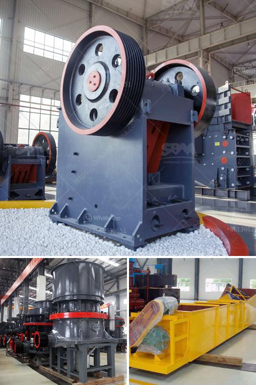

<h3>marble crusher equipment</h3>
Marble is a metamorphic rock formed by the recrystallization of limestone under high pressure and temperature. Marble is generally composed of calcite, dolomite, or a combination of both. The beautiful patterns and striking colors make marble a popular material for various construction and decorative purposes.

One important aspect of working with marble is crushing it into smaller pieces, which can then be used for different applications. This is where marble crusher equipment comes into play. These machines are specifically designed to break down marble into more manageable sizes.

Marble crusher equipment is characterized by its robust construction, easy maintenance, energy efficiency, and low operating costs. These crushers are ideal for crushing various types of marble, including limestone, dolomite, serpentine, and even granite.

Marble crusher equipment usually includes vibrating feeder, jaw crusher, impact crusher, cone crusher, hammer crusher, and mobile crusher. Different crushing equipment has different crushing capacities, making it ideal for various marble crushing applications.

When choosing the marble crusher equipment, it is important to consider the hardness, fragility, and abrasiveness of the marble. Additionally, the desired final product size and shape will also influence the type of crusher to be used.

Marble crusher equipment is widely used in construction, mining, and other industries. Its advanced technology and unique design ensure that it can efficiently crush marble and convert it into useful materials. This equipment enhances productivity and reduces the need for manual labor, making it a cost-effective option for marble crushing.

In conclusion, marble crusher equipment plays a vital role in the process of transforming marble into various useful materials. With its robust construction, energy efficiency, and low operating costs, this equipment allows for efficient and effective crushing of marble. Whether used for construction or decorative purposes, marble crusher equipment offers a reliable and practical solution.
<h3>Contact us</h3><ul><li><strong>Whatsapp:&nbsp;<a href="https://wa.me/8613661969651">+8613661969651</a></strong></li><li><a href="https://swt.shibang-china.com/?git&amp;zhl&amp;marble crusher equipment"><strong>Online Service(chat now)</strong></a></li></ul><h3>Related</h3><ul><li><a href='stone crusher plant machinery.md'>stone crusher plant machinery</a></li><li><a href='oman marble quarry companies.md'>oman marble quarry companies</a></li><li><a href='ton day cement clinker grinding plant.md'>ton day cement clinker grinding plant</a></li><li><a href='quartz stone making machine.md'>quartz stone making machine</a></li><li><a href='gypsum machine in germany.md'>gypsum machine in germany</a></li></ul>