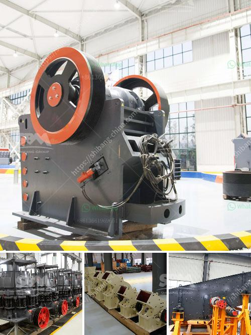

<h3>marble crusher machine in rajasthan</h3>
Marble, a wonderful natural resource found in abundance in Rajasthan, is known for its high quality and aesthetic appeal. Its popularity and demand in the construction industry have skyrocketed in recent years. However, to extract and process this beautiful stone, the use of advanced machinery is crucial. One such machine that plays a significant role in the marble industry is the marble crusher machine.

The marble crusher machine in Rajasthan has been successfully developed and improved by our company, aiming at the characteristics of marble's physical properties. It is widely used in metallurgy, mining, construction, chemical, electric power, transportation, and other industries. It has high crushing efficiency and can be used for medium and fine crushing of various ores and rocks with different hardness levels.

The marble crusher machine in Rajasthan adopts the principle of laminating crushing, which makes its finished product cube-shaped, with fewer needles and uniform particle size. In addition, it has reliable structure, high production efficiency, and smooth operation. Its hydraulic adjustment system greatly reduces downtime and improves work efficiency.

One of the biggest advantages of the marble crusher machine is its strong crushing capacity. It can crush the large-sized raw materials into smaller particles with a maximum feed size of 1500mm and a compressive strength below 350MPa. This enables it to process a wide range of materials, such as limestone, river pebble, dolomite, granite, and basalt.

Furthermore, the marble crusher machine in Rajasthan is widely used in many industries, including mining, construction, metallurgy, cement, chemical, refractory materials, ceramics, and so on. It has high processing power and is capable of crushing various materials with a compressive strength of up to 320 MPa.

With the rapid development of infrastructure construction in Rajasthan, the demand for high-quality marble products continues to rise. The marble crusher machine not only improves the production capacity and crushing efficiency but also expands the application range. Moreover, it effectively solves the problems such as short service life and easy wear of traditional crushers, making it an essential equipment in the marble industry.

In conclusion, the marble crusher machine in Rajasthan plays an important role in the marble industry. With its advanced technology and high crushing capacity, it can help improve the production efficiency of marble processing plants. Moreover, its application range in various industries makes it a versatile and valuable machine. As the demand for high-quality marble products continues to grow, the marble crusher machine will continue to play a vital role in meeting the market's needs and contributing to the development of Rajasthan's marble industry.
<h3>Contact us</h3><ul><li><strong>Whatsapp:&nbsp;<a href="https://wa.me/8613661969651">+8613661969651</a></strong></li><li><a href="https://swt.shibang-china.com/?git&amp;zhl&amp;marble crusher machine in rajasthan"><strong>Online Service(chat now)</strong></a></li></ul><h3>Related</h3><ul><li><a href='business plan for quarry.md'>business plan for quarry</a></li><li><a href='jaw crusher equipment alibaba.md'>jaw crusher equipment alibaba</a></li><li><a href='talc mineral processing.md'>talc mineral processing</a></li><li><a href='rotary dryer in cement industry.md'>rotary dryer in cement industry</a></li><li><a href='ball mill for silica sand.md'>ball mill for silica sand</a></li></ul>