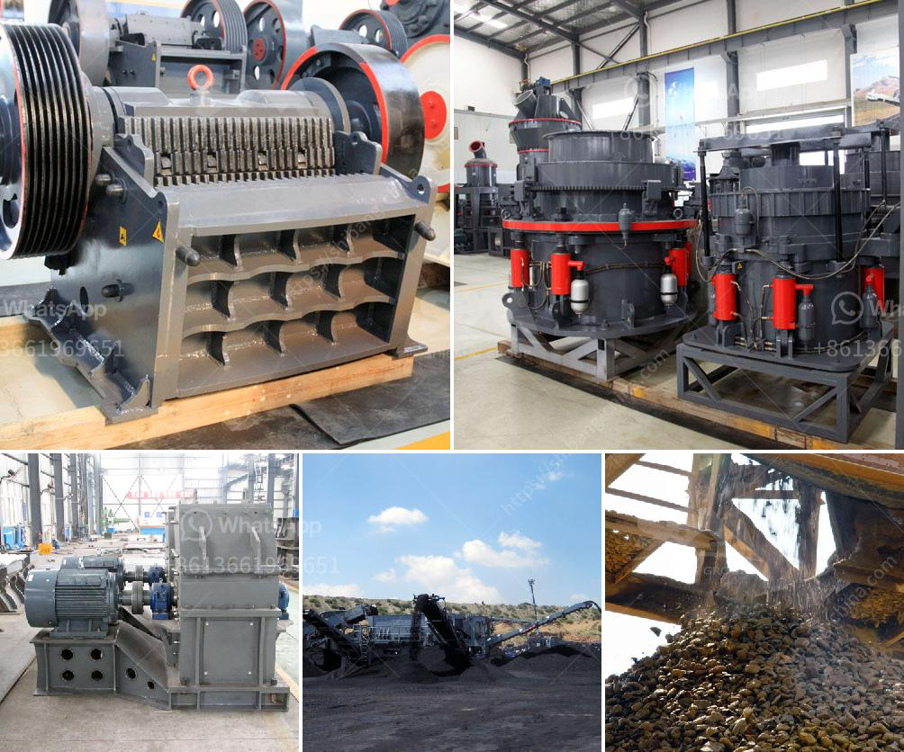

<h3>marble crusher machine</h3>
Marble, a type of metamorphic rock formed under high temperature and pressure inside the earth's crust that provides a beautiful and elegant aesthetic in various forms, has been used in sculpture and construction for centuries. To transform raw marble into a refined product, it requires an advanced crushing machine.

A marble crusher machine is designed to break larger rocks into smaller pieces so they can be used in construction and other industrial applications. Highly reliable, durable, and efficient, marble crushers provide a competitive edge to industries such as marble, construction materials, and decorative art.

Marble discovering has been a fascinating art for centuries. Ancient civilizations have crafted breathtaking structures using marble, from the Taj Mahal in India to the Pantheon in Rome. Today, modern technology allows us to extract marble from quarries efficiently and convert it into valuable products.

Marble crushers play a significant role in the marble production process. They are responsible for the primary crushing of raw marble blocks and produce smaller-sized marble aggregates for ready mix concrete, asphalt production, and various other applications. What makes them indispensable in the marble industry is their high crushing ability and strong build.

1. Durability: The machine must be constructed with durable materials to withstand the rigorous nature of the marble industry. It should be able to handle the high impact forces generated during operation without wearing out quickly.

2. Crushing efficiency: To ensure maximum productivity, the machine must have a high crushing efficiency, reducing the large marble blocks into smaller, usable aggregates quickly and efficiently.

3. Versatility: A good marble crusher machine should be able to process different types of marble with varying degrees of hardness. This ensures that the machine can handle a wide range of applications and materials.

4. Ease of maintenance: A machine with easily accessible parts and simple maintenance routines can save time and costs in the long run. Regular maintenance and inspections can significantly extend the lifespan of the machine.

In conclusion, a high-quality marble crusher machine is essential for the processing and production of marble aggregates. It can bring greater efficiency and productivity to the marble industry. To find a reliable and trustworthy machine that meets all the necessary criteria, it is crucial to consider factors such as durability, crushing efficiency, versatility, and ease of maintenance. With the right choice, businesses can transform raw marble into exquisite structures and decorative pieces, ensuring the tradition and beauty of this natural stone continue to inspire for years to come.
<h3>Contact us</h3><ul><li><strong>Whatsapp:&nbsp;<a href="https://wa.me/8613661969651">+8613661969651</a></strong></li><li><a href="https://swt.shibang-china.com/?git&amp;zhl&amp;marble crusher machine"><strong>Online Service(chat now)</strong></a></li></ul><h3>Related</h3><ul><li><a href='almeida stone crusher.md'>almeida stone crusher</a></li><li><a href='egypt gypsum powder manufacturer.md'>egypt gypsum powder manufacturer</a></li><li><a href='silica sand production plant in germany.md'>silica sand production plant in germany</a></li><li><a href='ball mill for gold in south africa.md'>ball mill for gold in south africa</a></li><li><a href='alluvial gold mining methods in zimbabwe.md'>alluvial gold mining methods in zimbabwe</a></li></ul>