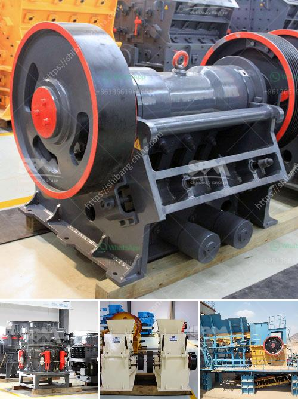

<h3>marble crushing line</h3>
Marble, a timeless and elegant natural stone, has been used for centuries in various architectural and decorative applications. From grand majestic structures to intricate sculptures, marble has played a significant role in showcasing the artistic prowess of humans. To bring out the true beauty of this stone, a marble crushing line is employed to extract and process this precious resource.

A marble crushing line consists of jaw crushers, cone crushers, vibrating feeders, and vibrating screens, which have been used in the marble crushing industry for a long time. The purpose of this process is to reduce the size of the marble mineral particles and obtain the desired products for various applications.

The first step in the marble crushing line is the excavation of the marble quarry. Proper planning and coordination are crucial to ensure the efficient extraction of marble blocks from the earth. Once the marble blocks are extracted, they are transported to the crushing site, where they are unloaded and further processed.

The primary crushers, usually heavy-duty jaw crushers, play a vital role in reducing the size of the marble blocks. These crushers utilize compression force to break down the marble into smaller pieces. The crushed materials then undergo further processing through cone crushers, which finely grind and shape them to achieve the desired product sizes.

Vibrating feeders are also an integral part of the marble crushing line. These feeders ensure a continuous supply of the marble blocks to the crushers by evenly distributing the material. The feeders prevent any congestion or blockages in the crushing line, ensuring a smooth and efficient operation.

To further enhance the efficiency of the crushing line, vibrating screens are employed. These screens separate the crushed materials into different sizes, allowing for the production of various products with specific dimensions. The use of multiple vibrating screens ensures precision and accuracy in size grading, contributing to the overall quality of the final products.

Marble crushing lines are not only used for producing raw materials for construction and decoration but also for creating finely crafted works of art. With the right combination of crushers, feeders, and screens, artisans can process the marble blocks to obtain materials suitable for creating sculptures, flooring tiles, countertops, and other intricate designs.

It is worth noting that proper maintenance and regular inspections are essential to ensure the longevity and optimal performance of the crushing line. Lubrication, cleaning, and replacement of worn parts are critical tasks that should be carried out regularly to prevent any breakdowns and ensure the smooth operation of the crushing line.

In conclusion, a marble crushing line serves as a vital component in the extraction and processing of this natural stone. Through the use of jaw crushers, cone crushers, vibrating feeders, and vibrating screens, the marble blocks are transformed into various products that enhance the beauty and elegance of architectural and decorative designs. Proper maintenance and regular inspections are crucial in maximizing the efficiency and performance of the crushing line, ensuring its longevity and uninterrupted operation.
<h3>Contact us</h3><ul><li><strong>Whatsapp:&nbsp;<a href="https://wa.me/8613661969651">+8613661969651</a></strong></li><li><a href="https://swt.shibang-china.com/?git&amp;zhl&amp;marble crushing line"><strong>Online Service(chat now)</strong></a></li></ul><h3>Related</h3><ul><li><a href='cost of starting a quarry business.md'>cost of starting a quarry business</a></li><li><a href='gold crushing plant.md'>gold crushing plant</a></li><li><a href='malaysian crusher plant manufacturer and supplier.md'>malaysian crusher plant manufacturer and supplier</a></li><li><a href='price quarry stone crusher.md'>price quarry stone crusher</a></li><li><a href='new technology stone crusher.md'>new technology stone crusher</a></li></ul>