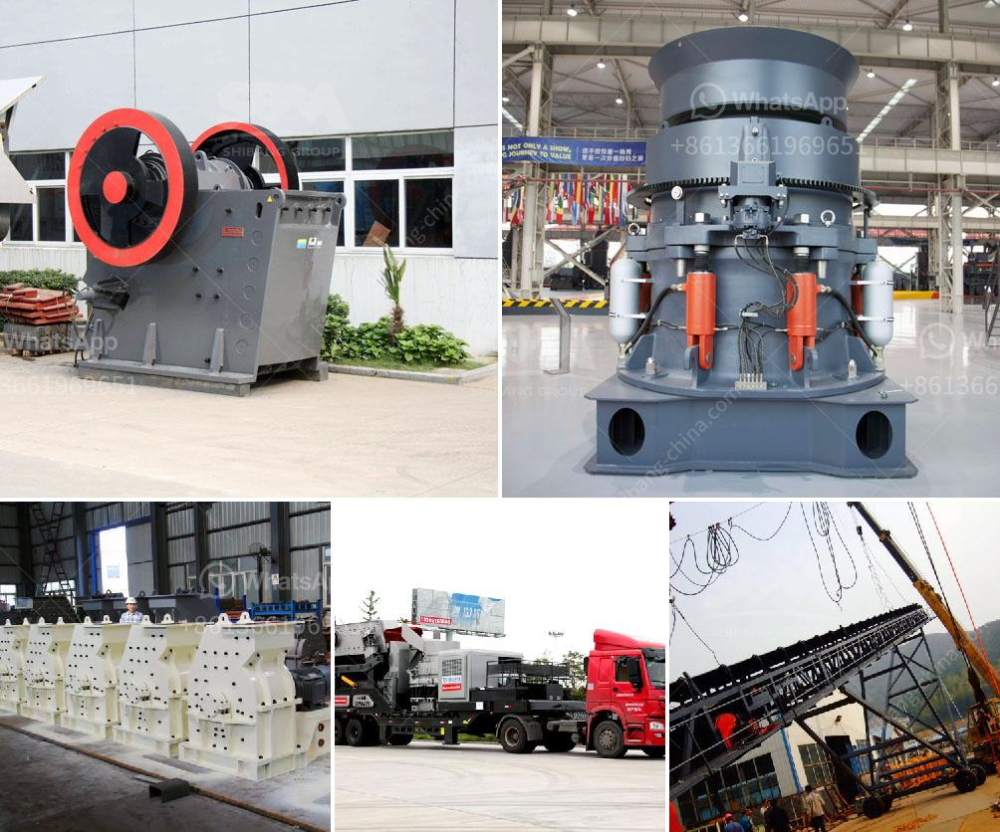

<h3>marble factory production line</h3>
Marble, renowned for its timeless beauty and elegance, has long been a symbol of luxury and sophistication. From ancient sculptures to modern architectural masterpieces, this exquisite stone has captivated the hearts of artists, architects, and designers for centuries. But have you ever wondered how marble is transformed from raw material into a work of art? Step inside a marble factory production line, a well-orchestrated symphony of machinery and craftsmanship, where this natural wonder receives its final form.

The production line of a marble factory is a carefully designed process that ensures the efficient transformation of raw marble blocks into exquisite finished products. The journey begins with the selection of high-quality marble blocks from quarries worldwide. These blocks are chosen based on their unique patterns, color variations, and structural integrity. Once selected, the blocks are transported to the factory, where the magic begins.

The first step on the production line is the cutting and shaping of the marble blocks. Huge diamond-tipped blades, fitted on computer-controlled cutting machines, slice through the solid blocks, creating slabs of various thicknesses. These slabs are then polished, giving them a smooth and glossy surface. The remaining waste material is also recycled and repurposed, reducing the environmental impact of the production process.

Next, the slabs are moved to the calibration stage. Here, automated machines ensure that the thickness of each slab is uniform, making them suitable for various applications like flooring, cladding, or countertops. This precision is crucial, as it guarantees a seamless installation and enhances the overall aesthetic appeal of the finished product.

After calibration, the slabs undergo various treatments, depending on the desired final look. Some slabs require additional polishing to achieve a mirror-like finish, while others may be honed, giving them a matte appearance. Surface treatments like flaming or brushing can also be applied to add texture and character to the marble.

Once the slabs are prepared, highly skilled craftsmen step in to give the marble its final form. Using state-of-the-art CNC machines, they cut intricate designs, shapes, and patterns into the marble. This process allows the creation of custom-made architectural elements, from staircases to ornate moldings, tailored to meet the precise requirements of each project.

Finally, the finished products are subjected to rigorous quality checks to ensure they meet the highest industry standards. Each piece is meticulously inspected for any visual defects or imperfections, guaranteeing that only flawless marble leaves the factory. The products are carefully packaged, ready to be delivered to construction sites, interior designers, and other discerning customers worldwide.

The production line of a marble factory is a blend of cutting-edge technology and traditional artisanal craftsmanship. It combines innovation and precision to transform a raw material into a masterpiece where nature's beauty shines through. From blocks of marble to perfectly customized products, every step of this fascinating process is a testament to the dedication of those involved in bringing this magnificent stone to life.

In conclusion, stepping into a marble factory production line is like entering a world of creativity and mastery. Through skillful handling and advanced machinery, raw marble blocks are transformed into mesmerizing works of art. This timeless wonder, cherished for its elegance and grandeur, continues to enthral and inspire generations to come.
<h3>Contact us</h3><ul><li><strong>Whatsapp:&nbsp;<a href="https://wa.me/8613661969651">+8613661969651</a></strong></li><li><a href="https://swt.shibang-china.com/?git&amp;zhl&amp;marble factory production line"><strong>Online Service(chat now)</strong></a></li></ul><h3>Related</h3><ul><li><a href='small concrete crusher.md'>small concrete crusher</a></li><li><a href='granite and marble business plan pdf.md'>granite and marble business plan pdf</a></li><li><a href='used coal washing plants for sale in india.md'>used coal washing plants for sale in india</a></li><li><a href='cost setting up limestone mine.md'>cost setting up limestone mine</a></li><li><a href='stone crusher machine price in bangladesh.md'>stone crusher machine price in bangladesh</a></li></ul>