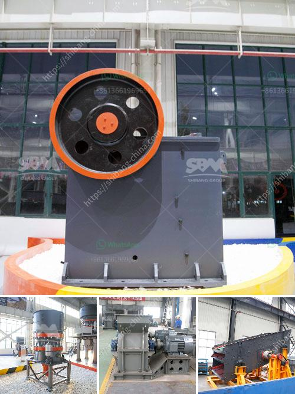

<h3>marble granding machine</h3>
Marble is a natural stone that has been used for centuries due to its elegance, durability, and timeless appeal. Over time, however, marble surfaces may lose their luster, suffer from scratches and stains, or become dull and worn-looking. Luckily, modern technology has introduced a solution to gracefully restore the beauty of marble: the marble grinding machine.

A marble grinding machine is a specifically designed tool for bringing the natural shine back to marble surfaces. It works by removing the topmost layer of a marble surface, which then reveals the fresh and undamaged layer underneath. The objective is to restore the marble's original finish and provide a smooth and gleaming appearance.

This machine consists of a motorized grinder, often equipped with diamond-tipped abrasive pads or discs. The pads or discs are available in various grit sizes, ranging from coarse to fine, depending on the level of restoration required. Coarse grit pads are used to remove deep scratches or stains, while progressively finer pads are employed for a smoother and shiny finish.

The process of grinding marble begins by thoroughly cleaning the surface, removing any dirt, dust, or debris that could hinder the grinding process. Once the surface is clean and dry, the marble grinding machine is moved over the area in a systematic and even manner. The machine's motor rotates the abrasive pads or discs at high speeds, ensuring efficient and consistent results.

During the grinding process, water is often used as a lubricant to prevent the marble surface from overheating. This technique also helps in flushing away the grinding residue, resulting in a cleaner and neater workspace. However, it's important to note that not all marble grinding machines require the use of water. Some machines are designed to work dry, limiting the mess and allowing for a quicker cleanup.

Marble grinding machines are highly versatile and can be used on various surfaces apart from marble. They can restore the shine of other natural stones like granite, limestone, travertine, and terrazzo. Additionally, these machines can also be employed to polish or buff the surface of manmade materials like engineered stone, concrete, or resin-based countertops.

The benefits of using a marble grinding machine are numerous. Firstly, it eliminates the need for costly and time-consuming marble replacement. Instead of resorting to a complete overhaul, the machine can bring the marble surface back to life at a fraction of the cost. This makes marble grinding a cost-effective solution for homeowners, businesses, and restoration professionals.

Furthermore, the grinding process is non-destructive, meaning it does not alter the inherent structural integrity or beauty of the marble. Instead, it removes only the damaged or worn-out layer on top, revealing the untouched and vibrant layer beneath. This allows for a truly authentic restoration, maintaining the original character of the marble.

In conclusion, marble grinding machines are a valuable tool for anyone seeking to restore the elegance and splendor of marble surfaces. Whether it's a residential floor, a kitchen countertop, or a grand marble staircase, these machines can bring back the natural beauty of stones that may have been worn down by time and use. With their efficiency, versatility, and cost-effectiveness, marble grinding machines are becoming an indispensable part of the stone restoration industry.
<h3>Contact us</h3><ul><li><strong>Whatsapp:&nbsp;<a href="https://wa.me/8613661969651">+8613661969651</a></strong></li><li><a href="https://swt.shibang-china.com/?git&amp;zhl&amp;marble granding machine"><strong>Online Service(chat now)</strong></a></li></ul><h3>Related</h3><ul><li><a href='turkey jaw crushers in istanbul.md'>turkey jaw crushers in istanbul</a></li><li><a href='aggregate crushing plant for sale.md'>aggregate crushing plant for sale</a></li><li><a href='stone crushing plant supplier south africa.md'>stone crushing plant supplier south africa</a></li><li><a href='pictures of copper ore mining nigeria.md'>pictures of copper ore mining nigeria</a></li><li><a href='dolomite crushing machine mill.md'>dolomite crushing machine mill</a></li></ul>