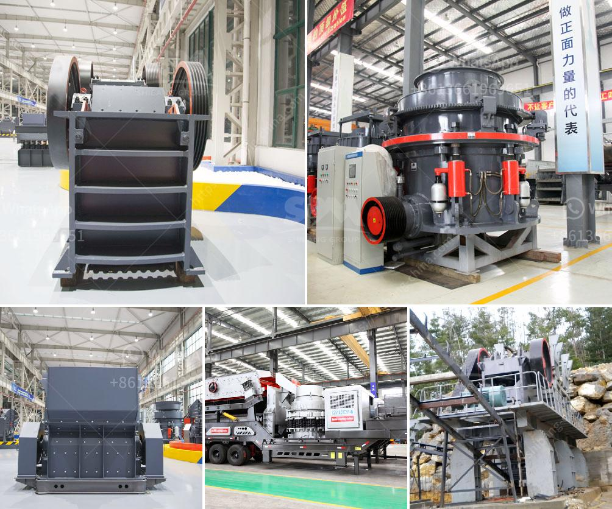

<h3>marble granite stone grinding machine price</h3>
Marble and granite are two of the most popular materials used in homes and commercial buildings. From kitchen countertops to bathroom tiles, these natural stones add elegance and sophistication to any space. However, over time, marble and granite surfaces can become dull and lose their shine due to daily wear and tear.

To restore the original luster of marble and granite, a grinding machine is essential. A marble granite stone grinding machine price is an important factor when purchasing a machine for the restoration and polishing of these natural stone types. However, it is also important to know how to choose the best marble granite stone grinding machine for the job.

The price range of marble granite stone grinding machines varies greatly depending on factors such as the model, brand, manufacturer's reputation, and functionality. Machines with advanced features and higher horsepower tend to be more expensive. On average, the price for a basic marble granite stone grinding machine starts from around $5000 and can go up to $10,000 or more.

When considering the price of a marble granite stone grinding machine, it is crucial to focus on the quality and functionality of the machine. A high-quality machine will have a sturdy construction, durable components, and advanced features that ensure efficient and precise results. Investing in a reliable machine will save money in the long run, as it will require fewer repairs and replacements.

The grinding capacity of a machine is another important factor that affects its price. Machines with higher grinding capacities can handle larger areas or a higher volume of work, reducing the overall time required for restoration and polishing. However, these machines tend to be more expensive due to their larger size and more powerful motors.

A good marble granite stone grinding machine should have user-friendly controls and be easy to operate. Additionally, it should require minimal maintenance to ensure long-lasting performance. Machines that come with detailed user manuals and offer technical support tend to have a higher price tag but are worth the investment for those who are new to stone restoration.

The reputation of the brand and the manufacturer is an essential consideration when buying a marble granite stone grinding machine. Established brands with a long history of producing reliable machines are more likely to have consistent quality and customer satisfaction. While these machines may come with a higher price, they often offer better performance and durability.

When looking for a marble granite stone grinding machine, it is important to consider the price along with factors such as quality, functionality, machine capacity, ease of use, and brand reputation. Investing in a high-quality, reliable machine will ensure efficient and precise stone restoration and polishing, ultimately adding value to any space.
<h3>Contact us</h3><ul><li><strong>Whatsapp:&nbsp;<a href="https://wa.me/8613661969651">+8613661969651</a></strong></li><li><a href="https://swt.shibang-china.com/?git&amp;zhl&amp;marble granite stone grinding machine price"><strong>Online Service(chat now)</strong></a></li></ul><h3>Related</h3><ul><li><a href='zircon sand production line price.md'>zircon sand production line price</a></li><li><a href='fully mobile limestone crusher.md'>fully mobile limestone crusher</a></li><li><a href='small scale copper refining equipment.md'>small scale copper refining equipment</a></li><li><a href='roller mill type p500.md'>roller mill type p500</a></li><li><a href='ball grinding mill india.md'>ball grinding mill india</a></li></ul>