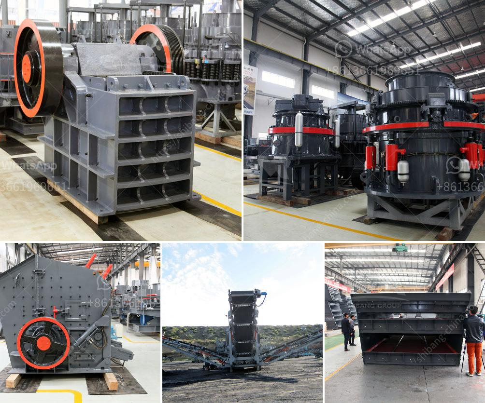

<h3>marble powder crusher plant</h3>
Marble has been a popular building material for centuries due to its appearance and durability. Marble powder, obtained as a by-product of marble cutting, grinding, and polishing, is commonly used in many construction and industrial applications. In recent years, the utilization of marble powder in the production of various products has gained significant attention. One such application is the use of marble powder in crusher plants.

Marble powder crusher plant is often used in various industries for crushing marble rock into desired size for building materials, ceramics, and abrasive materials. With the rapid development of technology, the marble powder crusher plant has gained wide recognition in the market. In the current industry-driven market scenario, this crusher plant is backed by advanced manufacturing techniques and high-quality materials.

The processes involved in marble powder crusher plant involve the initial crushing of marble rock, which is then transported to the powder grinding mill. During the grinding process, the marble is shattered, and the fine powder is produced in the mill. This powder is ready to be used in various applications such as soil stabilization, asphalt additive, and decorative coatings.

The process of the marble powder crusher plant mainly includes crushing, grinding, screening, grading, and powder collection. The material is conveyed to the storage bin by the elevator after being crushed by the jaw crusher. The vibrating feeder can deliver the materials to the main engine to be ground continuously and uniformly, and the ground powder is blown into the powder concentrator by the air blower for separation. The fine powder is collected by the cyclone collector and discharged through the powder outlet, which is the finished product.

The marble powder crusher plant greatly increases the efficiency and value of the crushed marble. Besides, the crusher plant manufacturer has focused on enhancing the environmental protection aspect of the equipment. The crusher plant produces a significant amount of dust and noise in the production process. This creates a strong possibility of pollution and urban quality is affected.

To mitigate these issues, the crusher plant manufacturers have implemented various measures. They have incorporated advanced exhaust systems to control the dust emissions and noise reduction systems to minimize noise pollution. Additionally, the crusher plants are designed with water sprayers to suppress any dust that may escape into the surroundings.

The marble powder crusher plant is found to be environmentally friendly and sustainable. The utilization of marble powder in various applications not only conserves natural resources but also reduces waste and prevents pollution. Moreover, the finished product obtained from the crusher plant has high-quality and uniform particle size, making it suitable for many industries.

In conclusion, the marble powder crusher plant is a reliable, highly efficient, and environmentally friendly solution that is increasingly being used in the construction and manufacturing industries. Its utilization helps in conserving natural resources, reducing waste, and contributing to a cleaner and greener environment. With further advancements in technology, the marble powder crusher plant is expected to witness more widespread adoption in the future.
<h3>Contact us</h3><ul><li><strong>Whatsapp:&nbsp;<a href="https://wa.me/8613661969651">+8613661969651</a></strong></li><li><a href="https://swt.shibang-china.com/?git&amp;zhl&amp;marble powder crusher plant"><strong>Online Service(chat now)</strong></a></li></ul><h3>Related</h3><ul><li><a href='machine of ultra fine mills.md'>machine of ultra fine mills</a></li><li><a href='price of grinding machine in bangladesh.md'>price of grinding machine in bangladesh</a></li><li><a href='sand mills for manufacturing.md'>sand mills for manufacturing</a></li><li><a href='copper crusher suppliers in zambia.md'>copper crusher suppliers in zambia</a></li><li><a href='hammer mill aluminum slag.md'>hammer mill aluminum slag</a></li></ul>