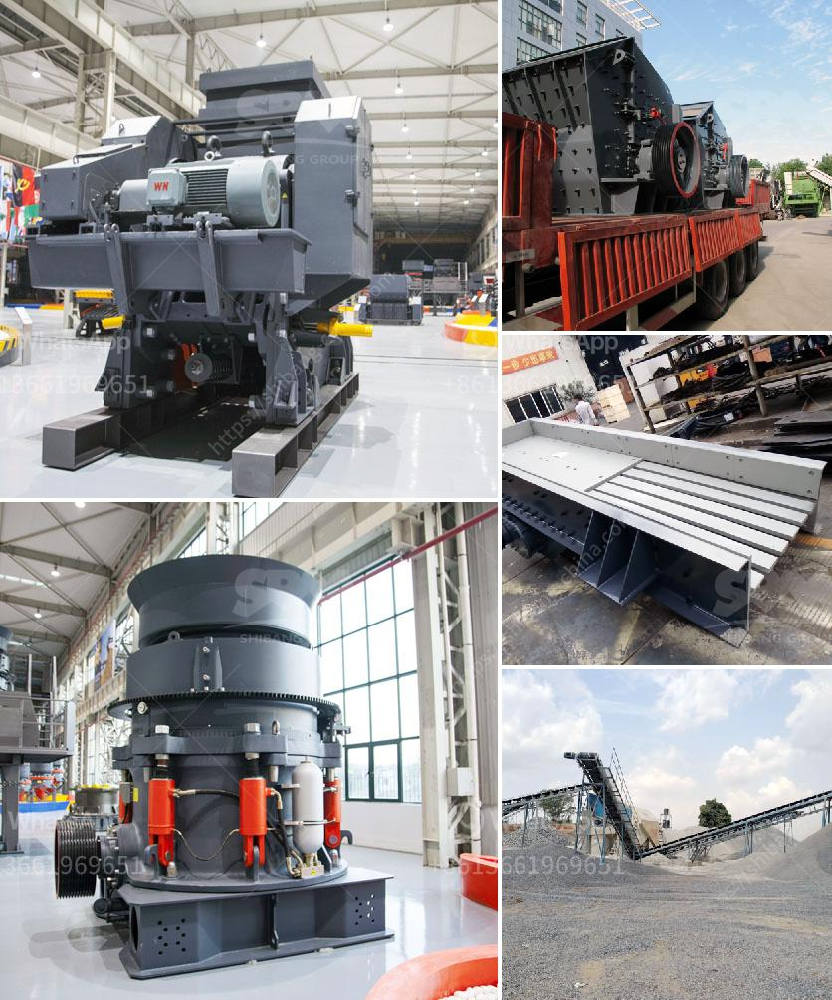

<h3>marble powder making machine in production</h3>
Marble powder, a by-product of the marble industry, has a wide range of applications in various industries. The market is booming with demands for marble powder, as it is used in manufacturing decorative materials, coatings, plastics, and even construction materials. To meet this escalating demand, the marble industry has started investing in marble powder making machines, which efficiently and effectively process the marble waste into usable powder.

Marble powder making machines have greatly contributed to the sustainability of the marble industry. Instead of disposing of the marble waste, these machines help convert it into a valuable resource. The process involves crushing and grinding the marble waste into a fine powder, which can then be used in a variety of applications. The machines are equipped with advanced technology and high-quality components, ensuring the production of consistent and high-quality marble powder.

One of the key advantages of marble powder making machines is their ability to attain a high production rate. These machines are designed to operate continuously, ensuring a smooth and efficient production process. With the ability to produce large quantities of marble powder in a short period, manufacturers can fulfill the growing demand for this versatile material.

Moreover, marble powder making machines are also known for their energy efficiency. They are carefully designed to minimize energy consumption during the production process. This not only helps in reducing operational costs but also contributes to a greener and more sustainable marble industry.

In conclusion, the introduction of marble powder making machines has been a game-changer for the marble industry. These machines have revolutionized the way marble waste is managed and have turned it into a valuable resource. With their high production rate and energy efficiency, they have spurred the growth of the industry and meet the increasing demands for marble powder. As technology continues to advance, we can expect further developments in the field of marble powder making machines, ensuring even more efficient and sustainable production processes.
<h3>Contact us</h3><ul><li><strong>Whatsapp:&nbsp;<a href="https://wa.me/8613661969651">+8613661969651</a></strong></li><li><a href="https://swt.shibang-china.com/?git&amp;zhl&amp;marble powder making machine in production"><strong>Online Service(chat now)</strong></a></li></ul><h3>Related</h3><ul><li><a href='ton day cement clinker grinding plant.md'>ton day cement clinker grinding plant</a></li><li><a href='gold crushing machine price in usa.md'>gold crushing machine price in usa</a></li><li><a href='grinding wet ball mill limestone.md'>grinding wet ball mill limestone</a></li><li><a href='stone crusher machine price in pakistan.md'>stone crusher machine price in pakistan</a></li><li><a href='crusher plant manufacturer from italy.md'>crusher plant manufacturer from italy</a></li></ul>