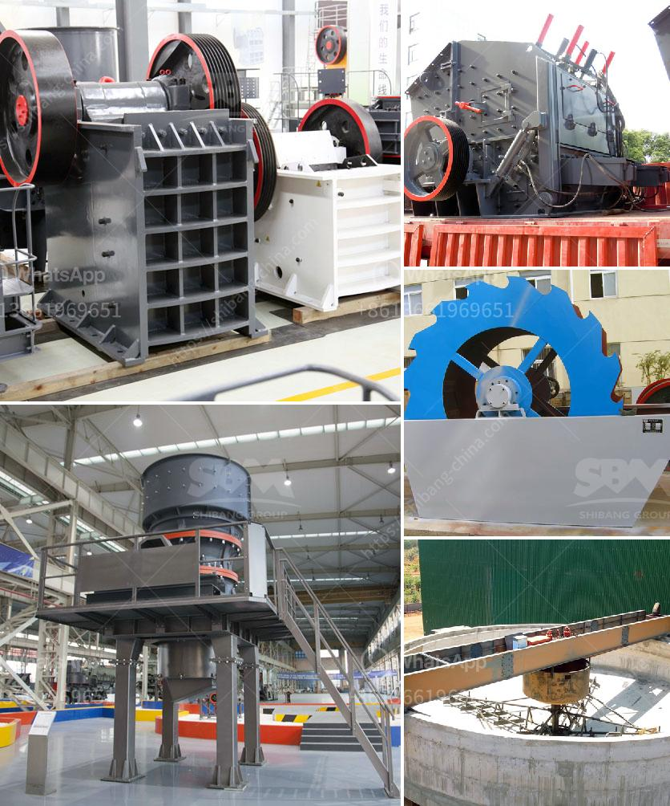

<h3>marble primary crusher manufacturer</h3>
Marble primary crushers are commonly used in the mining industry due to their high capacity and ability to process abrasive materials. Furthermore, these crushers have a long service life, making them an ideal choice for many mine operators. In this article, we will discuss the features and benefits of choosing a marble primary crusher from a reliable manufacturer.

Marble is a popular choice for construction and decoration, as it offers a timeless aesthetic and exceptional durability. However, before marble can be used in various applications, it needs to undergo several processes, including crushing, to achieve the desired size and shape.

A primary crusher plays a crucial role in the initial stage of marble processing. In order to ensure a reliable and efficient performance, it is essential to choose the right machine for this task. To achieve this, partnering with a reputable manufacturer is of utmost importance.

A reputable manufacturer will offer a comprehensive range of marble primary crushers that cater to different production capacities and requirements. They will utilize state-of-the-art technology to design and manufacture crushers that are durable, efficient, and cost-effective.

One of the key factors to consider when choosing a primary crusher is the feed size. Different mines have varying sizes of marble rocks, and the primary crusher should be able to process different materials of different sizes effectively. A reliable manufacturer understands this and will provide crushers with adjustable settings to accommodate varying feed sizes, ensuring consistent and high-quality output.

The durability of a primary crusher is directly related to its construction and materials used. A reputable manufacturer will use high-quality materials and incorporate robust design features to withstand the harsh operating conditions in the mining industry. This includes heavy-duty components, such as strong frames, high-performance bearings, and wear-resistant parts, which enhance the crusher's longevity and reduce downtime for maintenance and repairs.

Safety is a paramount concern in any mining operation. A reliable primary crusher manufacturer will prioritize safety by incorporating features such as enclosed compartments, safety guards, and emergency stop buttons. Additionally, they will provide comprehensive training and manuals to ensure proper usage and maintenance, reducing the risk of accidents and injuries at the workplace.

Investing in a marble primary crusher from a reputable manufacturer not only ensures a reliable and efficient operation but also offers long-term cost benefits. High-quality crushers are designed to be energy efficient, reducing electricity consumption and lowering operational costs. Furthermore, durable crusher components minimize the need for frequent replacement, resulting in reduced maintenance and spare parts expenses.

In conclusion, choosing a marble primary crusher manufactured by a reliable partner is crucial for achieving competitive production in the mining industry. These crushers offer excellent capacity, durability, and safety features to effectively process abrasive materials like marble. Additionally, they provide long-term cost benefits through energy efficiency and reduced maintenance requirements. By selecting a reputable manufacturer and investing in a quality primary crusher, mine operators can optimize their operation and enhance their productivity.
<h3>Contact us</h3><ul><li><strong>Whatsapp:&nbsp;<a href="https://wa.me/8613661969651">+8613661969651</a></strong></li><li><a href="https://swt.shibang-china.com/?git&amp;zhl&amp;marble primary crusher manufacturer"><strong>Online Service(chat now)</strong></a></li></ul><h3>Related</h3><ul><li><a href='brand of conveyor belts.md'>brand of conveyor belts</a></li><li><a href='mobile stone crusher for sale.md'>mobile stone crusher for sale</a></li><li><a href='used vsi crusher for sale in india.md'>used vsi crusher for sale in india</a></li><li><a href='how much does a jaw crusher cost.md'>how much does a jaw crusher cost</a></li><li><a href='stone crusher plant indonesia.md'>stone crusher plant indonesia</a></li></ul>