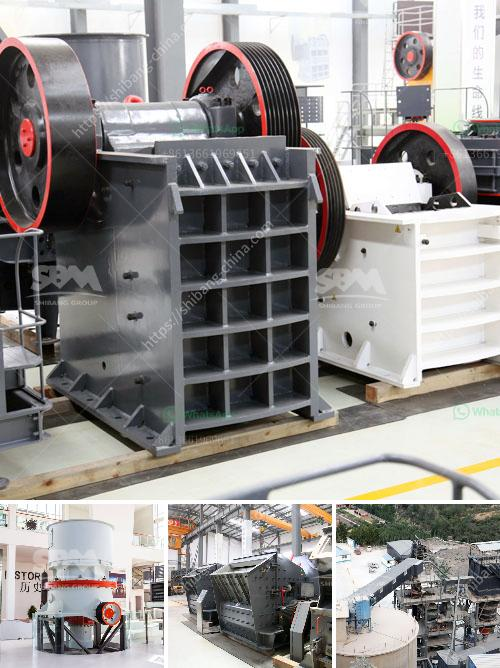

<h3>marble production process</h3>
Marble is a widely used natural stone for various applications, ranging from construction to sculpture. The process of extracting and processing marble starts with the quarrying, which involves removing large blocks from underground deposits and sending them to factories for further refinement. In this article, we will explore the different stages of marble production, from quarry to finished product.

The first stage of marble production is quarrying. This involves locating suitable marble deposits, which can be found in various parts of the world. Once a site is identified, the extraction process begins. Large blocks of marble are cut from the quarry using specialized equipment such as wire saws, diamond belt saws, or rock drills. These blocks can weigh up to several tons and require careful handling to prevent any damage.

After extraction, the marble blocks are transported to the factory for processing. The cutting and shaping of marble slabs is the next crucial step in the production process. Initially, the blocks are cut into smaller and more manageable sizes using wire saws or gang saws. These saws use diamond-encrusted blades to achieve precise cuts without causing excessive waste or damage to the stone.

Once the blocks are cut into slabs, they go through a series of polishing and finishing processes. The first step is usually grinding, which involves smoothing the surface of the marble slabs using abrasive tools and water. Grinding removes any imperfections and prepares the stone for further refinement.

After grinding, the slabs are passed through various polishing machines to achieve the desired level of shine and smoothness. These machines have rotating abrasive pads or brushes that gradually polish the surface of the stone. Different levels of grit are used to achieve different finishes, from a matte honed finish to a high-gloss polished finish.

Once the polishing process is complete, the marble slabs undergo quality checks to ensure that they meet the required standards. These checks include inspections for color consistency, surface defects, and thickness measurements. Slabs that pass the quality checks are then neatly packed and prepared for transportation to their final destination.

The final stage of marble production is the installation or use of the finished products. Marble slabs can be used in a variety of applications, such as flooring, countertops, wall cladding, and even sculptures. The durability, elegance, and natural beauty of marble make it a popular choice for both residential and commercial designs.

In conclusion, the process of marble production involves several stages, starting from quarrying and extraction to cutting, polishing, and finishing. The careful selection of marble deposits and the use of advanced technology ensure the production of high-quality marble slabs that can be used for various applications. From architectural designs to artistic creations, marble continues to be a timeless and versatile material that adds beauty and luxury to any space.
<h3>Contact us</h3><ul><li><strong>Whatsapp:&nbsp;<a href="https://wa.me/8613661969651">+8613661969651</a></strong></li><li><a href="https://swt.shibang-china.com/?git&amp;zhl&amp;marble production process"><strong>Online Service(chat now)</strong></a></li></ul><h3>Related</h3><ul><li><a href='ball mill for gold in south africa.md'>ball mill for gold in south africa</a></li><li><a href='100 tph hammer mill kenya.md'>100 tph hammer mill kenya</a></li><li><a href='used raymond grinding mill sale offer in pakistan.md'>used raymond grinding mill sale offer in pakistan</a></li><li><a href='iron ore beneficiation.md'>iron ore beneficiation</a></li><li><a href='granite and marble mining in uganda.md'>granite and marble mining in uganda</a></li></ul>