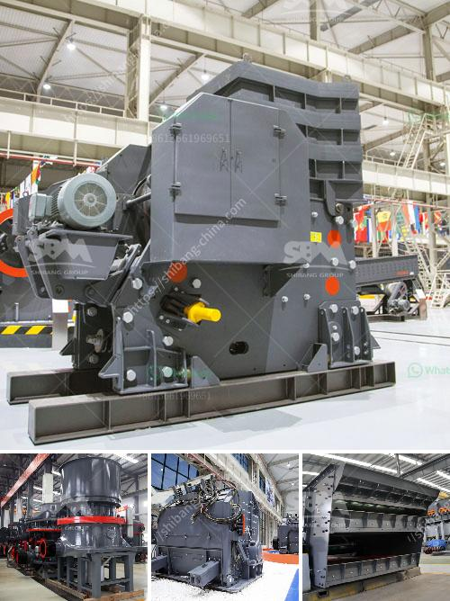

<h3>marchine stone crusher cost in kenya</h3>
Machine stone crusher cost in Kenya: How much is used stone crusher price in Kenya? How much is used stone crusher price in Kenya?

The stone crushing industry is still in its infancy in various parts of the country. The stone crushers are in a nascent stage and even small scale stone crushers that do not have their own premises are using borrowed land for their machinery. This is due to the high cost of investing in machinery, and also the lack of skilled personnel and sufficient capital.

However, with the advancement in technology, machinery has become more affordable, accessible, and efficient. The cost of a machine stone crusher in Kenya has reduced dramatically due to improved technology and increase in demand. There is also an increase in the number of crushing plants in Kenya and all around East Africa. The supply of the machines is also higher to meet the increasing demand from the construction industry and other sectors.

The cost of a machine stone crusher in Kenya is lower compared to the amount of labor involved in producing the same tonnage of crushed stone manually. Machine-operated stone crusher is the most popular stone crushing system in the market as it offers several advantages over manual crushing. This machine reduces the cost involved in manual crushing, hence increasing the profit for owners and operators. The machine also provides higher efficiency and productivity as it can crush larger stones in a shorter amount of time.

Machine stone crusher cost in Kenya depends on various factors, such as the type of stone crusher, the machine capacity, and the final product size required by the customer. Different stone crushing machines have different prices. Generally, the prices of stone crusher machines in Kenya are relatively competitive. However, the cost may vary depending on the brand, model, capacity, and after-sales service provided by the manufacturer.

In conclusion, the cost of a machine stone crusher in Kenya depends on various factors. With the advancement in technology, the cost of these machines has reduced, making them more affordable and accessible. The demand for machine stone crushers in Kenya has also increased due to the benefits they offer in terms of cost, efficiency, and productivity.
<h3>Contact us</h3><ul><li><strong>Whatsapp:&nbsp;<a href="https://wa.me/8613661969651">+8613661969651</a></strong></li><li><a href="https://swt.shibang-china.com/?git&amp;zhl&amp;marchine stone crusher cost in kenya"><strong>Online Service(chat now)</strong></a></li></ul><h3>Related</h3><ul><li><a href='buy sand washing plant in sri lanka.md'>buy sand washing plant in sri lanka</a></li><li><a href='project report on stone crushing unit.md'>project report on stone crushing unit</a></li><li><a href='chrome mining business plan crusher.md'>chrome mining business plan crusher</a></li><li><a href='cone crushers supplier mining.md'>cone crushers supplier mining</a></li><li><a href='lavadoras de arenas y agregados.md'>lavadoras de arenas y agregados</a></li></ul>