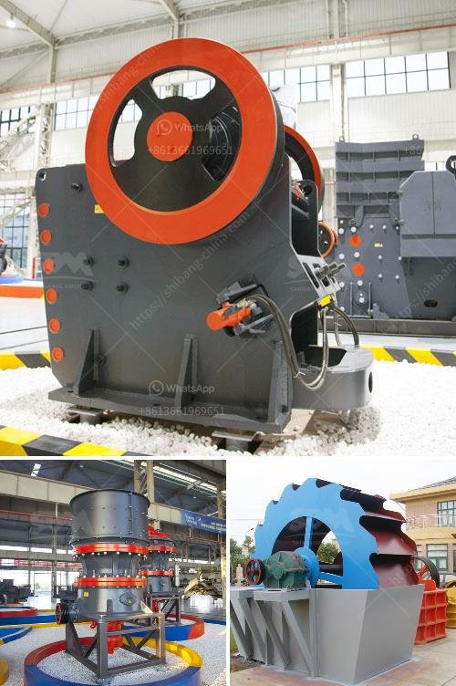

<h3>metal crusher manufacturers in colombia</h3>
Colombia, known for its rich natural resources and vibrant culture, is also making significant strides in the field of recycling. With the increasing emphasis on environmental sustainability and resource conservation, the demand for efficient waste recycling machinery has grown exponentially. This has led to the rise of metal crusher manufacturers in Colombia, who are revolutionizing the recycling industry with their innovative machinery and equipment.

Metal crusher manufacturers play a crucial role in promoting and facilitating recycling efforts in Colombia. These manufacturers specialize in designing and producing heavy-duty machinery that can efficiently dismantle and crush metallic waste, such as scrap cars, appliances, and industrial equipment. By reducing these metal objects into smaller, manageable pieces, these crushers significantly enhance the recycling process, making it easier to separate and extract valuable materials like steel, aluminum, and copper.

One of the leading metal crusher manufacturers in Colombia is ABC Machinery. With decades of experience in the industry, ABC Machinery has garnered a solid reputation for producing high-quality crushers that are not only effective but also safe and easy to operate. Their crushers are equipped with advanced technology and features like automatic overload protection, adjustable blade settings, and robust crushing chambers that guarantee optimal performance and material processing.

In addition to manufacturing metal crushers, these companies also provide comprehensive after-sales service, including installation, maintenance, and spare parts support. This ensures that customers can maximize the lifespan of their machinery and achieve the best results in their recycling operations. The metal crusher manufacturers in Colombia have built strong relationships with their clients, offering personalized solutions tailored to their specific requirements.

The impact of metal crusher manufacturers on the recycling industry is significant. By providing efficient and reliable machinery, they have contributed to increased recycling rates in Colombia, reducing the strain on landfills and conserving valuable resources. Additionally, the process of recycling metal waste also reduces carbon emissions and helps combat climate change, making it an environmentally friendly solution.

Furthermore, the recycling industry provides employment opportunities and economic growth. Metal crusher manufacturers in Colombia have created jobs for skilled technicians, engineers, and workers involved in the manufacturing, installation, and maintenance of their machinery. This boosts the local economy and contributes to the overall development of the country.

However, despite the positive effects of metal crusher manufacturers, challenges still exist. One such challenge is the need for increased awareness and education around recycling. Many individuals and businesses remain unaware of the benefits of proper waste management and recycling. Efforts must be made at the government and community level to raise awareness about the role of metal crushers and recycling in promoting a sustainable future.

Overall, the emergence of metal crusher manufacturers in Colombia has brought about a revolution in the recycling industry. These manufacturers have not only revolutionized the way metal waste is processed but have also played a vital role in promoting environmental sustainability, creating employment opportunities, and contributing to economic growth. As Colombia continues to prioritize recycling efforts, the demand for efficient machinery from metal crusher manufacturers is only set to grow, ensuring a greener and more sustainable future.
<h3>Contact us</h3><ul><li><strong>Whatsapp:&nbsp;<a href="https://wa.me/8613661969651">+8613661969651</a></strong></li><li><a href="https://swt.shibang-china.com/?git&amp;zhl&amp;metal crusher manufacturers in colombia"><strong>Online Service(chat now)</strong></a></li></ul><h3>Related</h3><ul><li><a href='100tph raw mill specification.md'>100tph raw mill specification</a></li><li><a href='project proposal about grinding milling company.md'>project proposal about grinding milling company</a></li><li><a href='mobile rock crusher.md'>mobile rock crusher</a></li><li><a href='ball mill grinding media work.md'>ball mill grinding media work</a></li><li><a href='stone crusher machine price in pakistan.md'>stone crusher machine price in pakistan</a></li></ul>