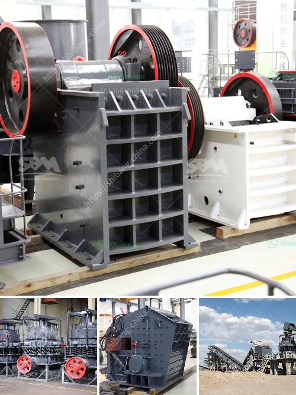

<h3>micron limestone grinding unit in india</h3>
Micron limestone grinding unit in India is a multinational company dealing in cement grinding and crushing plant in India. It offers high-quality powdered limestone, a prerequisite for the successful lamination of tiles, marble and granite floors. Limestone grinding unit not only has an industrial advantage but also supports the environmental footprint by lowering it by a considerable extent.

In recent years, limestone grinding unit has gained a significant position in the lucrative market of cement grinding. The unit has transformed into a prominent business sphere and key differentiator in the global marketplace. The unit has expanded its operations to various parts of India and has become one of the top competitors in the cement grinding segment.

The primary purpose of limestone grinding unit is to produce the high-quality limestone powder required for various applications. The grinding unit is equipped with the latest technology and cutting-edge machinery to grind and crush the limestone into fine powder. This powder is used as a raw material for cement production and other industrial applications.

One of the key advantages of limestone grinding unit in India is its ability to produce uniform particle size distribution. This ensures consistent quality and performance of the final product. The unit is equipped with advanced separators and classifiers that help in achieving the desired particle size, thereby enhancing the overall quality of the limestone powder.

The limestone grinding unit in India uses the latest technology to capture the environmental benefits of limestone grinding. The unit explores various processes like classification, dry grinding, wet grinding and micronising of the mined limestone to produce the desired limestone powder for different applications. This helps in reducing the consumption of natural resources and minimizing the impact on the environment.

Moreover, the limestone grinding unit in India supports the government's initiative of sustainable development by adopting various eco-friendly practices. The unit focuses on reducing energy consumption, minimizing water wastage, and controlling air emissions. This not only enhances the overall efficiency of the grinding unit but also ensures compliance with environmental regulations.

The limestone grinding unit in India has emerged as a key player in the cement grinding segment. Its impeccable performance and commitment to sustainability have made it a preferred choice for many customers. The unit's dedication to customer satisfaction, along with its strong focus on environmental sustainability, sets it apart from its competitors.

In conclusion, the micron limestone grinding unit in India is a significant player in the cement grinding segment. It offers high-quality limestone powder, essential for various industrial applications. The unit's commitment to sustainability and environmental conservation makes it a leading choice in the market. With its state-of-the-art technology and cutting-edge machinery, the limestone grinding unit continues to set new standards in the cement grinding industry.
<h3>Contact us</h3><ul><li><strong>Whatsapp:&nbsp;<a href="https://wa.me/8613661969651">+8613661969651</a></strong></li><li><a href="https://swt.shibang-china.com/?git&amp;zhl&amp;micron limestone grinding unit in india"><strong>Online Service(chat now)</strong></a></li></ul><h3>Related</h3><ul><li><a href='limestone crusher rotor mechanical.md'>limestone crusher rotor mechanical</a></li><li><a href='gypsum board manufacturing.md'>gypsum board manufacturing</a></li><li><a href='crusher for crushing calcium carbonate.md'>crusher for crushing calcium carbonate</a></li><li><a href='crusher manufacturers turkey.md'>crusher manufacturers turkey</a></li><li><a href='quarry crusher equipment manufacturer in germany.md'>quarry crusher equipment manufacturer in germany</a></li></ul>