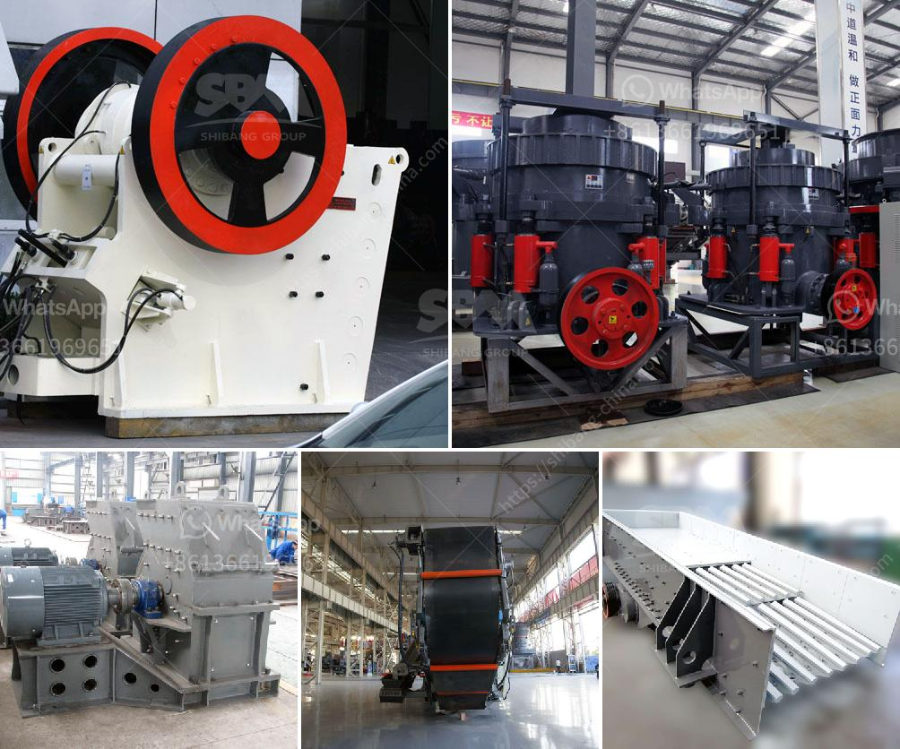

<h3>mill price hammer mill</h3>
The mill price hammer mill is a machine used to shred or crush materials into smaller pieces. It is widely used in various industries, such as grain milling, feed processing, and biomass production. The machine operates by rotating a series of hammers at high speeds, which impacts and grinds the material.

One of the key advantages of the mill price hammer mill is its versatility. It can handle a wide range of materials, including grains, corn, soybeans, and biomass such as wood chips and straw. This makes it a preferred choice for farmers, feed millers, and biofuel producers. The ability to process different materials with a single machine simplifies production processes and reduces investment costs.

Another benefit of the mill price hammer mill is its efficiency. With its high-speed rotation and multiple hammers, it can quickly crush materials into smaller sizes. This enhances the processing speed, allowing for higher production rates and increased productivity. Moreover, the machine produces consistent particle sizes, ensuring uniformity in the end product.

The mill price hammer mill also offers ease of operation and maintenance. It is equipped with user-friendly controls and can be easily adjusted to achieve the desired particle size. The machine requires minimal supervision and can be operated by even inexperienced personnel. Additionally, it is designed with easy access to internal parts, facilitating routine maintenance and reducing downtime.

When considering the mill price hammer mill, it is essential to consider the quality and durability of the machine. High-quality construction materials ensure longevity and reliability, enabling the machine to withstand heavy-duty operations and prolonged use. Additionally, it is advisable to choose a model that comes with a warranty and excellent after-sales service to address any potential issues.

In conclusion, the mill price hammer mill is a versatile and efficient machine used in various industries for material shredding and crushing. With its ability to handle different materials, high-speed operation, ease of use, and durability, it is an excellent investment for businesses looking to optimize their production processes and achieve higher productivity.
<h3>Contact us</h3><ul><li><strong>Whatsapp:&nbsp;<a href="https://wa.me/8613661969651">+8613661969651</a></strong></li><li><a href="https://swt.shibang-china.com/?git&amp;zhl&amp;mill price hammer mill"><strong>Online Service(chat now)</strong></a></li></ul><h3>Related</h3><ul><li><a href='funding for establishment of stone crushers.md'>funding for establishment of stone crushers</a></li><li><a href='four roller mill.md'>four roller mill</a></li><li><a href='rock crusher china.md'>rock crusher china</a></li><li><a href='mining equipment for hire in kenya.md'>mining equipment for hire in kenya</a></li><li><a href='small scale pulverizing ball mill.md'>small scale pulverizing ball mill</a></li></ul>