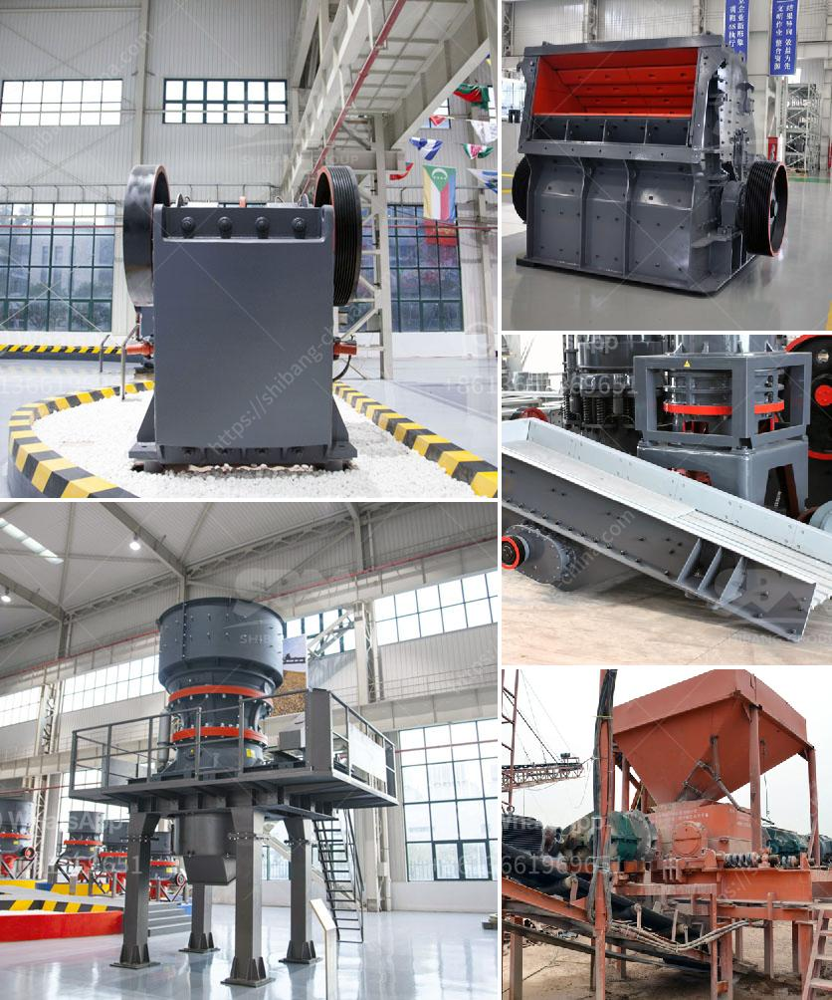

<h3>milling grinding machines manufacturer europe</h3>
Milling and grinding machines are essential pieces of equipment in many industrial sectors. European manufacturers are known for their high-quality machinery, advanced engineering, and innovative designs. In this article, we will explore some of the leading milling and grinding machines manufacturer in Europe.

Europe is home to numerous manufacturers of CNC (Computer Numerical Control) milling machines, which are used for shaping and cutting materials with precision and accuracy. These machines are widely used in industries such as automotive, aerospace, and medical devices.

One of the top manufacturers of CNC milling machines in Europe is DMG MORI. With a history dating back to 1870, DMG MORI has stood the test of time and is now a global leader in the manufacturing of CNC machines. Their milling machines are known for their reliability, high-performance, and user-friendly interfaces. They offer a wide range of models, from small benchtop machines to large industrial-scale models capable of handling heavy-duty work.

Another prominent European manufacturer of CNC milling machines is Haas Automation. Founded in 1983, Haas Automation has quickly established a reputation for producing cost-effective machines without compromising on quality. Their machines are known for their rigidity, accuracy, and ease of use. Haas offers a broad range of models suitable for various applications, making them a popular choice among manufacturers across different industries.

When it comes to grinding machines, European manufacturers are also at the forefront. The grinding process involves removing material from a workpiece using an abrasive wheel or belt. It is a critical step in many manufacturing processes, such as finishing, shaping, and sharpening.

One of the leading grinding machine manufacturers in Europe is Schleifmittelwerk Burka-Kosmos GmbH. With over 100 years of experience, the company specializes in developing and manufacturing grinding wheels for various applications. Their products are known for their exceptional quality, durability, and precision.

Another renowned European manufacturer in the grinding machine industry is Studer. Founded in 1912, Studer has built a solid reputation for producing high-precision grinding machines. With innovative technologies and a focus on customer satisfaction, Studer offers a wide range of grinder models suitable for diverse grinding applications.

Other notable European manufacturers of milling and grinding machines include Makino, FANUC, and EMAG. These companies have extensive expertise in the field of machining and have been providing reliable and efficient equipment to numerous industries.

In conclusion, Europe is home to many reputable manufacturers of milling and grinding machines. These companies have a long history of excellence in engineering and produce high-quality machinery that meets the needs of various industries. Whether it is a CNC milling machine or a grinding machine, European manufacturers are known for their precision, reliability, and advanced technology. Investing in European-made equipment ensures efficiency, productivity, and long-term value for businesses in need of milling and grinding solutions.
<h3>Contact us</h3><ul><li><strong>Whatsapp:&nbsp;<a href="https://wa.me/8613661969651">+8613661969651</a></strong></li><li><a href="https://swt.shibang-china.com/?git&amp;zhl&amp;milling grinding machines manufacturer europe"><strong>Online Service(chat now)</strong></a></li></ul><h3>Related</h3><ul><li><a href='mineral materials crushers.md'>mineral materials crushers</a></li><li><a href='vibrating screen feeder.md'>vibrating screen feeder</a></li><li><a href='100 tph hammer mill kenya.md'>100 tph hammer mill kenya</a></li><li><a href='mobile rock crusher manufacturers.md'>mobile rock crusher manufacturers</a></li><li><a href='thailand for stone crusher plant.md'>thailand for stone crusher plant</a></li></ul>