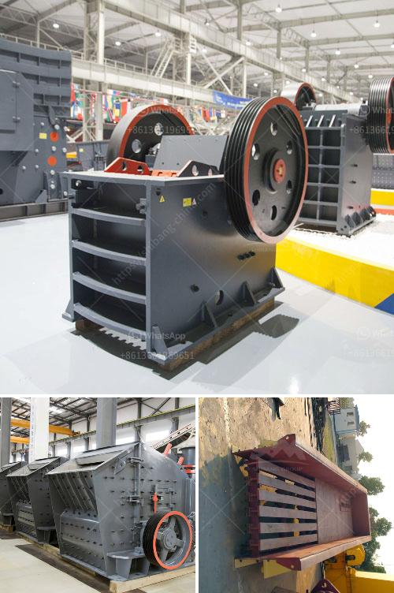

<h3>milling machine grinding mill</h3>
Milling machines are used in various industries for grinding solid materials into smaller pieces. They are efficient, reliable, and versatile machines that are essential in the manufacturing process. One such milling machine is a grinding mill, which is commonly used for milling or grinding a wide range of materials into finer particles.

A grinding mill typically consists of a rotating drum filled with grinding media such as balls or rods. The material to be ground is fed into the drum, and as the drum rotates, the grinding media collide with the particles, effectively reducing their size. The finer particles are discharged through a screen, while the larger particles are retained inside the drum for further grinding.

Grinding mills are designed to handle a variety of materials, including fragile and heat-sensitive materials. They are used in industries such as mining, construction, ceramics, and chemicals, where fine and uniform grinding is required. The grinding process can be wet or dry, depending on the material and the desired end product.

One of the key advantages of using a grinding mill is its ability to produce uniform and consistent particles. This is important in industries where the quality and purity of the materials are critical. The grinding mill ensures that the particles are evenly distributed and have a consistent size, which enhances the overall product quality and performance.

Another advantage of using a grinding mill is its versatility. It can grind a wide range of materials, from soft and non-abrasive to hard and abrasive materials. This makes it suitable for grinding various ores, minerals, and raw materials. Additionally, some grinding mills can be adjusted to produce different particle sizes, allowing manufacturers to meet specific requirements for their products.

Grinding mills are also known for their energy efficiency. They require less energy compared to other milling machines, making them a cost-effective option for many industries. Additionally, some grinding mills are equipped with advanced features such as automatic feed control and temperature control, further improving their energy efficiency and reducing energy consumption.

In conclusion, grinding mills are essential machines in many industries for reducing the size of materials into finer particles. They offer advantages such as uniform and consistent particle size, versatility, and energy efficiency. Whether it is for mining, construction, ceramics, or chemicals, a grinding mill plays a crucial role in the manufacturing process, ensuring high-quality and reliable end products.
<h3>Contact us</h3><ul><li><strong>Whatsapp:&nbsp;<a href="https://wa.me/8613661969651">+8613661969651</a></strong></li><li><a href="https://swt.shibang-china.com/?git&amp;zhl&amp;milling machine grinding mill"><strong>Online Service(chat now)</strong></a></li></ul><h3>Related</h3><ul><li><a href='top 20 coal mining companies in indonesia.md'>top 20 coal mining companies in indonesia</a></li><li><a href='cone crushers supplier mining.md'>cone crushers supplier mining</a></li><li><a href='gypsum powder production equipment price.md'>gypsum powder production equipment price</a></li><li><a href='rock crusher china.md'>rock crusher china</a></li><li><a href='mini sand stone crusher price.md'>mini sand stone crusher price</a></li></ul>