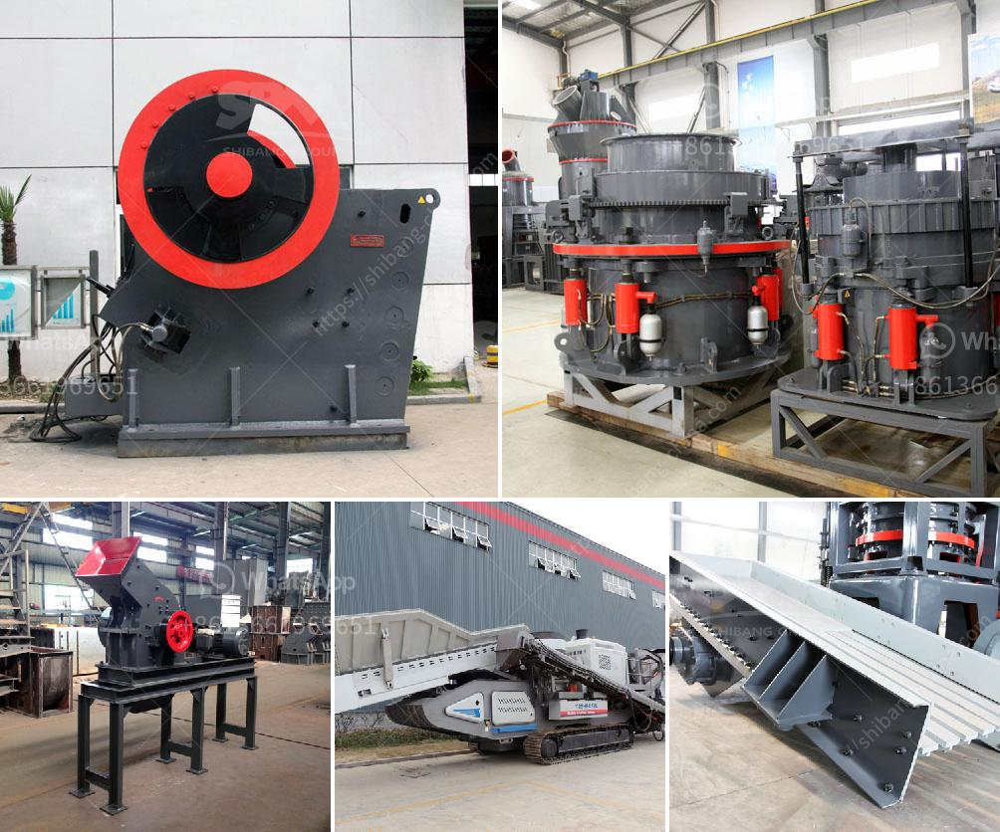

<h3>milling machine of jaw crusher</h3>
A milling machine is a tool used to machine solid materials. It consists of a rotary cutter, which moves along a stationary workpiece to create a desired shape or contour. In the field of mining and construction, jaw crushers play a crucial role in processing hard and abrasive materials. The milling machine of a jaw crusher is a heavy-duty machine that can efficiently grind rock into small pieces.

The milling machine consists of a hopper, which feeds the rock into the jaw crusher. The rock is crushed by the stationary jaw, and a second jaw, also known as a swing jaw, moves back and forth to generate the crushing action. The smaller pieces of rock fall through the opening at the bottom of the jaws and are collected in a chute.

One of the key advantages of using a milling machine for jaw crushers is their ability to handle large rocks. The powerful motor and strong jaws of the machine can process rocks that are several feet in diameter. This makes them suitable for handling tough materials in mining and construction sites.

Another advantage of using a milling machine for jaw crushers is their versatility. The same machine can be used to crush various types of rocks, including granite, basalt, and limestone. This allows for more efficient use of resources and reduces the need for multiple machines.

Furthermore, jaw crushers equipped with a milling machine can produce consistent and uniform output. The machine can be adjusted to produce the desired size of rock, ensuring that all the particles are of the same size. This is important for a range of applications, including the production of concrete and asphalt.

In conclusion, a milling machine for jaw crushers is a versatile and powerful tool that can efficiently grind rock into small pieces. Its ability to handle large rocks and produce consistent output makes it an essential machine in the mining and construction industry. Whether it is processing hard and abrasive materials or producing concrete and asphalt, a milling machine of a jaw crusher is indispensable.
<h3>Contact us</h3><ul><li><strong>Whatsapp:&nbsp;<a href="https://wa.me/8613661969651">+8613661969651</a></strong></li><li><a href="https://swt.shibang-china.com/?git&amp;zhl&amp;milling machine of jaw crusher"><strong>Online Service(chat now)</strong></a></li></ul><h3>Related</h3><ul><li><a href='copper ore machine in china.md'>copper ore machine in china</a></li><li><a href='mobile crushing stone machines from austria.md'>mobile crushing stone machines from austria</a></li><li><a href='china roller mill kenya.md'>china roller mill kenya</a></li><li><a href='black powder ball mill grinder.md'>black powder ball mill grinder</a></li><li><a href='what is the feed of jaw crusher.md'>what is the feed of jaw crusher</a></li></ul>