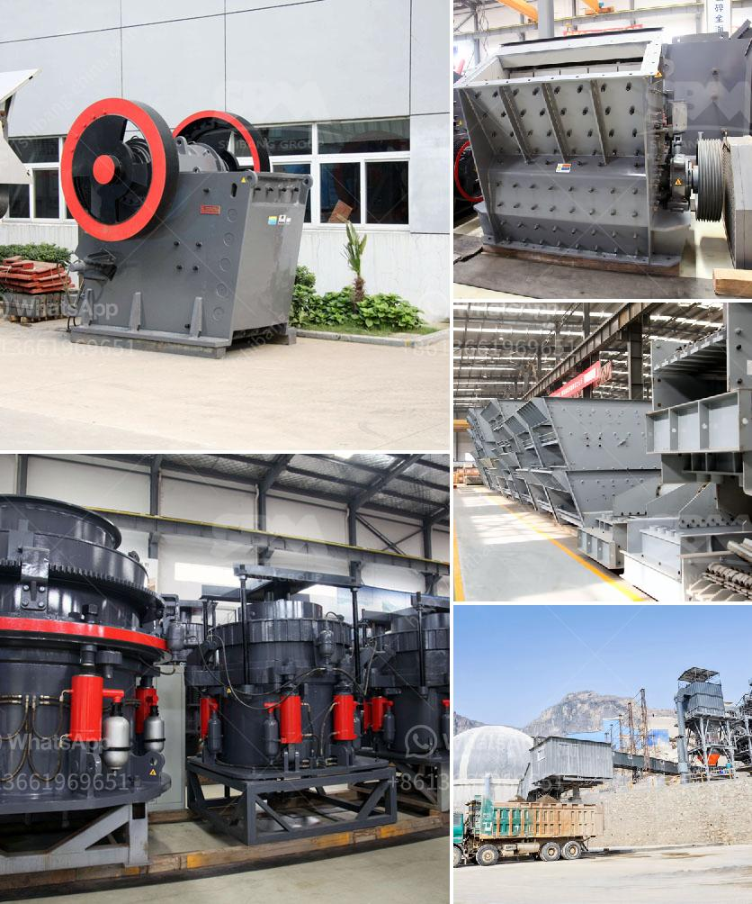

<h3>mineral ball mill</h3>
The mineral ball mill is a key equipment for grinding materials into fine powder. It is widely used in ore dressing, building materials, chemical industry, etc.

The ball mill can grind various ores and other materials either wet or dry. There are two kinds of ball mill, grate type and overfall type due to different ways of discharging material. There are also many types of grinding media available, such as steel ball, ceramic ball, and manganese ball. The centrifugal force caused by rotation of barrel brings the steel balls to a certain height and impact and grind the materials. The ground materials are discharged through the discharging board thus the grinding process is finished.

Compared with other grinding machines, the ball mill has a simple structure, low cost, and reliable operation. Its operation is smooth and the maintenance is convenient. It is widely used in the grinding of mineral products in metallurgy, building materials, chemical industry, and other industries. The ball mill can be divided into dry ball mill and wet ball mill according to the material wetting property. The ball mill can be divided into overflow ball mill and grate ball mill according to the mode of discharging material.

With the continuous development of beneficiation technology, the equipment market demand is gradually expanding, and the mill has also undergone significant changes. The traditional ball mill has a low output and a high energy consumption, which is far from meeting the market demand. In order to improve the grinding efficiency and reduce energy consumption, a new type of grinding equipment, the mineral ball mill, has emerged.

The mineral ball mill is a high-efficiency grinding equipment developed by Hongxing Machinery. It is a rolling bearing with a substitute sliding bearing. The energy saving of 20%-30% than the ordinary ball mill. The processing capacity is increased by 15%-20%, and the unit energy consumption is reduced by about 10%. The fineness of the grinding material is between 0.074mm and 0.4mm, and the particle size distribution is even.

In conclusion, the mineral ball mill is a highly efficient grinding equipment that can grind the ore materials into fine powder. It has a wide range of applications in various industries and is favored by users for its high efficiency and low energy consumption. The continuous improvement and development of the ball mill technology will make a significant contribution to the beneficiation industry.
<h3>Contact us</h3><ul><li><strong>Whatsapp:&nbsp;<a href="https://wa.me/8613661969651">+8613661969651</a></strong></li><li><a href="https://swt.shibang-china.com/?git&amp;zhl&amp;mineral ball mill"><strong>Online Service(chat now)</strong></a></li></ul><h3>Related</h3><ul><li><a href='gypsum processing crusher.md'>gypsum processing crusher</a></li><li><a href='sand material small crusher machine.md'>sand material small crusher machine</a></li><li><a href='mobile granite crusher.md'>mobile granite crusher</a></li><li><a href='granite crushers in germany.md'>granite crushers in germany</a></li><li><a href='chrome mining business plan.md'>chrome mining business plan</a></li></ul>