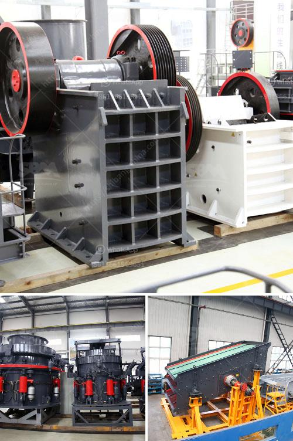

<h3>mineral materials crushers</h3>
In the world of resource extraction, crushers play a pivotal role in breaking down raw materials into smaller, manageable sizes. These machines are specifically designed to crush mineral materials, such as limestone, coal, and ores, to facilitate further processing. They have proven to be essential assets in numerous industries, including mining, construction, and manufacturing.

One of the most significant advancements in the realm of crushers is the utilization of state-of-the-art mineral materials crushers. These technologically advanced machines boast improved efficiency, productivity, and sustainability. Equipped with cutting-edge features, they offer enhanced performance and reduced energy consumption, which ultimately translates into cost savings for companies.

One key feature of these crushers is their high level of versatility. They can handle a wide array of raw materials, from softer rocks like limestone to tougher ores like iron and copper. This adaptability makes them the go-to choice for companies operating in diverse sectors. With the ability to crush materials into different sizes and shapes, mineral materials crushers contribute greatly to downstream processing and manufacturing operations.

Another crucial aspect of modern crushers is their environmental efficiency. Many models are designed with sustainability in mind, incorporating advanced technologies that reduce emissions and noise levels. This aligns with the growing demand for eco-friendly practices and regulatory requirements, making mineral materials crushers an attractive choice for responsible resource extraction.

Furthermore, these crushers are built to maximize uptime and minimize downtime. They are equipped with robust components and mechanisms, ensuring high durability and long service life. This reliability is vital in industries that heavily rely on continuous material crushing, enabling companies to meet production targets without unexpected interruptions.

In conclusion, mineral materials crushers have revolutionized the world of resource extraction. Their versatility, efficiency, and sustainability make them indispensable tools for a wide range of industries. As technology continues to advance, we can expect to witness further innovations in these machines, driving the evolution of resource extraction processes towards more sustainable and efficient practices.
<h3>Contact us</h3><ul><li><strong>Whatsapp:&nbsp;<a href="https://wa.me/8613661969651">+8613661969651</a></strong></li><li><a href="https://swt.shibang-china.com/?git&amp;zhl&amp;mineral materials crushers"><strong>Online Service(chat now)</strong></a></li></ul><h3>Related</h3><ul><li><a href='iron ore processing machine cost.md'>iron ore processing machine cost</a></li><li><a href='china quartz sand dryer manufacturer.md'>china quartz sand dryer manufacturer</a></li><li><a href='used vsi crusher for sale in india.md'>used vsi crusher for sale in india</a></li><li><a href='limestone plant machinery manufacturers sale tamilnadu.md'>limestone plant machinery manufacturers sale tamilnadu</a></li><li><a href='ball mill shell materials.md'>ball mill shell materials</a></li></ul>