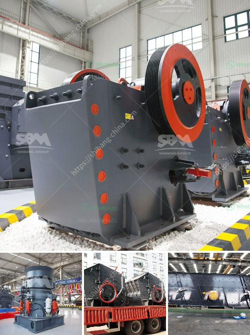

<h3>mineral processing calculations pdf</h3>
Mineral processing calculations are an essential aspect of the mining industry, as they provide crucial information about the efficiency and profitability of extraction operations. These calculations involve complex mathematical formulas and represent critical steps in the overall mineral processing workflow. In this article, we will explore the importance of mineral processing calculations and discuss the benefits of using PDF-based resources for these calculations.

Mineral processing calculations encompass various aspects, including mineral liberation, particle size distribution, mass balance, grade-recovery relationships, and process efficiencies. These calculations play a pivotal role in designing and optimizing extraction processes, making informed decisions about equipment selection, and evaluating the economic viability of mining projects.

One of the main challenges in mineral processing calculations is managing large sets of data and performing numerous calculations accurately and efficiently. This is where PDF-based resources come into play. PDF files provide an organized and easily accessible platform for storing vast amounts of information, including formulas, charts, and graphs. Mining professionals can access these resources digitally, allowing for quick referencing and streamlined workflow.

The advantages of using PDF-based resources for mineral processing calculations are numerous. Firstly, PDF files offer a compact and portable format, making it easy to share information between team members, regardless of their location. This promotes collaboration and real-time data exchange, enhancing the overall efficiency and accuracy of calculations.

Furthermore, PDF files can be easily searched and navigated, saving valuable time and effort when looking for specific calculations or formulas. These resources often include hyperlinks and bookmarks, allowing users to move between sections effortlessly. Additionally, PDF files can be annotated and highlighted, facilitating the documentation and sharing of key findings and insights.

PDF-based resources for mineral processing calculations are not limited to basic formulas and calculations. They often include comprehensive case studies, practical examples, and step-by-step instructions on how to perform specific calculations. This helps mining professionals gain a deeper understanding of the underlying principles and apply the calculations effectively in real-world scenarios.

Moreover, PDF files can be easily updated and revised, ensuring that mining professionals have access to the latest research and industry developments. They can be supplemented with additional information and updated with new data, providing continuous support for mineral processing calculations.

In conclusion, mineral processing calculations are crucial for the mining industry. They provide key insights into the efficiency and profitability of extraction operations, helping mining professionals make informed decisions and optimize their processes. PDF-based resources offer numerous benefits for mineral processing calculations, including easy accessibility, portability, searchability, and annotatability. By utilizing these resources, mining professionals can enhance their workflow, improve accuracy, and stay up-to-date with the latest research and industry advancements.
<h3>Contact us</h3><ul><li><strong>Whatsapp:&nbsp;<a href="https://wa.me/8613661969651">+8613661969651</a></strong></li><li><a href="https://swt.shibang-china.com/?git&amp;zhl&amp;mineral processing calculations pdf"><strong>Online Service(chat now)</strong></a></li></ul><h3>Related</h3><ul><li><a href='stone crushing units.md'>stone crushing units</a></li><li><a href='cara menghitung kapasitas pada belt conveyor.md'>cara menghitung kapasitas pada belt conveyor</a></li><li><a href='used concrete crusher manufacturer in malaysia.md'>used concrete crusher manufacturer in malaysia</a></li><li><a href='iron ore beneficiation plant cost.md'>iron ore beneficiation plant cost</a></li><li><a href='bentonite crushing machine price list.md'>bentonite crushing machine price list</a></li></ul>