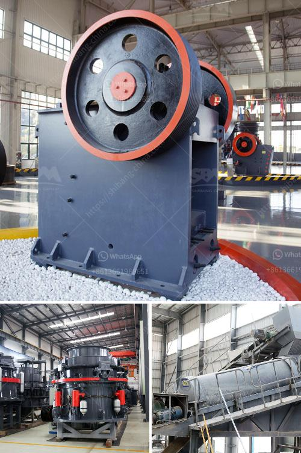

<h3>mineral that is used to make talcum powder</h3>
When we think of talcum powder, the first thing that comes to mind is its use in baby care products. However, talcum powder is not just limited to keeping babies dry and comfortable. This versatile mineral has been used for centuries in various industries, owing to its unique properties and benefits.

Talcum powder is primarily made out of a mineral known as talc. Talc is a naturally occurring soft and silky mineral. It is composed of magnesium, silicon, and oxygen atoms, forming a hydrous magnesium silicate. Talc deposits are found worldwide in rocks formed through the metamorphic process. These deposits are often located near or within metamorphic rocks like serpentine, gabbro, and chlorite.

One of the key advantages of talc is its exceptional ability to absorb moisture. It has a high water-absorption capacity, which makes it a perfect ingredient for products designed to keep skin dry. This absorption quality has made talcum powder a popular component in products like body powders, anti-perspirants, and feminine hygiene products.

Talcum powder is renowned for its gentle and soothing characteristics, making it an ideal choice for products for delicate skin. It is widely used in baby powders to prevent diaper rashes and keep babies comfortable. It helps to absorb excess moisture and maintains the smoothness of a baby's skin. Additionally, talc’s anti-friction properties make it highly suitable for preventing chafing and reducing irritation.

Apart from its use in personal care products, talcum powder has also found applications in the cosmetics industry. Talc acts as an excellent filler, enhancing the texture, opacity, and smoothness of various cosmetic products like foundations, blushes, eyeshadows, and face powders. Its fine particles provide a soft and velvety feel to the skin, making it a popular ingredient among cosmetic formulators.

Furthermore, talcum powder has industrial uses as well due to its unique characteristics. It serves as an effective lubricant, reducing friction and minimizing wear in machinery and equipment. Its ability to withstand high temperatures and pressure makes it suitable for use in the manufacturing of ceramics, paint, plastics, rubber, and paper. Talc also acts as a filler and reinforcement agent, adding strength and stiffness to various materials.

Although talcum powder has several advantages, it is important to note that the safety of its long-term use has been a subject of debate. Some studies have suggested a possible link between the use of talcum powder in the genital area and an increased risk of ovarian cancer in women. As a result, several lawsuits have been filed, and various regulatory bodies have issued warnings. It is crucial to consider these concerns and opt for alternative products containing safe ingredients for personal use.

In conclusion, talcum powder is a versatile mineral with a wide range of uses. Its exceptional moisture-absorbing and soothing properties have made it a popular ingredient in personal care and cosmetic products. Additionally, talc’s industrial applications extend to various manufacturing sectors, offering benefits like lubrication and reinforcement. As with any product, it is essential to stay informed about any potential risks associated with talcum powder. Evaluating the benefits and possible drawbacks can help consumers make informed decisions about its usage.
<h3>Contact us</h3><ul><li><strong>Whatsapp:&nbsp;<a href="https://wa.me/8613661969651">+8613661969651</a></strong></li><li><a href="https://swt.shibang-china.com/?git&amp;zhl&amp;mineral that is used to make talcum powder"><strong>Online Service(chat now)</strong></a></li></ul><h3>Related</h3><ul><li><a href='dolomite powder making machine for processing line.md'>dolomite powder making machine for processing line</a></li><li><a href='gold ore crusher machine.md'>gold ore crusher machine</a></li><li><a href='calcium carbide production machinery.md'>calcium carbide production machinery</a></li><li><a href='mtm 160 mill spare parts suppliers in india.md'>mtm 160 mill spare parts suppliers in india</a></li><li><a href='ethiopia gypsum manufacturers.md'>ethiopia gypsum manufacturers</a></li></ul>