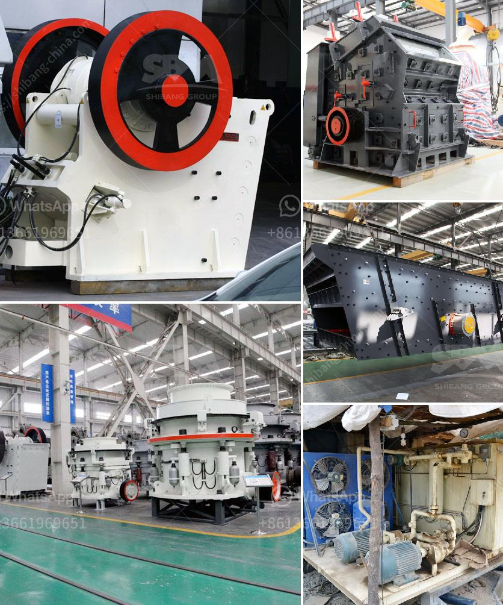

<h3>mini cement plant project cost india</h3>
India is the second-largest production country of cement in the world. With a growing economy and increasing infrastructure projects, the demand for cement is on the rise. Setting up a mini cement plant can be a lucrative opportunity for entrepreneurs in India.

A mini cement plant is a small-scale manufacturing facility that produces cement. It differs from large-scale cement plants in terms of investment, production capacity, and size. A mini cement plant can have a production capacity of up to 1000 tons per day, making it more suitable for small-scale cement manufacturers.

The cost of setting up a mini cement plant in India varies depending on the specific requirements and choices of the entrepreneur. However, an approximate initial investment of Rs 50 to 60 lakhs is necessary for setting up a small-scale cement plant in India.

1. Land: The first essential requirement for setting up a mini cement plant is land. The land needed for a cement plant varies depending on the capacity and location. Typically, a 1-acre land is required for a mini cement plant.

2. Factory Building: After acquiring the land, the next step is to construct a factory building. The size of the factory building depends on the production capacity and other factors. The cost of constructing a factory building can range from Rs 10 to 20 lakhs.

3. Machinery and Equipment: The machinery and equipment required for a mini cement plant include crushers, raw mill, kiln, coal mill, clinker grinding unit, cement silo, and packaging machine. The cost of machinery and equipment for a mini cement plant can range from Rs 25 to 50 lakhs.

4. Raw Materials: The main raw material required for cement production is limestone, which can be sourced from nearby mines. Additionally, other materials like gypsum, fly ash, and coal are also required. The cost of raw materials can vary from Rs 5 to 10 lakhs.

5. Manpower: A mini cement plant requires various skilled and unskilled labor for its operation. The cost of hiring manpower can range from Rs 10 to 15 lakhs.

6. Other Expenses: Other expenses include electricity charges, water supply, transportation, marketing, and administrative costs. These expenses can range from Rs 5 to 10 lakhs.

In conclusion, setting up a mini cement plant in India can be a profitable venture, given the increasing demand for cement in the country. The project cost can vary depending on the specific requirements and choices of the entrepreneur. However, an approximate initial investment of Rs 50 to 60 lakhs is necessary. Entrepreneurs willing to venture into the cement manufacturing sector should conduct a thorough market analysis and feasibility study before proceeding with the project. With proper planning and execution, a mini cement plant project can yield good returns and contribute to the growth of the Indian economy.
<h3>Contact us</h3><ul><li><strong>Whatsapp:&nbsp;<a href="https://wa.me/8613661969651">+8613661969651</a></strong></li><li><a href="https://swt.shibang-china.com/?git&amp;zhl&amp;mini cement plant project cost india"><strong>Online Service(chat now)</strong></a></li></ul><h3>Related</h3><ul><li><a href='impact crusher equipment manufacturer.md'>impact crusher equipment manufacturer</a></li><li><a href='limestone crusher cost.md'>limestone crusher cost</a></li><li><a href='iron ore crusher for sale.md'>iron ore crusher for sale</a></li><li><a href='funding for establishment of stone crushers.md'>funding for establishment of stone crushers</a></li><li><a href='how to make talcum powder in the escapists.md'>how to make talcum powder in the escapists</a></li></ul>