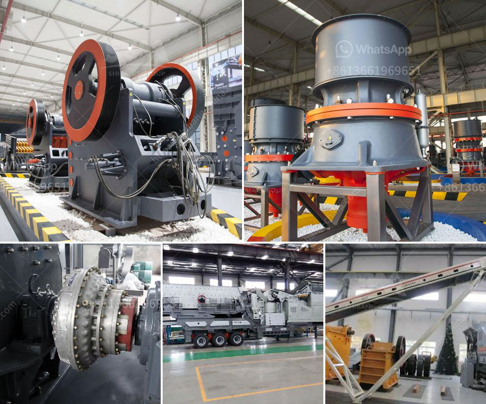

<h3>mini cement plant project in india</h3>
India is the second largest producer of cement worldwide. The country's cement industry plays a vital role in the growth and development of various sectors such as infrastructure, housing, commercial and industrial construction. To meet the increasing demands of cement, many companies are constantly seeking opportunities to set up new plants.

One such emerging project in India is the mini cement plant. A mini cement plant is smaller in size compared to a full-fledged cement plant. These plants are highly efficient and take up minimal space, making them a preferable option for small-scale cement production.

The mini cement plant project in India has witnessed immense growth in recent years. With government initiatives and increasing infrastructure spending, there is a huge scope for expansion of the cement industry. Moreover, the mini cement plant offers numerous advantages such as low capital investment, low production cost, and high flexibility.

Setting up a mini cement plant requires a well-planned approach. The project involves various stages, including obtaining necessary permissions, procuring machinery and raw materials, construction of the plant, and commissioning. Companies need to conduct comprehensive market research and feasibility studies to identify potential business opportunities.

The mini cement plant project creates employment opportunities for local communities. From skilled labor to managerial positions, these projects contribute significantly to generating employment in both urban and rural areas. It also provides a boost to the local economy through the purchase of raw materials, transportation, and other related activities.

The Indian government has also undertaken measures to support the growth of the mini cement plant project. Tax incentives, subsidies, and other financial assistance schemes are provided to attract potential investors and promote sustainable development in the cement industry.

In conclusion, the mini cement plant project in India presents a promising opportunity for entrepreneurs and investors. The constant growth of the construction sector and government initiatives make this project highly lucrative. With proper planning, execution, and market analysis, a mini cement plant can yield substantial profits while contributing to the country's economic development.
<h3>Contact us</h3><ul><li><strong>Whatsapp:&nbsp;<a href="https://wa.me/8613661969651">+8613661969651</a></strong></li><li><a href="https://swt.shibang-china.com/?git&amp;zhl&amp;mini cement plant project in india"><strong>Online Service(chat now)</strong></a></li></ul><h3>Related</h3><ul><li><a href='used silica crushing plants for sale.md'>used silica crushing plants for sale</a></li><li><a href='tonnes per hour crusher.md'>tonnes per hour crusher</a></li><li><a href='small scale hard rock gold ore processing.md'>small scale hard rock gold ore processing</a></li><li><a href='general layout of cement plant.md'>general layout of cement plant</a></li><li><a href='crusher stone crusher 1 ton peru.md'>crusher stone crusher 1 ton peru</a></li></ul>