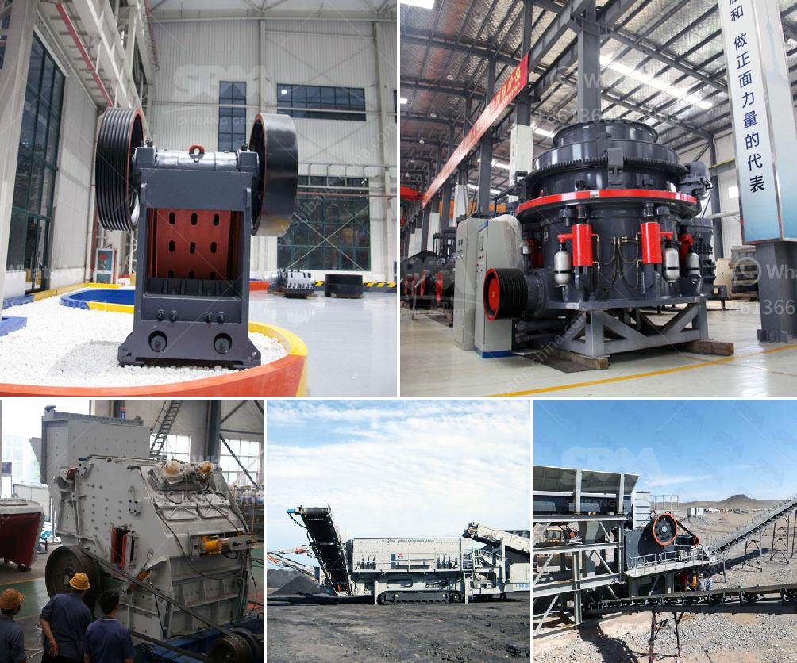

<h3>mini cement plant project report india</h3>
A mini cement plant project report is a detailed document that outlines various aspects of the project, including the production capacity, machinery requirements, cost of production, and revenue generation. The report projects the feasibility of establishing a mini cement plant by objectively analyzing the regional demand-supply scenario and the level of investment required.

India, a rapidly growing economy, is witnessing significant infrastructure development. The construction sector is booming, necessitating a massive supply of cement. As a result, establishing a mini cement plant in India has become a lucrative opportunity for entrepreneurs.

The project report recommends choosing a location that has an abundant supply of raw materials, such as limestone and clay, which are essential for cement production. It also advises entrepreneurs to analyze the regional demand for cement and estimates the potential market size.

The report outlines the machinery requirements for a mini cement plant, such as crushers, mills, conveyor belts, kilns, dust collectors, etc. It assesses the cost of procuring and installing these machines, and also factors in the cost of manpower, power consumption, and maintenance expenses.

Financial projections play a crucial role in the project report, as they demonstrate the viability of the venture. The report covers capital investment needed, projected revenue, and expenses for the first few years. It also includes a break-even analysis, indicating the point at which the project will start generating profits.

A mini cement plant project report provides valuable insights for entrepreneurs seeking to enter the cement industry. It serves as a blueprint for planning and executing the project efficiently, ensuring a smooth operational setup.

In conclusion, the mini cement plant project report outlines the feasibility and profitability of establishing a mini cement plant in India. It helps entrepreneurs make informed decisions by providing comprehensive information on various aspects of the project. With India witnessing tremendous growth in the construction sector, setting up a mini cement plant can be a lucrative venture for aspiring entrepreneurs.
<h3>Contact us</h3><ul><li><strong>Whatsapp:&nbsp;<a href="https://wa.me/8613661969651">+8613661969651</a></strong></li><li><a href="https://swt.shibang-china.com/?git&amp;zhl&amp;mini cement plant project report india"><strong>Online Service(chat now)</strong></a></li></ul><h3>Related</h3><ul><li><a href='kaolin crusher price.md'>kaolin crusher price</a></li><li><a href='project proposal for gypsum manufacturing.md'>project proposal for gypsum manufacturing</a></li><li><a href='coal crusher supplier.md'>coal crusher supplier</a></li><li><a href='talc powder grinding mills in german.md'>talc powder grinding mills in german</a></li><li><a href='conveyor belts philippine price.md'>conveyor belts philippine price</a></li></ul>