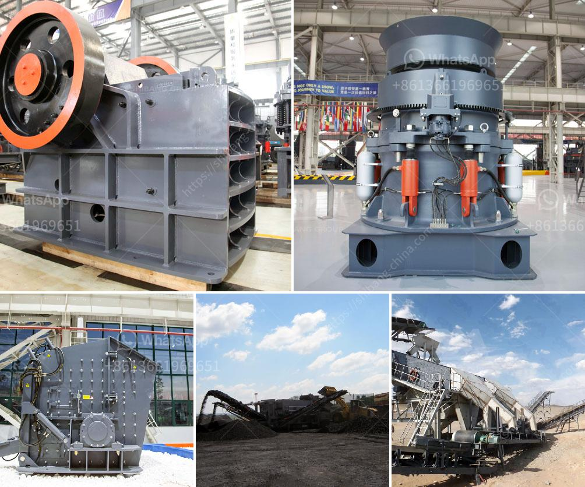

<h3>mini sand stone crusher price</h3>
Mini sand stone crusher price is a concern for many customers. The machine made sand is produced through crushing stones and sand making, so it has a wide range of applications in modern construction. What's more, the sand production line can be customized to different sizes, to meet the production requirements of different customers. The performance characteristics of the machine-made sand are related to the selection of crusher model. Therefore, when selecting a model, users should pay more attention to the characteristics of the crusher.

Generally speaking, the price of the equipment is determined by a variety of factors, such as equipment manufacturers, specifications, quality, region, market demand, etc. Different manufacturers have different equipment prices, and the same equipment will also have different prices due to different specifications and quality. In terms of market demand, the price of the equipment will increase when the market demand is in a growth state.

The mini sand stone crusher price in the market is relatively low, although the large-scale stone crusher treats a wide range of materials, in terms of the particle size of finished products, it can be adjusted according to different needs of users, which is also one of the advantages of the sand stone crusher. However, compared with the large-sized equipment, the mini sand stone crusher price is slightly lower, so users will feel that the price of the stone crusher is lower, and the production efficiency of the equipment is also higher. What's more, mini sand stone crusher is not only highly efficient, but also reliable and flexible in application. It can adjust the particle size of the finished products according to the actual needs of users, and can also be customized according to the specific requirements of users.

In addition, the mini sand stone crusher is driven by a motor, while the large-scale equipment is driven by a hydraulic system. Users can choose different types of equipment according to their preferential factors, so that the cost of the equipment can be effectively reduced, and the production efficiency and particle size of the equipment can be effectively improved.

In conclusion, the mini sand stone crusher price can be controlled within a certain range depending on the specific needs of users. It can not only effectively reduce the cost of equipment, but also improve the production efficiency and particle size of the equipment. Therefore, when buying equipment, users should fully consider their actual needs, and choose the appropriate equipment model and specifications according to their actual needs, so as to convey the machine-made sand that meets their needs.
<h3>Contact us</h3><ul><li><strong>Whatsapp:&nbsp;<a href="https://wa.me/8613661969651">+8613661969651</a></strong></li><li><a href="https://swt.shibang-china.com/?git&amp;zhl&amp;mini sand stone crusher price"><strong>Online Service(chat now)</strong></a></li></ul><h3>Related</h3><ul><li><a href='what is a mobile crusher.md'>what is a mobile crusher</a></li><li><a href='rod mill for sale perth.md'>rod mill for sale perth</a></li><li><a href='black powder ball mill grinder.md'>black powder ball mill grinder</a></li><li><a href='tonnes per hour crusher.md'>tonnes per hour crusher</a></li><li><a href='screw conveyor design calculation.md'>screw conveyor design calculation</a></li></ul>