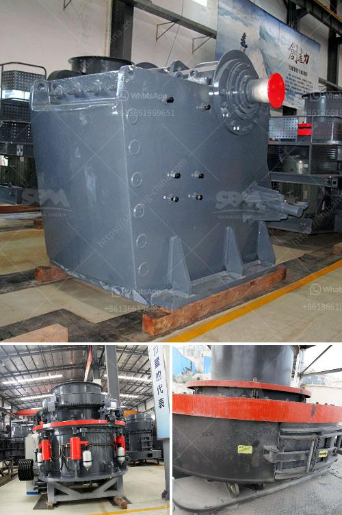

<h3>mini stone crusher machine cost mill</h3>
Mini stone crusher machine cost is adjustable depending on the specific production requirements. With the booming development of infrastructure construction, the demand for sand and gravel is increasing year by year, and the requirement for the stone crusher machine is also growing due to its high production capacity. The mini stone crusher machine is a popular crusher equipment in the market.

Mini stone crusher machine cost is determined by a variety of factors, including: the type of stone crusher, principles of stone crusher, the price of raw materials, and so on. Moreover, there are many different types of stone crushers available in the market to choose from based on the production requirements. Therefore, it is important to identify the appropriate type of stone crusher machine for your specific project.

The mini stone crusher machine is a useful tool for the construction and mining industry. It is often used to crush all kinds of stones with a variety of hardness in order to help companies build better roads, improve infrastructure or create a more efficient working environment. In most cases, the mini stone crusher machine also comes with a small feeder for better and uniform material distribution.

The mini stone crusher machine has a simple and compact structure, making it easy to operate and maintain. Moreover, the small size makes it convenient to transport and install. Therefore, the mini stone crusher machine is practical and cost-effective for businesses.

Compared to large scale stone crushing machines, the mini stone crusher machine cost is low. For small scale crushing applications, they are ideal choice because of their low operating cost. In addition, the mini stone crusher machine’s power consumption is low and it also takes up small floor space. By taking advantage of these factors, businesses can save both time and money while still maintaining high production rates.

The mini stone crusher machine cost can be reduced by using high-quality and efficient crushing equipment. Another important factor is the optimization of the crushing process. To achieve the optimal crushing efficiency, the combination of the speed, stroke and the crushing cavity should be analyzed in detail. The selection of the appropriate crushing equipment and the optimization of the crushing process can greatly improve the crushing efficiency and reduce the overall cost.

In conclusion, the mini stone crusher machine cost is determined by a variety of factors, such as the type of stone crusher, principles of stone crusher, the price of raw materials, and so on. However, the factors that affect the cost of these machines should be considered before purchasing a mini stone crusher machine. With appropriate equipment, businesses can improve their efficiency and productivity while minimizing the cost of operation.
<h3>Contact us</h3><ul><li><strong>Whatsapp:&nbsp;<a href="https://wa.me/8613661969651">+8613661969651</a></strong></li><li><a href="https://swt.shibang-china.com/?git&amp;zhl&amp;mini stone crusher machine cost mill"><strong>Online Service(chat now)</strong></a></li></ul><h3>Related</h3><ul><li><a href='mtm grinding mill.md'>mtm grinding mill</a></li><li><a href='activated carbon a full set of production equipment.md'>activated carbon a full set of production equipment</a></li><li><a href='stone crushing machines in oman.md'>stone crushing machines in oman</a></li><li><a href='chrome mining business plan.md'>chrome mining business plan</a></li><li><a href='hammer mill aluminum slag.md'>hammer mill aluminum slag</a></li></ul>