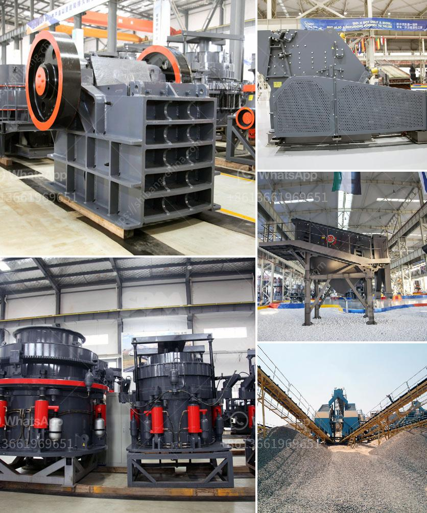

<h3>mini stone jaw crushers</h3>
The mini stone jaw crusher machine is widely used in mining, building materials, chemical industry, metallurgy and so on. It is suitable for primary and secondary crushing of all kinds of minerals and rocks with compressive strength less than 320 MPa.

The mini stone jaw crusher is a kind of crude crushing equipment widely used at home and abroad. It mainly applies for primary and crude crushing of all kinds of hard rocks and block materials. Mini stone jaw crushers are powered by motor, through the motor pulley and V-belts, the eccentric shaft is driven by the triangle belt and slot wheel to make the movable jaw plate move along a regulated track.

The mini stone jaw crusher machine has low cost, low energy consumption, wide range of application, wide crushing ration and crushing strength. Uniform particle size, simple structure, reliable operation and convenient maintenance. The utility model has the advantages of large processing capacity, high production efficiency, small granularity, and good grain shape of the finished product. It is a stone crusher with good economic and environmental protection performance.

With the continuous improvement of technology, the mini stone jaw crusher has also become a common choice of customers, because of its small size, easy transportation and convenient maintenance. The mini stone jaw crusher is suitable for crushing all kinds of hard and abrasive rocks, and can crush materials whose compressive strength is less than 320MPa.

The mini stone jaw crusher machine has a deep crushing cavity and the frame employs the joggle joint welding and entirely annealing technology which make the crusher a simple, durable and robust structure and improve the capacity and the crushing ratio. It is also fast and convenient to replace the spare parts. The machine adopts double row spherical roller bearing which has fine alignment, reducing the resistance and increasing the rotational inertia of rotor, thus significantly improving the production capacity.

In conclusion, the mini stone jaw crusher machine is widely used in mining, building materials, chemical industry, metallurgy and so on. It is suitable for primary and secondary crushing of all kinds of minerals and rocks with compressive strength less than 320 MPa. Its compact structure, high efficiency, low energy consumption and easy maintenance make it a favorite among customers.
<h3>Contact us</h3><ul><li><strong>Whatsapp:&nbsp;<a href="https://wa.me/8613661969651">+8613661969651</a></strong></li><li><a href="https://swt.shibang-china.com/?git&amp;zhl&amp;mini stone jaw crushers"><strong>Online Service(chat now)</strong></a></li></ul><h3>Related</h3><ul><li><a href='used iron ore jaw crusher price nigeria.md'>used iron ore jaw crusher price nigeria</a></li><li><a href='barium carbonate manufacturing process.md'>barium carbonate manufacturing process</a></li><li><a href='feasibility report for black stone crushers in jharkhand.md'>feasibility report for black stone crushers in jharkhand</a></li><li><a href='hard rock gold mining equipment.md'>hard rock gold mining equipment</a></li><li><a href='mineral processing calculations pdf.md'>mineral processing calculations pdf</a></li></ul>