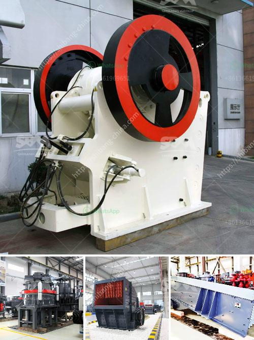

<h3>mining and quarrying crusher machinery and equipment</h3>
Mining and quarrying industries are the backbone of global development. As the demand for natural resources continues to increase, so does the need for efficient and reliable machinery and equipment. Crushers play a crucial role in these industries, enabling the extraction and processing of raw materials to meet the ever-growing demands of society.

Mining and quarrying crushers are essentially crushing machines used to break down materials such as ore, coal, limestone, and granite into smaller pieces. They are commonly used in the mining and quarrying processes to deal with large rocks, excavated materials, and stone aggregates. 

These crushers utilize high pressure, impact, or compression force to reduce the size of the raw materials. They are available in various types, including jaw crushers, cone crushers, impact crushers, and gyratory crushers. Each type caters to specific needs and requirements of different mining and quarrying operations.

Jaw crushers are commonly used in the primary crushing stage and can handle large-sized rocks. They work by compressing the material between two plates, known as jaws, which move towards each other to break the rock into smaller pieces. Jaw crushers are known for their simplicity, reliability, and high capacity.

Cone crushers, on the other hand, are typically used in secondary and tertiary crushing stages. Their main advantage is the ability to produce a narrow range of product sizes. Cone crushers operate by squeezing the material between an eccentrically rotating mantle and a concave. This action results in a more cubical product shape and can be used to produce high-quality aggregates for construction purposes.

Impact crushers are versatile machines that can be used in various stages of the crushing process. They utilize the principle of rapid impact to crush the material and are suitable for both soft and hard rocks. Impact crushers are commonly used for recycling applications and in quarrying operations where materials such as asphalt, concrete, and bricks are processed.

Gyratory crushers are powerful machines used in the primary crushing stage. They consist of a conical-shaped main shaft that gyrates around its own axis, causing the rock to be compressed between the mantle and concave. Gyratory crushers are known for their high capacity and are often used to process large volumes of material.

In addition to crushers, mining and quarrying machinery and equipment include screens, feeders, and conveyors. Screens are used to separate the desired product from the undersized material. Feeders are used to regulate the flow of material into the crushers, while conveyors transport the crushed material from one stage to another. All these components work together to ensure a smooth and efficient crushing process in mining and quarrying operations.

The mining and quarrying industries are highly demanding and require robust and reliable machinery and equipment. Crushers play a vital role in these industries by facilitating the efficient extraction and processing of raw materials. With advances in technology, crushers are becoming more versatile, providing improved productivity and lower operating costs. Investing in quality mining and quarrying crusher machinery and equipment is essential for enhancing productivity, reducing downtime, and ensuring smooth operations in these vital industries.
<h3>Contact us</h3><ul><li><strong>Whatsapp:&nbsp;<a href="https://wa.me/8613661969651">+8613661969651</a></strong></li><li><a href="https://swt.shibang-china.com/?git&amp;zhl&amp;mining and quarrying crusher machinery and equipment"><strong>Online Service(chat now)</strong></a></li></ul><h3>Related</h3><ul><li><a href='bauxite ore processing equipment price.md'>bauxite ore processing equipment price</a></li><li><a href='gold mining equipment mobile plant.md'>gold mining equipment mobile plant</a></li><li><a href='ball mill operating rpm calculation.md'>ball mill operating rpm calculation</a></li><li><a href='complete crushing for sale with price.md'>complete crushing for sale with price</a></li><li><a href='ballast stone crusher.md'>ballast stone crusher</a></li></ul>