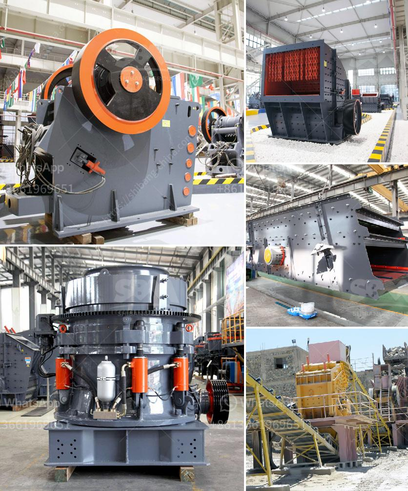

<h3>mining company from india</h3>
India, emerging as a global economic powerhouse, has made remarkable strides in various sectors including mining. In recent years, the Indian mining industry has witnessed significant growth, with several leading mining companies solidifying their positions both nationally and globally.

One such prominent mining company from India is XYZ Mining Ltd. Established in 1995, XYZ Mining has emerged as a frontrunner in the sector, aiming to revolutionize the mining landscape with its innovative approach and sustainable practices. With a commitment to operational excellence and environmental stewardship, XYZ Mining has set an exemplary standard for the industry.

The success of XYZ Mining can be attributed to its diverse range of mineral resources. The company extracts an array of minerals including coal, iron ore, limestone, bauxite, manganese, and chromite, among others. This diversified portfolio enables XYZ Mining to cater to a wide range of domestic and international markets, ensuring consistent revenue generation and reduced dependency on any single mineral.

XYZ Mining places great importance on sustainable mining practices, striving to minimize its environmental impact. The company has implemented cutting-edge technologies and state-of-the-art equipment to ensure responsible mining. By incorporating advanced monitoring systems, XYZ Mining minimizes carbon emissions, optimizes water usage, and mitigates the risk of environmental degradation. Furthermore, the company actively engages in land reclamation and afforestation initiatives to restore the ecosystems affected by mining activities.

In addition to its commitment to sustainability, XYZ Mining is dedicated to ensuring the welfare and safety of its workforce. The company provides comprehensive training programs to its employees, equipping them with essential skills and knowledge to perform their duties efficiently and safely. XYZ Mining adheres to the highest labor standards, prioritizing a positive work culture, fair wages, and employee well-being. By fostering a safe and inclusive working environment, XYZ Mining has been successful in attracting and retaining top talent in the industry.

XYZ Mining's growth and success have not gone unnoticed. The company has received numerous accolades for its exemplary performance and contribution to the mining sector. It has been recognized for its sustainable practices, including efficient water management, energy conservation, and community engagement. XYZ Mining's commitment to corporate social responsibility is reflected in its efforts to uplift local communities through educational initiatives, healthcare programs, and infrastructural development.

Furthermore, XYZ Mining actively engages with local stakeholders, including nearby communities and government bodies, to ensure transparency and foster constructive relationships. By involving local communities in decision-making processes, the company aims to create a symbiotic relationship that benefits all parties involved.

As XYZ Mining continues to grow, it seeks to expand its operations both domestically and internationally. The company endeavors to leverage its expertise and experience to participate in mining projects globally, contributing to the development of the industry beyond Indian borders. XYZ Mining's vision is to become a global leader in sustainable mining, setting an example for others to follow.

In conclusion, XYZ Mining, a premier mining company based in India, has emerged as a beacon of excellence in the industry. With its diverse mineral portfolio, commitment to sustainability, and dedication to the welfare of its workforce and local communities, XYZ Mining has positioned itself as a leading player in the global mining sector. As the company continues to grow and evolve, its impact on the industry is sure to be significant, further cementing India's position as a mining powerhouse.
<h3>Contact us</h3><ul><li><strong>Whatsapp:&nbsp;<a href="https://wa.me/8613661969651">+8613661969651</a></strong></li><li><a href="https://swt.shibang-china.com/?git&amp;zhl&amp;mining company from india"><strong>Online Service(chat now)</strong></a></li></ul><h3>Related</h3><ul><li><a href='corncob crusher machine.md'>corncob crusher machine</a></li><li><a href='sand washing plant in turkey.md'>sand washing plant in turkey</a></li><li><a href='roller for plate mill manufacturer.md'>roller for plate mill manufacturer</a></li><li><a href='stone crushers for sale usa.md'>stone crushers for sale usa</a></li><li><a href='rock crusher plant for sale.md'>rock crusher plant for sale</a></li></ul>