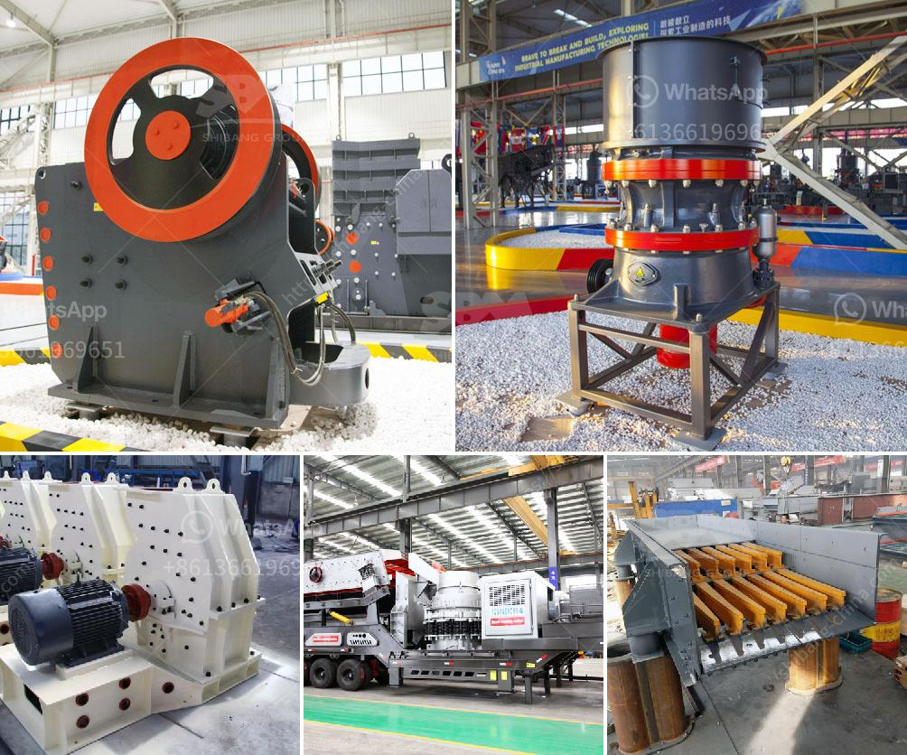

<h3>mining conveyors for sale in zimbabwe</h3>
Mining conveyors play a crucial role in the overall efficiency and productivity of mining operations in Zimbabwe. These conveyor systems are responsible for transporting bulk materials, such as coal, ore, and minerals, throughout the mine site. With the right conveyor system in place, mining companies can significantly improve their production rates and reduce manual labor, ultimately maximizing their profitability.

In Zimbabwe, mining is a thriving industry, with numerous mines extracting minerals, such as gold, platinum, and diamonds. To efficiently extract these valuable resources, mining companies rely on conveyors to transport the material from the extraction point to the processing plant. These conveyors are specially designed to withstand harsh mining conditions, ensuring reliable operation and minimal downtime.

One significant advantage of using mining conveyors is their ability to handle large quantities of materials continuously. This eliminates the need for manual handling, reducing the risk of injuries and improving overall productivity. Moreover, mining conveyors can be equipped with additional features, such as sensors and automation systems, to further enhance their efficiency and safety.

For mining companies in Zimbabwe looking to invest in new conveyor systems or expand their existing fleet, there are various options available in the market. Several reputable manufacturers and suppliers offer mining conveyors for sale, providing a wide range of options to suit different mining applications and budgets.

When considering the purchase of mining conveyors, mining companies should consider factors such as the conveyor's capacity, speed, and adaptability to different terrains. Additionally, durability and reliability are crucial attributes to ensure uninterrupted operations in the demanding mining environment.

Furthermore, it is essential to select a conveyor system that can be easily integrated into the existing mining infrastructure. Compatibility with other mining equipment, such as crushers, screens, and processing plants, is crucial to achieving a seamless and efficient workflow.

In conclusion, mining conveyors are indispensable equipment in the mining industry in Zimbabwe. They offer a cost-effective and efficient solution for transporting bulk materials, improving productivity, and reducing manual labor. Mining companies should explore the available options in the market and select a conveyor system that aligns with their specific requirements, ensuring a successful and profitable mining operation.
<h3>Contact us</h3><ul><li><strong>Whatsapp:&nbsp;<a href="https://wa.me/8613661969651">+8613661969651</a></strong></li><li><a href="https://swt.shibang-china.com/?git&amp;zhl&amp;mining conveyors for sale in zimbabwe"><strong>Online Service(chat now)</strong></a></li></ul><h3>Related</h3><ul><li><a href='list of machinery used in the quarry.md'>list of machinery used in the quarry</a></li><li><a href='industrial impact crushers.md'>industrial impact crushers</a></li><li><a href='largest crusher manufacturing company.md'>largest crusher manufacturing company</a></li><li><a href='hammer mill aluminum slag.md'>hammer mill aluminum slag</a></li><li><a href='crusher and screening equipment price in south africa.md'>crusher and screening equipment price in south africa</a></li></ul>