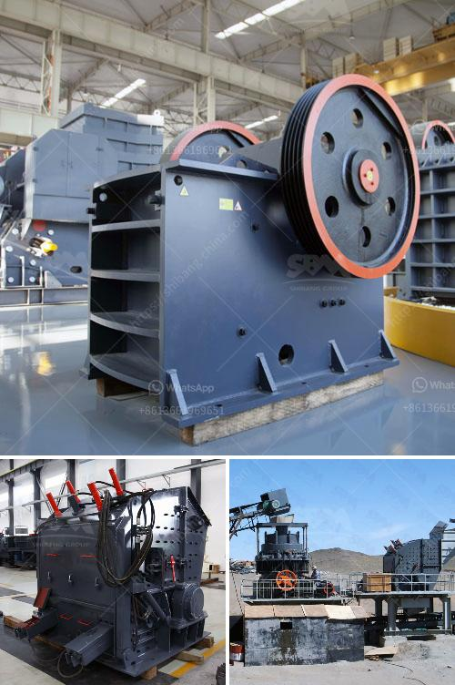

<h3>mining crusher plant limestone process</h3>
Limestone is a sedimentary rock composed mostly of the mineral calcite and comprising about 15% of the Earth's sedimentary crust. It is a basic building block of the construction industry and a chief material from which aggregate, cement, lime, and building stone are made. Limestone is abundant in most parts of the world and is easily accessible, making it an ideal choice for a variety of construction applications. Its widespread use in buildings, bridges, roads, dams, and other structures is a testament to its versatility and durability.

One of the key components of limestone is calcium carbonate (CaCO3). During the mining process, limestone is extracted and processed into crushed stone, gravel, and sand. The process involves several stages of crushing, screening, and washing to produce the required sizes and specifications for construction purposes.

As the stone goes through various stages of crushing and screening, it is sorted into different sizes and specifications. The process is more involved than simply crushing the stone and screening it. It actually starts with the mining of the limestone, which is done selectively to maintain high-quality standards. After the extraction, the limestone is taken to a primary crusher where it undergoes a variety of crushing processes depending on the rock size and hardness. The crushing process produces small particles of limestone, which are then screened into various sizes and used in a variety of applications, such as road base, railroad ballast, and concrete aggregate.

Once the limestone has been crushed and screened, it is transferred by conveyor belt or manually to the subsequent crushing stages. The crushed material is fed into one or more secondary crushers for further refinement and sorting. After the secondary crushers, the stone is further screened and sorted based on size and specification requirements for different construction applications.

Besides crushing, the limestone can also undergo additional processes, such as washing and scrubbing, to remove impurities and improve quality. The washed limestone is then further processed to produce various grades of limestone for use in different applications.

Mining crusher plant limestone process is not as simple as other materials. Many factors impact the final product. Before mining, the proper planning must be done in advance. Back then, engineers must analyze geological conditions and geographical location to determine the best excavation method. Once the planning is executed, drilling and blasting operations can commence, followed by loading, hauling, crushing, and screening processes. Each of these stages requires specialized equipment to ensure efficient and effective production.

Mining crusher plant limestone process is indeed a complex and intricate process, involving multiple stages and activities. If not handled with care, it may result in significant production delays and monetary losses. Understanding the various stages and knowing what equipment is appropriate for each stage is crucial for a smooth and successful operation. Additionally, stringent quality control measures must also be in place to ensure the final product meets the required specifications.

Limestone plays a vital role in the construction industry, providing a strong and durable foundation for structures and infrastructure development. The mining crusher plant limestone process allows for excellent durability, making it the ideal building material to withstand harsh weather conditions and everyday wear and tear. In addition, the versatility and abundance of limestone make it a cost-effective and widely sought after material for construction purposes. The mining crusher plant limestone process offers a win-win situation for both the builders and the environment.

In conclusion, mining crusher plant limestone process has and continues to play a crucial role in the construction industry. The process involves several stages including drilling, blasting, crushing, screening, washing, and refining. limestone is extracted from mines and undergoes various processes to meet the required specifications for construction purposes. It is a widely used material that offers durability, versatility, and cost-effectiveness, making it an essential component in the construction industry.
<h3>Contact us</h3><ul><li><strong>Whatsapp:&nbsp;<a href="https://wa.me/8613661969651">+8613661969651</a></strong></li><li><a href="https://swt.shibang-china.com/?git&amp;zhl&amp;mining crusher plant limestone process"><strong>Online Service(chat now)</strong></a></li></ul><h3>Related</h3><ul><li><a href='gold stamp mill for sale in china.md'>gold stamp mill for sale in china</a></li><li><a href='mobile gold processing plant for sale.md'>mobile gold processing plant for sale</a></li><li><a href='mining conveyors for sale in zimbabwe.md'>mining conveyors for sale in zimbabwe</a></li><li><a href='quartz stone 30 80 plant process.md'>quartz stone 30 80 plant process</a></li><li><a href='vertical roller mill suppliers.md'>vertical roller mill suppliers</a></li></ul>