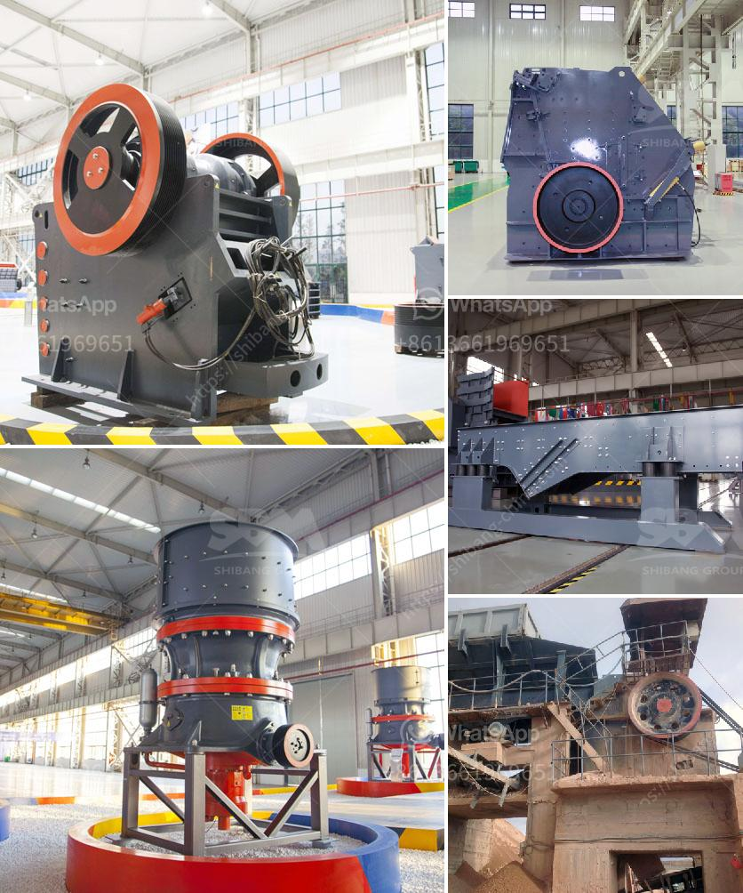

<h3>mining equipment for hire in kenya</h3>
The mining industry in Kenya is growing at a steady pace, driven by an increasing demand for metallic and non-metallic minerals. Kenya’s mining sector is dominated by production of non-metallic minerals encompassing industrial minerals such as soda ash, fluorspar, and titanium minerals, as well as construction materials like limestone, gypsum, and dimension stones. With the immense potential that the mining sector holds for the country’s economic growth, the need for advanced and efficient mining equipment has become indispensable.

One of the primary challenges faced by mining companies in Kenya is the lack of access to modern mining equipment. This hampers their ability to operate efficiently and extract minerals to their full potential. However, with the availability of mining equipment for hire, this challenge can be effectively addressed.

Mining equipment for hire is a convenient and cost-effective option for small to medium-scale mining operations. These machines not only enable mining companies to access advanced technology without a significant capital investment, but also provide them with flexibility in terms of operations and project duration. With mining equipment for hire, companies can rent specific machinery on an as-needed basis, optimizing the use of resources and significantly reducing overall costs.

The variety of mining equipment available for hire in Kenya includes drilling machines, excavators, loaders, bulldozers, crushers, and grinders, among many others. Each machine is designed to perform specific tasks in the mining process, ensuring efficiency, accuracy, and safety. For instance, drilling machines are essential for exploration and sampling, excavators for digging and hauling, and crushers for crushing and grinding rocks.

Apart from ensuring efficient operations, the use of advanced mining equipment also contributes to minimizing environmental impact. Machines that are specifically designed for mining purposes are equipped with advanced features, such as emission controls, noise reduction technology, and fuel-saving mechanisms. By renting such equipment, mining companies in Kenya can adhere to sustainable mining practices and comply with environmental regulations.

Moreover, hiring mining equipment enables companies to leverage the expertise and skills of equipment operators. Authorized dealers and rental companies usually provide trained professionals to operate and maintain the machines, ensuring optimal performance and troubleshooting in case of any technical issues. This eliminates the need for mining companies to train their own workforce, saving time, effort, and cost.

For the rental companies, offering mining equipment for hire presents a lucrative business opportunity. By providing access to advanced machinery, these companies play a vital role in driving the growth of Kenya’s mining industry. Moreover, the regular servicing and maintenance of the equipment ensure its longevity, allowing the rental companies to maximize the lifespan of their assets.

In conclusion, the availability of mining equipment for hire in Kenya unlocks immense possibilities for the country’s mining sector. Leveraging advanced technology and expertise, mining companies can overcome their equipment limitations and execute mining activities with greater efficiency, accuracy, and sustainability. Furthermore, the rental companies contribute significantly to the growth of the sector while ensuring the highest standards of equipment performance and environmental compliance. With mining equipment for hire, Kenya's mining potential can be fully realized, boosting economic growth and the overall development of the country.
<h3>Contact us</h3><ul><li><strong>Whatsapp:&nbsp;<a href="https://wa.me/8613661969651">+8613661969651</a></strong></li><li><a href="https://swt.shibang-china.com/?git&amp;zhl&amp;mining equipment for hire in kenya"><strong>Online Service(chat now)</strong></a></li></ul><h3>Related</h3><ul><li><a href='gypsum crusher plant pdf.md'>gypsum crusher plant pdf</a></li><li><a href='stone crushing plant of germany.md'>stone crushing plant of germany</a></li><li><a href='cone crusher supply.md'>cone crusher supply</a></li><li><a href='rock sand making machine.md'>rock sand making machine</a></li><li><a href='100tph stone crusher price list.md'>100tph stone crusher price list</a></li></ul>