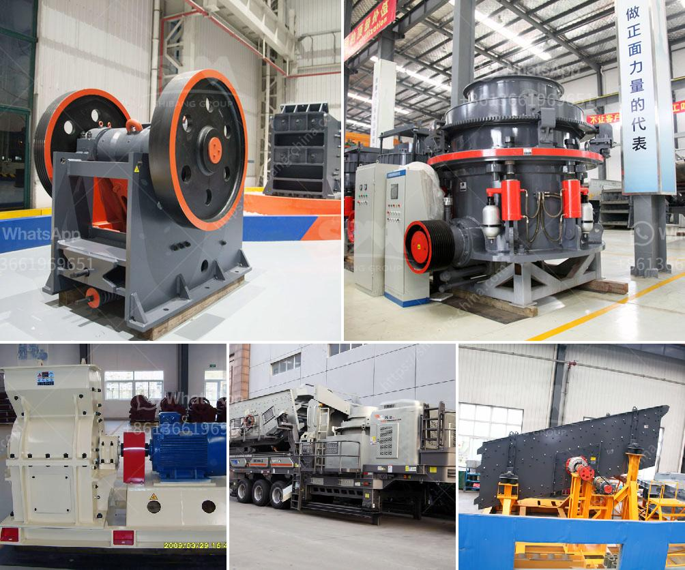

<h3>mining equipment hire indonesia</h3>
Indonesia is a leading producer of minerals and has an abundant mining sector that utilizes various sophisticated equipment. However, mining activities can be capital intensive, and many mining companies in the country lack the necessary funds to invest in mining equipment. To bridge this gap, mining equipment hire has emerged as a viable solution, offering numerous benefits to mining companies.

One of the primary advantages of mining equipment hire in Indonesia is cost-effectiveness. Purchasing mining equipment can be a substantial financial burden for companies, especially smaller or emerging mining operations. By opting for mining equipment rental, companies can access a wide range of advanced machinery without incurring the high upfront costs associated with purchasing. This allows mining companies to allocate their capital to other essential aspects of their operations, such as exploration activities or human resources.

Moreover, equipment hire offers flexibility and scalability for mining companies. The mining industry is subject to market fluctuations, and the demand for equipment can vary significantly depending on projects and market conditions. Through equipment rental, companies can easily scale their operations up or down, depending on their needs. This flexibility ensures that mining companies can adapt quickly to changes in the industry, optimizing their production and reducing downtime.

Another advantage of mining equipment hire is access to the latest and most advanced machinery. Equipment rental companies constantly update their inventory, ensuring that mining operations have the most efficient and technologically advanced equipment available. This allows companies to benefit from cutting-edge technology, improving productivity, and efficiency. Rental companies also provide training and maintenance support, ensuring that mining personnel are skilled in handling the equipment and that it operates at peak performance.

Furthermore, equipment hire eliminates the need for companies to invest in equipment storage and maintenance facilities. Owning and managing equipment storage can be costly, particularly for companies working in remote mining areas. By utilizing rental services, mining companies can mitigate these expenses and focus their resources on core activities, streamlining operations and reducing operational overheads.

In addition to financial and operational benefits, mining equipment hire also promotes sustainability and environmental responsibility. The rental industry promotes the reuse and recycling of equipment, reducing the need for new manufacturing and resource extraction. This contributes to the conservation of natural resources and lessens the environmental impact associated with mining activities. Furthermore, rental companies often enforce strict maintenance and repair practices, ensuring that equipment operates optimally, reducing energy consumption and emissions.

To conclude, mining equipment hire in Indonesia offers numerous benefits to mining companies. It provides cost-effective access to advanced machinery, allowing companies to allocate their capital efficiently. Flexibility and scalability enable companies to adapt to market fluctuations, reducing downtime and optimizing production. Access to the latest technology improves productivity, while rental companies provide training and maintenance support. Additionally, equipment hire promotes sustainability and environmental responsibility, reducing the need for new manufacturing and resource extraction. With the growing demand for mining equipment in Indonesia, the rental industry proves to be a beneficial solution for boosting production efficiency in the mining sector.
<h3>Contact us</h3><ul><li><strong>Whatsapp:&nbsp;<a href="https://wa.me/8613661969651">+8613661969651</a></strong></li><li><a href="https://swt.shibang-china.com/?git&amp;zhl&amp;mining equipment hire indonesia"><strong>Online Service(chat now)</strong></a></li></ul><h3>Related</h3><ul><li><a href='crusher manufacturers prices.md'>crusher manufacturers prices</a></li><li><a href='raymond grinder mill pakistan.md'>raymond grinder mill pakistan</a></li><li><a href='portable crusher in philippines.md'>portable crusher in philippines</a></li><li><a href='gypsum machine in germany.md'>gypsum machine in germany</a></li><li><a href='quartz stone manufacturing process.md'>quartz stone manufacturing process</a></li></ul>