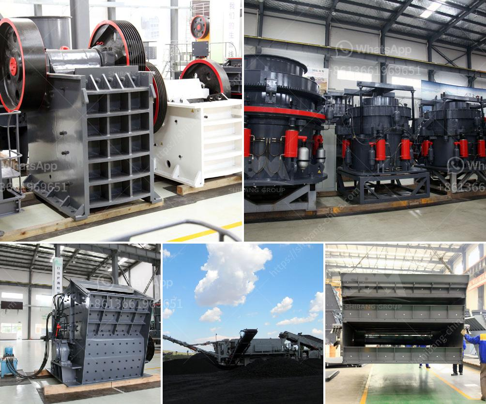

<h3>mining equipment made in germany</h3>
Germany has long been known for its high-quality engineering and manufacturing, and this reputation extends to the mining industry as well. German-made mining equipment is renowned for its reliability, durability, and efficiency. Companies around the world rely on these innovative machines to extract minerals and other valuable resources from the ground.

The mining sector demands equipment that can withstand harsh conditions and heavy workloads, and German manufacturers understand these requirements well. They have perfected the art of designing and building machinery that can handle the toughest mining operations. The use of advanced technologies and materials ensures that the equipment is not only robust but also efficient, helping mining operations run smoothly and efficiently.

One of the key advantages of German mining equipment is its focus on sustainability. Companies in Germany have a deep commitment to reducing their carbon footprint and developing eco-friendly technologies. Many mining machines are designed to be more energy-efficient and emit fewer emissions, aligning with global efforts to combat climate change.

Moreover, German-made mining equipment is highly customizable, allowing companies to tailor machines to their specific needs. Whether it's surface mining, underground mining, or mineral processing, German manufacturers can provide equipment designed to meet the unique challenges faced in each sector of the industry. Their expertise in industrial automation and digitalization further enhances the efficiency and safety of mining operations.

In recent years, the demand for German mining equipment has been on the rise globally. Key markets such as Asia-Pacific, Africa, and the Americas have recognized the superior quality and reliability of these machines, leading to increased exports. Furthermore, German manufacturers offer comprehensive after-sales services and support worldwide, ensuring continuous operation and minimal downtime for mining companies.

In conclusion, German mining equipment sets the benchmark for quality and reliability in the industry. These machines are designed to withstand the rugged conditions of mining operations while also being energy-efficient and environmentally friendly. With their technological expertise and commitment to sustainability, German manufacturers continue to lead the way in providing mining equipment that meets the needs of companies worldwide.
<h3>Contact us</h3><ul><li><strong>Whatsapp:&nbsp;<a href="https://wa.me/8613661969651">+8613661969651</a></strong></li><li><a href="https://swt.shibang-china.com/?git&amp;zhl&amp;mining equipment made in germany"><strong>Online Service(chat now)</strong></a></li></ul><h3>Related</h3><ul><li><a href='roller raymond mill.md'>roller raymond mill</a></li><li><a href='iron ore beneficiation plant for sale.md'>iron ore beneficiation plant for sale</a></li><li><a href='mini stone jaw crushers.md'>mini stone jaw crushers</a></li><li><a href='grinding ball mill equipment.md'>grinding ball mill equipment</a></li><li><a href='definivion jaw crusher.md'>definivion jaw crusher</a></li></ul>