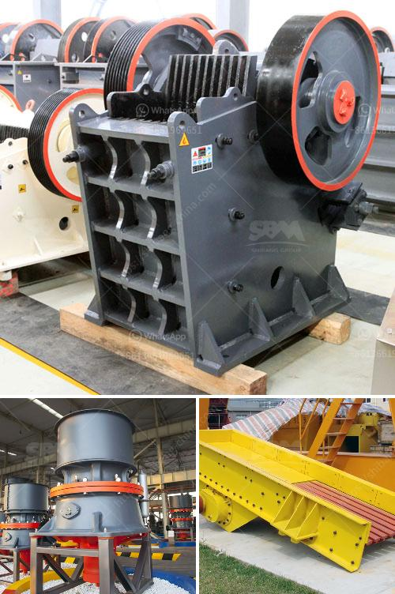

<h3>mining equipment manufacturers colombia</h3>
Colombia has been one of the leading mining countries in South America, and it has experienced significant growth in its mining sector over the past few decades. This growth can be attributed to several factors, including a favorable investment climate, rich mineral resources, and a proactive government that has promoted mining activities. However, the success of the mining industry in Colombia would not have been possible without the support of mining equipment manufacturers.

Mining equipment plays an essential role in the mining process as it facilitates the extraction of minerals from the Earth's surface or underground. These equipment are crucial for various stages of mining, including exploration, excavation, transport, processing, and reclamation. As the demand for minerals continues to rise, so does the need for high-quality mining equipment that can withstand the challenging operating conditions in mines.

Fortunately, Colombia has a vibrant and competitive market for mining equipment manufacturers. These manufacturers cater to the diverse needs of the mining industry by offering a wide range of innovative and efficient equipment solutions. They have expertise in designing and producing equipment that is tailored to the specific requirements of different mining operations, be it coal, gold, copper, or any other mineral.

One of the leading mining equipment manufacturers in Colombia is Komatsu Colombia. With extensive experience and a strong track record, Komatsu Colombia has established itself as a trusted supplier in the industry. The company offers a comprehensive range of mining equipment, including excavators, bulldozers, dump trucks, and drills. These machines are known for their robustness, reliability, and advanced technological features, which contribute to increased productivity and lower operating costs for miners.

Another prominent player in the mining equipment manufacturing sector in Colombia is Caterpillar Colombia. Caterpillar is a global leader in the industry and has been serving the Colombian market for several years. The company offers a wide array of equipment designed to meet the specific needs of different mining operations. From large-scale surface mining equipment to underground mining machinery, Caterpillar Colombia provides innovative solutions that enhance mining efficiency and safety.

In addition to global players like Komatsu and Caterpillar, Colombia also has domestic mining equipment manufacturers that contribute significantly to the country's mining industry. These local manufacturers understand the unique challenges faced by Colombian miners and provide tailored equipment solutions. They have a deep understanding of the local mining environment and are well-positioned to provide prompt after-sales support and maintenance services.

Furthermore, the Colombian government has been actively promoting the development of local mining equipment manufacturing capabilities. Through initiatives like tax incentives, research and development funding, and technical training programs, the government aims to enhance the competitiveness of local manufacturers and reduce the country's reliance on imported mining equipment.

In conclusion, mining equipment manufacturers in Colombia play a crucial role in supporting the country's thriving mining industry. With their innovative and reliable solutions, these manufacturers contribute to increased productivity, operational efficiency, and safety in Colombian mines. Whether it is global players like Komatsu and Caterpillar or local manufacturers, they all bring valuable expertise and technological advancements that drive the success of the mining sector in Colombia.
<h3>Contact us</h3><ul><li><strong>Whatsapp:&nbsp;<a href="https://wa.me/8613661969651">+8613661969651</a></strong></li><li><a href="https://swt.shibang-china.com/?git&amp;zhl&amp;mining equipment manufacturers colombia"><strong>Online Service(chat now)</strong></a></li></ul><h3>Related</h3><ul><li><a href='silica sand production plant in germany.md'>silica sand production plant in germany</a></li><li><a href='crusher plant cost estimation.md'>crusher plant cost estimation</a></li><li><a href='used gold ore processing equipment for sale.md'>used gold ore processing equipment for sale</a></li><li><a href='kaolin crusher processing in china.md'>kaolin crusher processing in china</a></li><li><a href='manufacture of ball mill stator.md'>manufacture of ball mill stator</a></li></ul>