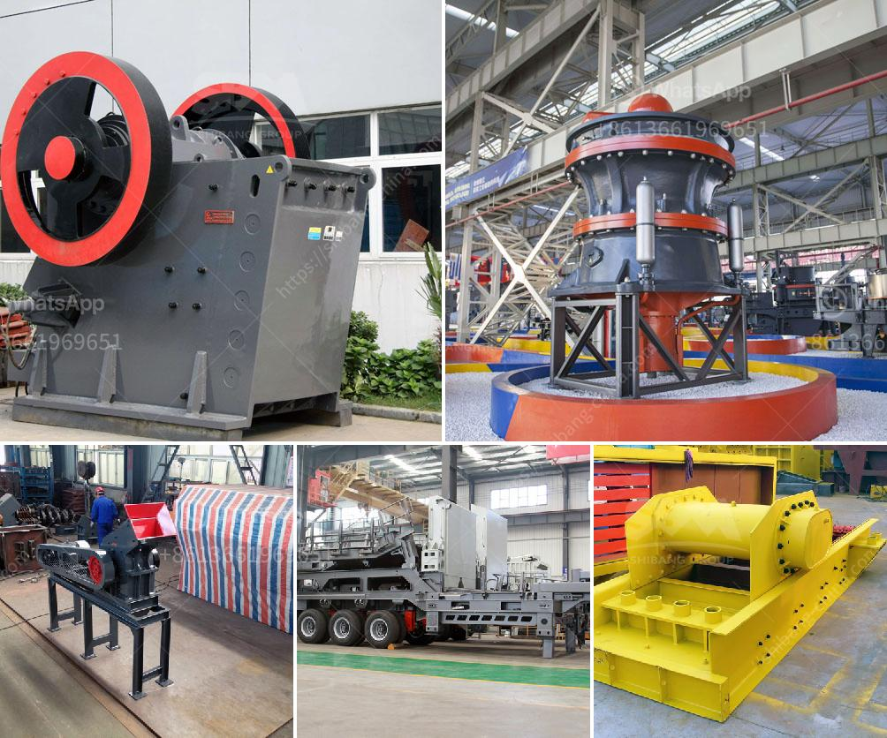

<h3>mining equipment price in ghana</h3>
Mining industry is booming in Ghana with the discovery of various minerals including gold, manganese, and bauxite. With the increasing demand for these minerals, the need for mining equipment is also growing.

When it comes to mining equipment, price is always a crucial factor to consider. In Ghana, some mining equipment sellers can give you reasonable prices, while others may charge you exorbitantly. It is essential to do thorough research and compare prices from various sources before making a purchasing decision.

The price of mining equipment in Ghana varies depending on various factors such as the quality, brand, and capacity. For instance, a small-scale gold mining equipment supplier in Ghana may charge a higher price for a brand-new equipment with advanced features compared to a local distributor who sells used or refurbished machinery.

Apart from the quality and capacity, the brand name of the equipment also affects the price. Internationally renowned brands may have higher prices due to their reputation for quality and performance. However, some local brands may offer similar features and specifications at a more affordable price. It is advisable to carefully evaluate the pros and cons of different brands before making a purchase decision.

Another factor to consider in determining the price of mining equipment in Ghana is import taxes and duties. Ghana's government imposes import duties on certain types of machinery, including mining equipment. This increases the overall cost of acquiring mining equipment and should be factored into your budgeting.

In addition to import duties, there might be other costs associated with obtaining mining equipment in Ghana. Transportation costs, insurance, and maintenance expenses should also be considered to have a complete picture of the total cost of acquiring and operating mining equipment.

To ensure you get the best price for mining equipment in Ghana, it is advisable to source quotes from multiple suppliers. Comparing prices from different sellers will give you an idea of the market range and help you negotiate a better deal.

Furthermore, it is essential to assess the reputation and reliability of the supplier before making a purchasing decision. Read customer reviews and testimonials, check if they have a physical showroom or office, and inquire about warranty and after-sales services. These factors will help you determine if the supplier is trustworthy and reliable.

Lastly, it is crucial to consider the long-term value of the mining equipment you are purchasing. While it can be tempting to opt for the cheapest option, it is important to remember that investing in high-quality equipment can save you money in the long run. Superior quality machinery will require less maintenance, have a longer lifespan, and offer better performance, ultimately leading to increased productivity and profitability.

In conclusion, the price of mining equipment in Ghana varies depending on factors such as quality, brand, capacity, import duties, and additional costs. It is crucial to do thorough research, compare prices from multiple suppliers, assess the reputation and reliability of the supplier, and consider the long-term value and benefits of the equipment. By following these steps, you can make an informed decision and ensure that you get the best price for your mining equipment investment in Ghana.
<h3>Contact us</h3><ul><li><strong>Whatsapp:&nbsp;<a href="https://wa.me/8613661969651">+8613661969651</a></strong></li><li><a href="https://swt.shibang-china.com/?git&amp;zhl&amp;mining equipment price in ghana"><strong>Online Service(chat now)</strong></a></li></ul><h3>Related</h3><ul><li><a href='calcium carbonate powder coating machine in pune india.md'>calcium carbonate powder coating machine in pune india</a></li><li><a href='used stone crusher in usa for sale.md'>used stone crusher in usa for sale</a></li><li><a href='price of hammer mill in nigeria.md'>price of hammer mill in nigeria</a></li><li><a href='business plan for quarry.md'>business plan for quarry</a></li><li><a href='rock crusher application.md'>rock crusher application</a></li></ul>