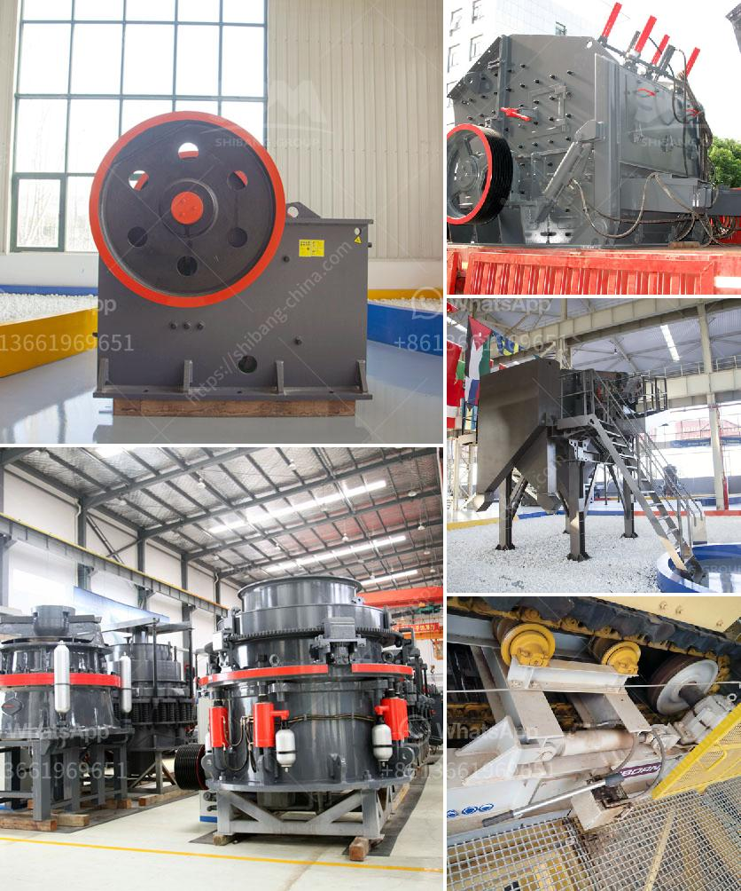

<h3>mobile aggregate plant for sale in the philippines</h3>
The Philippines is known for its rich natural resources, making it a prime location for the mining industry. With the growing demand for aggregates for various construction projects, the need for a reliable crusher plant is a must.

Fortunately, investing in a mobile aggregate plant for sale in the Philippines is easy and convenient with AIMIX Group. This plant allows contractors to produce high-quality aggregates while eliminating transportation costs and reducing the carbon footprint.

A mobile aggregate plant, also known as a portable crushing plant, is a complete set of crushing and screening equipment commonly used in modern mining and construction industries. It is designed to produce high-quality aggregates, sand, and gravel through crushing, screening, and conveying processes.

One of the key advantages of a mobile aggregate plant is its flexibility. It can be easily transported from one site to another, making it ideal for contractors who frequently move between job sites. Whether it's a remote mountain site or an urban construction project, a mobile plant can adapt to different locations and produce the required aggregates on-site.

When it comes to choosing a mobile aggregate plant for sale in the Philippines, there are several factors to consider. First and foremost, it's essential to choose a reliable manufacturer or supplier with a good reputation. AIMIX Group is a leading manufacturer and supplier of mobile crushing plants in the Philippines. They have a wide range of products to meet different requirements and budgets.

In addition to reliability, it's important to consider the production capacity of the plant. The capacity will depend on the size and type of the plant, as well as the specific requirements of the project. AIMIX Group offers mobile aggregate plants with a range of production capacities, from 30 to 500 tons per hour, allowing contractors to choose the most suitable option for their projects.

Another key consideration is the quality of the aggregates produced by the plant. AIMIX Group mobile aggregate plants are equipped with advanced crushing and screening equipment, ensuring the production of high-quality aggregates. This is crucial for construction projects that require durable and consistent materials.

Furthermore, a mobile aggregate plant should be easy to operate and maintain. AIMIX Group's plants are designed with user-friendly interfaces and efficient maintenance systems, reducing downtime and increasing productivity. They also provide comprehensive after-sales support, including on-site installation, training, and regular maintenance.

Investing in a mobile aggregate plant for sale in the Philippines can bring significant benefits to contractors and project owners. It eliminates the need for transporting aggregates from a distant quarry, saving time and money. Additionally, it reduces the environmental impact by minimizing carbon emissions from transportation.

Overall, a mobile aggregate plant offers a cost-effective and convenient solution for producing high-quality aggregates in the Philippines. With AIMIX Group's reliable and efficient plants, contractors can meet the growing demand for aggregates in the construction industry, contributing to the country's infrastructure development.
<h3>Contact us</h3><ul><li><strong>Whatsapp:&nbsp;<a href="https://wa.me/8613661969651">+8613661969651</a></strong></li><li><a href="https://swt.shibang-china.com/?git&amp;zhl&amp;mobile aggregate plant for sale in the philippines"><strong>Online Service(chat now)</strong></a></li></ul><h3>Related</h3><ul><li><a href='grinding steel balls for mining.md'>grinding steel balls for mining</a></li><li><a href='ball grinder machine.md'>ball grinder machine</a></li><li><a href='marble powder making machine in production.md'>marble powder making machine in production</a></li><li><a href='manufacturing process of calcium carbonate.md'>manufacturing process of calcium carbonate</a></li><li><a href='impact crusher turkey.md'>impact crusher turkey</a></li></ul>